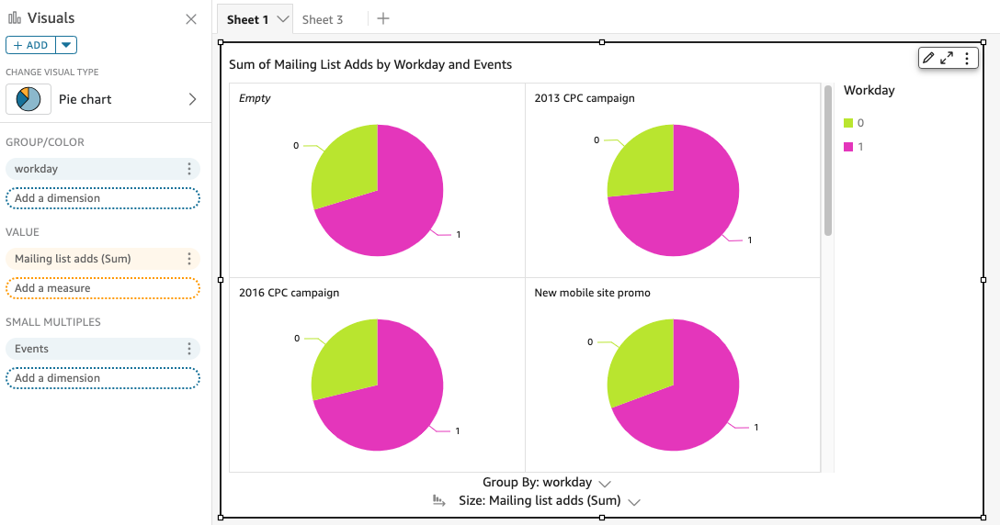
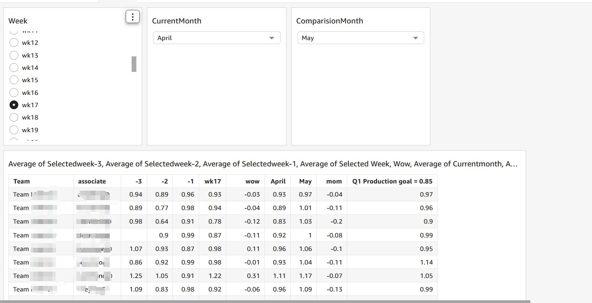

# SPRINT 10 - Visualização de Dados

## Certificados
Para maiores informações sobre os certificados, siga o link: [certificados](certificados)

## Desafio
Para maiores informações sobre o desafio final, siga o link: [desafio](desafio)

## Evidências
Para maiores informações sobre as evidências, siga o link: [evidências](evidencias)

## Exercícios
Para maiores informações sobre os exercícios, siga o link: [exercícios](exercicios)

--- 

## Resumo dos Estudos

### Visualização de Dados

- ***Storytelling*** é habilidade de contar histórias com uma narrativa envolvente para transmitir uma mensagem e criar conexões.
- ***STORYTELLING* NA ANÁLISE DE DADOS**
    - O Analista de Dados coleta os dados brutos, avalia os dados e elabora conclusões relevantes = ***insights***.
    - A visualização dos dados começa muito antes da construção de um dashboard.
- **Análise exploratória vs Análise explanatória**
    - A **análise exploratória** é realizada pelo profissional responsável pela análise. Realiza-se uma "garimpagem" nos dados gerados para descobrir o que é interessante e aproveitável ali.
    - A **análise explanatória** é a explanação dos insights encontrados, comunicar apenas o que é importante.
- Conhecer o público e identificar o objetivo.

### Gráficos do QuickSight
- O QuickSight conta com diversos tipos de gráficos para adicionar a uma visualização.

1. **Gráficos de Barra**
- Mais versátil, além da facilidade em interpretá-lo. Podem ser construídos utilizando barras horizontais ou verticais com possibilidade de uma ou mais categorias.

2. **Gráficos de Linha**
- São comumente utilizados para apresentar as mudanças de uma métrica com o passar do tempo.

3. **Gráfico BoxPlot**
- É um tipo de gráfico muito utilizado em estatística descritiva, pois identifica de forma visual 5 importantes valores: **máximo**, **mínimo**, **mediana**, **quartil inferior** e **quartil superior**. 

4. **Gráficos de linhas e colunas (combo)**
- Permitem exibir a comparação entre diferentes categorias associada com mudanças ao longo do tempo.

5. **Gráficos Donut (Rosquinha)**
- São utilizados para comparar o quanto cada valor de uma dimensão representa sobre o total.

6. **Gráfico Heat maps**
- São gráficos que apresentam uma medida em relação a sua intersecção com duas dimensões. Aplica-se uma variação de coloração para indicar se o valor aproxima-se do máximo (mais escuro) ou do mínimo (mais claro).

7. **Histograma**
- Permitem representar graficamente a distribuição de frequência de uma métrica.

8. **Gráficos de Mapa**
- O QuickSight permite criar dois tipos de gráfico no formato de mapas: de pontos e preenchido. Mapa de pontos apresentam valores para cada localização, diferenciando valores pelo tamanho do ponto. Já um mapa preenchido apresenta a diferença de valores de cada região alterando as tonalidades de cores. Em ambos é pré-requisito para uso a existência de informações de localização no *dataset*.

9. **Múltiplas pequenas visualizações**
- Gráficos de linha, barras e pizza podem ser customizados para apresentar várias pequenas visualizações, criadas a partir de um campo de categorização (***small multiples***). 
- Recurso especialmente útil para apresentar uma série de visualizações que evidenciam o impacto do campo de categorização dos dados.

### Tabelas do QuickSight

1. **Tabelas**
- Permite algumas customizações, como alterar cor de fundo de linha, coluna ou texto e adicionar ícone quando os dados se enquadrarem em determinadas condições de formatação condicional.

2. **Tabelas Dinâmicas**
- Úteis para apresentar métricas com base na intersecção de dimensões. Têm características muito similares às tabelas dinâmicas de software de planilha eletrônica.

### Cartões de KPI
- Tipo de objeto visual que permite comparar uma métrica em relação ao seu valor de referência. São exemplos de aplicação a comparação entre resultado de vendas em relação ao projeto, volume total de compras de um item em relação ao mesmo período do ano anterior, entre outros.

### Insights
- São computações analítics sugeridas ou customizadas que podem ser adicionadas à análise. Estão disponíveis a partir do menu *Add Insight*, junto às demais opções de adicionar painel, texto, título, etc. Podemos selecionar uma computação pronta ou customizar nossa própria narrativa através da opção *Customize narrative* do menu suspenso.

### Caixas de Texto
- Objetos utilizados para adicionar texto à visualização. Disponibilizam ferramentas de edição, com opção de adicionar imagens, hiperlinks e formatações típicas de editores de texto.

### Nuvem de palavras
- Apresentam palavras obtidas a partir de uma dimensão, expressando sua importância (quantidade de ocorrências) pelo tamanho.

### Desenvolvimento do Dashboard

**CORES**
- Em algumas situações as cores do tema/dashboard são pré-definidas de acordo com cada empresa/cliente. Quando não há essa possibilidade você será responsável por escolher a paleta de cores que será utilizada. É importante manter a consistência, você não precisa utilizar apenas uma cor para compor um dashboard inteiro, porém mistrurar muitas cores também pode ser um problema. Afinal "O layout e as palavras podem dizer uma coisa, mas as cores podem dizer outra".

### Tipografia 
- Abrange todo o estudo, criação e aplicação dos caracteres, estilos, formatos e arranjos visuais das palavras. Por serem a base na comunicação escrita eles precisam ser bem trabalhadas para estarem em sintonia com a mensagem que você deseja passar.
- A tipografia deve ser pré-definida. O tamanho da letra também é importante, escolher letras pequenas pode dificultar a leitura, assim como o contrário pode chamar a atenção de maneira equivocada.

### Formatar visualizações no QuickSight
- Toda visualização adicionada a uma análise apresenta um conjunto de opções de customização. Para acessá-las é preciso clicar no ícone em formato de lápis no canto superior direito do painel. As opções de formatação são exibidas à esquerda e dependem do tipo de objeto selecionado. Também podemos customizar cores em alguns tipos de gráfico clicando com o botão direito sobre uma área específica.

### Field wells
- Boa parte dos elementos visuais adicionados a uma análise solicitam informar campos no *Field Wells*. 
- Por meio dessas configurações que criamos as séries dos gráficos, por exemplo. 
- Logo, os tipos e quantidades de campos solicitados dependem do objeto visual adicionado ao painel. Para adicionar campos aos espaços de interesse, basta arrastá-los do *databaset*. 

### Temas
- São coleções de configurações que se aplicam a várias visualizações e *dashboards*. 
- Além dos temas nativos, podemos criar outros através do editor de temas.
- Importante considerar que toda a análise deve ter um tema vinculado.
- Utilizamos temas para uniformizar e adequar as visualizações a requisitos técnicos.

---

### Storytelling em dados
- ***Storytelling*** em dados é a prática de criar narrativas cativantes usando informações e insights derivados de dados.
- Visa ir além de simplesmente apresentar números e estatísticas, buscando envolver emocionalmente o público e transmitir uma mensagem clara e memorável.
- Importante considerar o **público-alvo**.
- Fundamental selecionar visualizações adequadas, utilizar linguagem clara e objetiva.
- **Base do *storytelling***
    - Dados
    - Enredo
    - Representação visual

**COMO CONTAR UMA HISTÓRIA COM DADOS?**

1. Formule uma teoria
    - O que você quer demonstrar ou provar?
    - Qual é seu ponto?
    - O que você espera que a informação coletada demonstre para você?
2. Colete informação
    - Não existe *storytelling* com dados sem dados consistentes e pertinentes.
    - Etapa mais fundamental.
    - Pesquisar, filtrar, analisar e tirar insights a partir dos dados.
3. Definir um propósito
    - Qual será o rumo da narrativa.
    - Ter a capacidade de descrever o objetivo da narrativa em uma única sentença.
4. Fazer perguntas
    - Qual foi o resultado da coleta de dados?
    - Ela reforçou ou refutou a sua teoria inicial?
5. Definir um "Call to Action"
    - Pensar na ação que você quer que seja realizada ao final da sua história.
    - "Chamada para a ação".
6. Traduzir em informação visual
    - Momento de reunir todo o planejamento e transformá-lo em narrativa.

---

### AWS QuickSight

Serviço gerenciado de *Business Intelligence* que permite a **criação e compartilhamento de análises de dados** a fim de **obter insights de inteligência de negócios de forma rápida e fácil**.

Pode ser integrado com diversas fontes de dados, como Redshift, S3, RDS.

#### Termos básicos
- **Preparação de dados:** filtragem, renomeação de campos, alteração de tipos, adição de campos calculadores ou criação de consultas SQL no momento da criação/edição do dataset.
- **Dataset:** coleção de dados de interesse, obtidos através de um ou mais *data sources*.
- ***Data sources*:** representação de uma conexão a uma fonte de dados específica (banco de dados relacional, arquivo, Athena, Spark).
- **SPICE (Super-fast, Paralell, In-memory Calculation Engine):** *motor in-memory* com armazenamento associada que acelera o processamento de cálculos e a recuperação de dados. Atua como um mecanismo de cache que favorece o rápido processamento de dados sem comprometer a experiência do usuário.
- **Análise:** espaço de trabalho onde se criam visualizações - representações gráficas.
- **Visualização:** é uma representação visual específica dos dados, como um gráfico, KPI, insight, etc.
- **Planilha:** divisão de uma análise, tal qual uma aba de navegação. Compreende uma ou mais visualizações.
- **Dashboard:** é a versão publicada de uma análise.

#### Datasets
- Conjuntos de dados utilizados em análises.
- O QuickSight possibilita a conexão com diversas fontes de dados (RDS, Redshift, S3, PostgreSQL...).
- Pode-se realizar junções (joins) entre datasets.
- **Campos calculados:** novas colunas que podemos criar por meio da aplicação de funções e/ou combinação de colunas já existentes.
- **Filtros:** critérios que restringem os dados que efetivamente estarão disponíveis em todas as análises que fizerem uso do dataset.
- **Excluded fields:** campos que estão no dataset, mas que não devem ser disponibilizados para uso em análises.

___