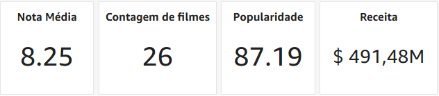
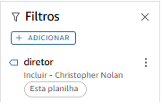
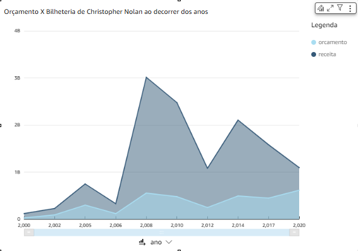

# 🧩 Desafio da Sprint 10
Este diretório contém os arquivos necessários para a realização do desafio desta Sprint.

___

## 📝 Enunciado
O desafio da Sprint 10 é uma continuação do desafio iniciado na Sprint 6, sendo a quinta e última entrega do desafio final.

- **Consumo de dados**: momento de extrair *insights*, apresentando-os por meio do AWS QuickSight.

### Afazeres
Extrair insights dos dados ingeridos e processados nas Sprints anteriores. Isso deve ser realizado por meio da ferramenta de visualização de dados QuickSight.

- Criar um *dashboard* no AWS QuickSight, utilizando como única e exclusiva fonte de dados as tabelas da camada *Refined* do data lake.

--- 

## Resolução

### 1. Criação de Datasets no QuickSight

Primeiramente, criei um dataset (dados-refinados) no QuickSight para poder acessar os dados em minha análise.

Dessa forma, selecionei como fonte de dados o Amazon Athena, mais especificamente a tabela "fato_filme", que é a tabela central da modelagem dos meus dados (tabela fato). Essa tabela, juntamente às tabelas de dimensões, foi criada pelo *crawler* que buscou os dados salvos no S3 camada *Refined*.

Fazendo isso, obtive um **erro de permissão**. Para isso, necessitei alterar as permissões de acesso do QuickSight para que acessasse os arquivos do S3. As instruções de configuração da conta do QuickSight não continham permissões para o S3, apenas para o Athena, Redshift, IAM e RDS. A imagem abaixo comprova essa modificação.

Com isso, para juntar todos os dados das dimensões e do fato_filme, criei todos os datasets das outras tabelas para trazer todos os dados necessários para a análise.

### 2. Junções entre datasets

Para unir os dados, bastou selecionar o dataset "fato_filme", clicar nos **três pontinhos** -> **Editar**.

Após, seleciona-se a opção **Adicionar dados** no canto superior direito da tela.

Seleciona-se, então, a opção **conjunto de dados**.

Agora, deve-se selecionar cada tabela criada a partir da modelagem realizada, realizando as junções com a tabela fato_filme.

Na sequência, seleciona-se a junção ao centro das tabelas e configura-se o campo responsável pela junção. Exemplo:

Posteriormente, fiz para todas as outras dimensões criadas, resultando no seguinte esquema:

### 3. Construção do dashboard

Para criar uma análise com base nos dados ajustados na seção anterior, basta selecionar o conjunto de dados, clicar nos **três pontinhos** e selecionar a opção **Criar análise**.

#### 3.1. Criação de visualizações KPI

Primeiramente, tive a ideia de criar algumas visualizações KPI, com informações gerais a respeito do diretor por mim escolhido: Christopher Nolan.

#### 3.2. Criação de gráfico de área

Tive a ideia de realizar um comparativo dos orçamentos e das receitas (bilheterias) atingidas por Christopher Nolan, evidenciando a crescente da carreira do diretor.

Para isso, selecionei o **gráfico de área** e coloquei no **eixo X** o **ano de lançamento**, e no **eixo Y** os campos **orcamento** e **receita**.

No entanto, inicialmente, apareciam dados referentes a todos os filmes do dataset. Para isso, necessitei adicionar um filtro, limitando para os filmes de Nolan.

Filtrando pelo diretor "Christopher Nolan", criei o seguinte filtro:

Realizando isso, meu gráfico ficou da seguinte maneira:

___

### ↩️ [Retornar ao início](../../README.md)