# 🧩 Desafio da Sprint 10
Este diretório contém os arquivos necessários para a realização do desafio desta Sprint.

___

## 📝 Enunciado
O desafio da Sprint 10 é uma continuação do desafio iniciado na Sprint 6, sendo a quinta e última entrega do desafio final.

- **Consumo de dados**: momento de extrair *insights*, apresentando-os por meio do AWS QuickSight.

### Afazeres
Extrair insights dos dados ingeridos e processados nas Sprints anteriores. Isso deve ser realizado por meio da ferramenta de visualização de dados QuickSight.

- Criar um *dashboard* no AWS QuickSight, utilizando como única e exclusiva fonte de dados as tabelas da camada *Refined* do data lake.

--- 

## Resolução

### 1. Criação de Datasets no QuickSight

Primeiramente, criei um dataset (dados-refinados) no QuickSight para poder acessar os dados em minha análise.

Dessa forma, selecionei como fonte de dados o Amazon Athena, mais especificamente a tabela "fato_filme", que é a tabela central da modelagem dos meus dados (tabela fato). Essa tabela, juntamente às tabelas de dimensões, foi criada pelo *crawler* que buscou os dados salvos no S3 camada *Refined*.

Fazendo isso, obtive um **erro de permissão**. Para isso, necessitei alterar as permissões de acesso do QuickSight para que acessasse os arquivos do S3. As instruções de configuração da conta do QuickSight não continham permissões para o S3, apenas para o Athena, Redshift, IAM e RDS. A imagem abaixo comprova essa modificação.

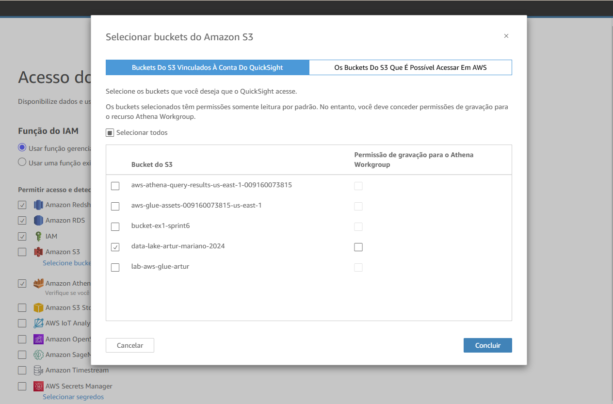

Com isso, para juntar todos os dados das dimensões e do fato_filme, criei todos os datasets das outras tabelas para trazer todos os dados necessários para a análise.

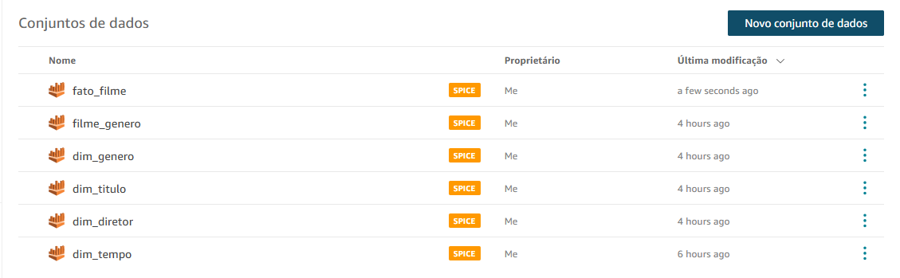

### 2. Junções entre datasets

Para unir os dados, bastou selecionar o dataset "fato_filme", clicar nos **três pontinhos** -> **Editar**.

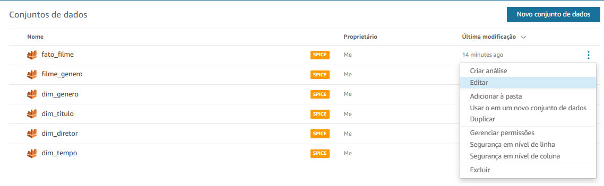

Após, seleciona-se a opção **Adicionar dados** no canto superior direito da tela.

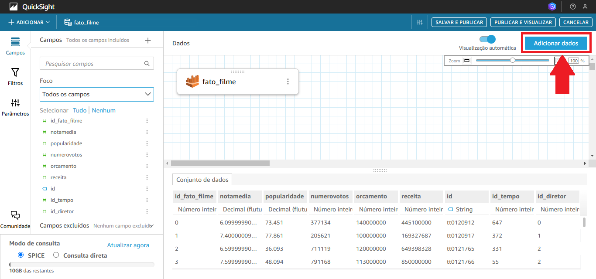

Seleciona-se, então, a opção **conjunto de dados**.

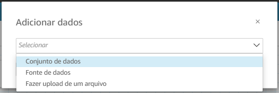

Agora, deve-se selecionar cada tabela criada a partir da modelagem realizada, realizando as junções com a tabela fato_filme.

Na sequência, seleciona-se a junção ao centro das tabelas e configura-se o campo responsável pela junção. Exemplo:

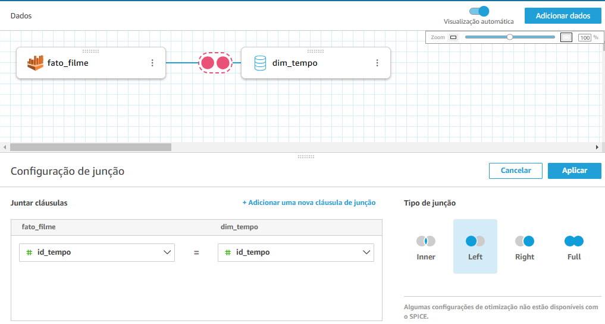

Posteriormente, fiz para todas as outras dimensões criadas, resultando no seguinte esquema:

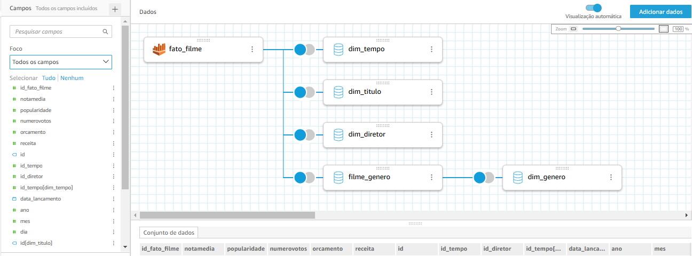

### 3. Construção do dashboard

Para criar uma análise com base nos dados ajustados na seção anterior, basta selecionar o conjunto de dados, clicar nos **três pontinhos** e selecionar a opção **Criar análise**.

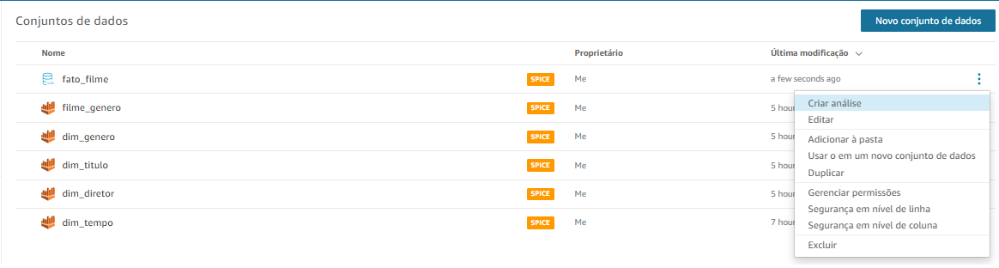

Decidi criar mais de uma página para a minha análise, dividindo em três:

1. **Visão Geral**
2. **Filmes do gênero Crime/Guerra - Trilogia Batman e Dunkirk**
3. **Análise temporal**

### 1. Visão Geral

#### 3.1.1. Criação de visualizações KPI

Primeiramente, tive a ideia de criar algumas visualizações KPI, com informações gerais a respeito do diretor por mim escolhido: Christopher Nolan.

Para criar uma dessas visualizações, criei o campo calculado "lucro":

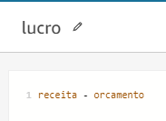

Os campos selecionados para cada visualização foram:

Por fim, o resultado das visualizações KPI foi o seguinte:

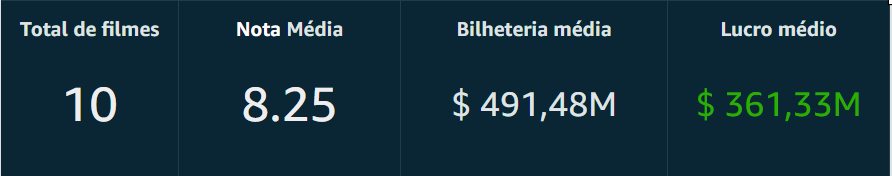

#### 3.1.2. Criação de gráfico de linha (orçamento x receita no decorrer dos anos)

Tive a ideia de realizar um comparativo dos orçamentos e das receitas (bilheterias) atingidas por Christopher Nolan, evidenciando a crescente da carreira do diretor.

Para isso, selecionei o **gráfico de linhas** e coloquei no **eixo X** o **ano de lançamento**, e no **eixo Y** os campos **orcamento** e **receita**.

O gráfico ficou da seguinte maneira:

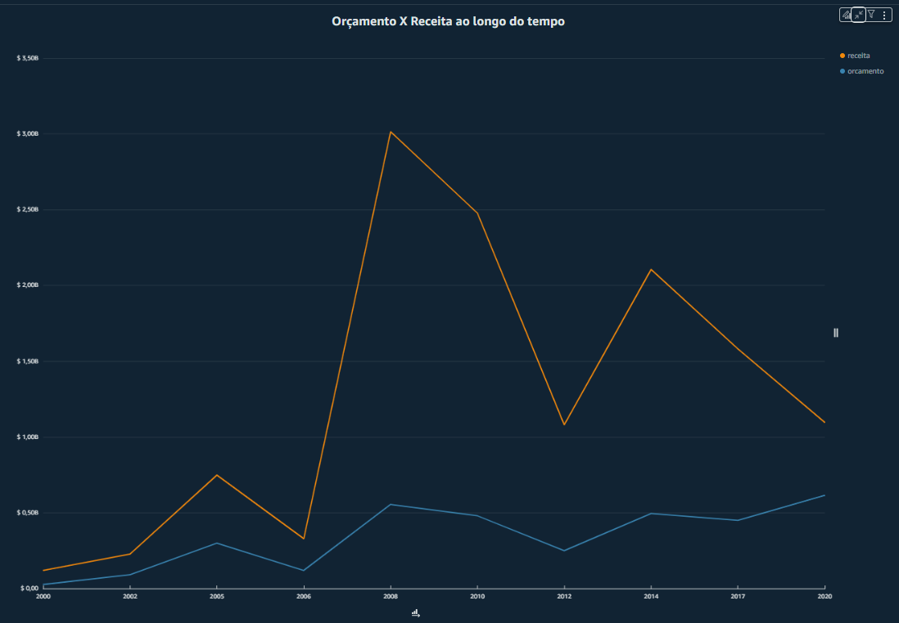

Para possuir os dados apenas do diretor Christopher Nolan, adicionei um filtro em toda a planilha, para que apenas selecionasse os dados do diretor.

#### 3.1.3. Criação do gráfico de pizza (distribuição dos gêneros dos filmes de Nolan)

Também desenvolvi um gráfico de pizza, o qual conteria a distribuição dos gêneros dos filmes de Christopher Nolan. Para isso, selecionei o tipo de gráfico e selecionei apenas o campo "genero".

**Campos**

**Filtros**

Para selecionar apenas os filmes de Christopher Nolan, utilizei os seguintes filtros:

Pode-se perceber que utilizei o filtro de excluir o gênero "*Family*". Fiz isso para "poluir" menos o visual, haja vista que o gênero não afetaria em minha análise, ainda mais por ter apenas 1 filme do gênero.

**Resultado**

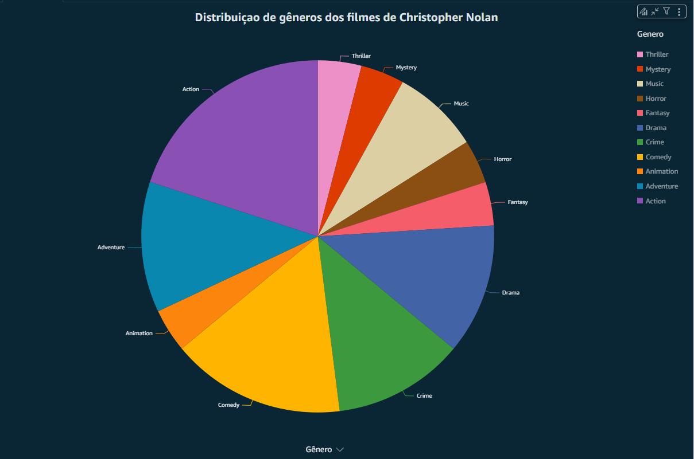

### 3.1.4. Gráfico de barras (maiores bilheterias de Christopher Nolan)

Além disso, realizei um gráfico de barras para ver os 10 títulos com maiores bilheterias de Christopher Nolan, a fim de perceber quais filmes tiveram mais sucesso do ponto de vista financeiro.

**Campos**
Para isso, selecionei o *titulo* para o **eixo x** e a *receita* para o **eixo y**.

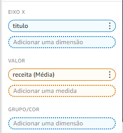

**Filtros**
Nesta visualização, o único filtro foi para selecionar os filmes de Christopher Nolan, fazendo um comparativo apenas entre os filmes do diretor.

**Resultado**

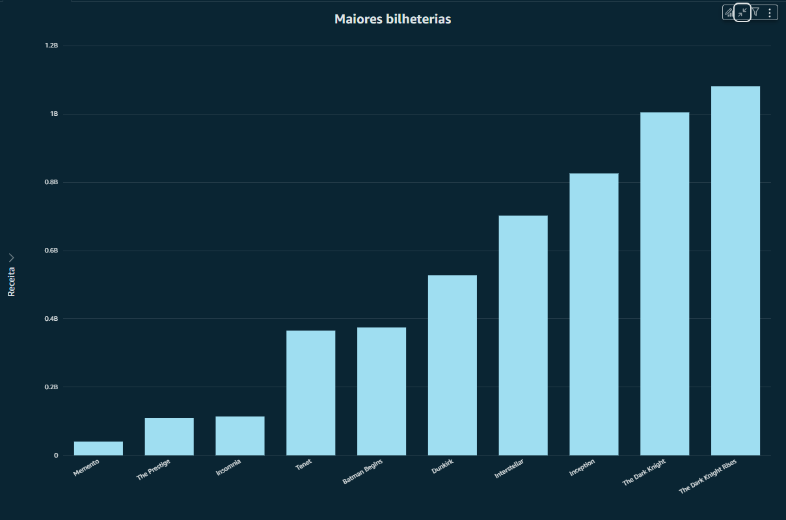

Além disso, inseri uma imagem do diretor, o nome dele e um breve resumo da carreira dele no Dashboard.

Por fim, a página de **Visão Geral** resultou no seguinte:

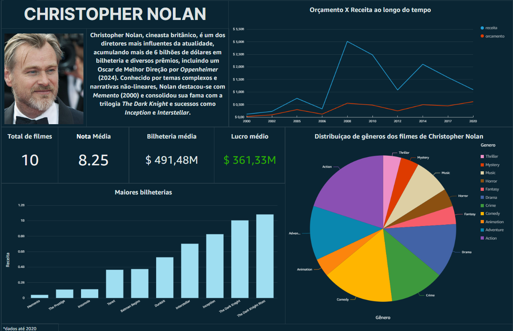

### 2. Filmes do gênero Crime/Guerra

Essa análise optei por realizar devido à designação desses dois gêneros para a minha Squad (2). Dessa forma, busquei filmes desses gêneros do diretor por mim selecionado.

- **Trilogia Batman** - filmes do gênero Crime, sendo um dos maiores sucessos do diretor.
- **Dunkirk** - uma nova proposta no cenário dos filmes de Guerra, conquistando o público e tendo um ótimo desempenho no cinema.

### 3.2.1 - Gráfico de barras (comparação dos filmes com outros filmes do mesmo gênero)

Para realizar isso, necessitei criar campos calculados chamados "Categoria Batman" e "Categoria Dunkirk". Eles fazem a distinção se consiste nos filmes que estou analisando, ou se é algum outro filme dos gêneros Crime ou Guerra. As imagens abaixo ilustram como foram criados esses campos:

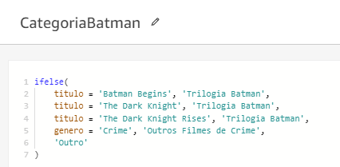

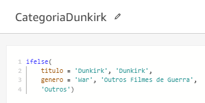

Depois disso, selecionei para o eixo Y as médias dos campos "orcamento" e "receita":

Personalizei as cores, ajustei o título e outros atributos visuais e ficou da seguinte forma:

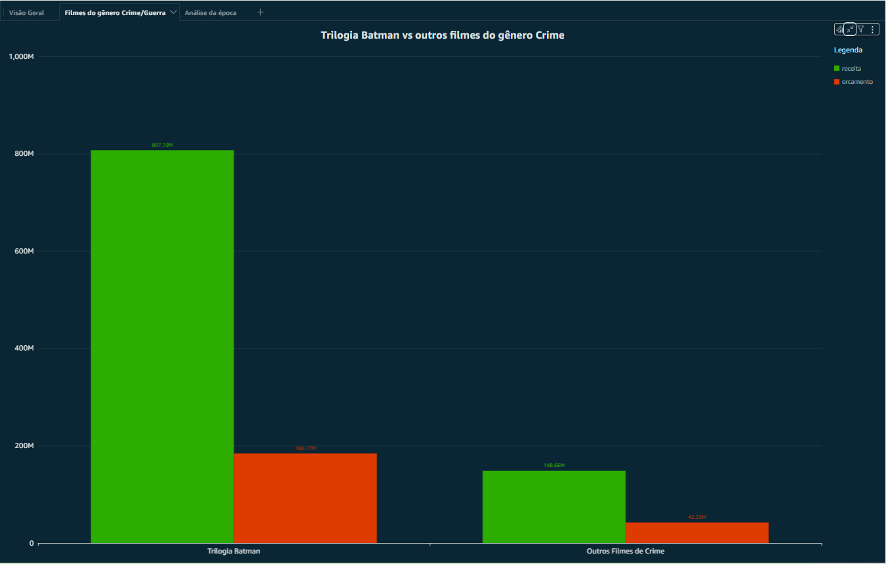

Com esses gráficos, pode-se perceber que essas obras de Christopher Nolan tiveram desempenho muito acima da média em comparação a outras obras de mesmo gênero sob o ponto de vista da receita e do orçamento.

Vale ressaltar, ademais, que esses filmes foram produzidos após o diretor já ter tido outros filmes de sucesso, o que o permitiu possuir orçamentos maiores, gerando receitas ainda maiores.

Em suma, do mesmo modo que ele tem orçamentos consideráveis, as receitas são proporcionalmente elevadas, elucidando o sucesso do diretor no cenário do cinema mundial.

### 3.2.2 - Tabelas de notas e lucros

Além disso, para incrementar a análise, optei por colocar a nota média (popular) e o lucro das obras em comparação aos outros filmes, visando elucidar que ao passo que Christopher Nolan tem filmes que agradam a opinião popular, os filmes dele também lucram.

Novamente necessitei utilizar os campos calculados "CategoriaBatman" e "CategoriaDunkirk", além dos campos de *notamedia* e *lucro* (também calculado).

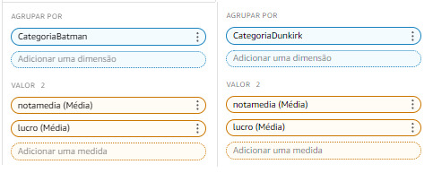

Dessa forma, após editar alguns parâmetros visuais, o resultado foi o seguinte:

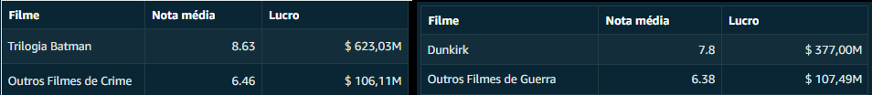

### 3.2.3 - Gráfico de Gauge (participação dos filmes na receita obtida pelo diretor)

Para a criação desse gráfico, necessitei criar campos calculados: "Receita Batman" e "Receita Dunkirk". Os cálculos estão representados a seguir:

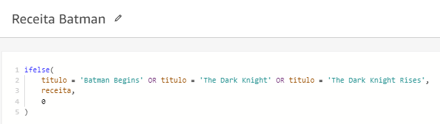

Esse campo contém o total da receita obtida apenas pelos filmes do Batman.

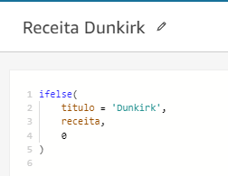

Esse campo contém o total da receita obtida apenas pelo filme Dunkirk.

Dessa forma, selecionei a receita total (soma) e a receita de cada filme em comparação a esse todo, evidenciando por qual percentual da receita esses filmes são responsáveis.

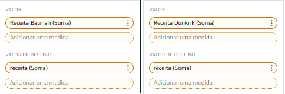

Por conseguinte, ajustei os valores para aparecerem como moeda ($) e a unidade inseri bilhão (B). Os gráficos de Gauge ficaram assim:

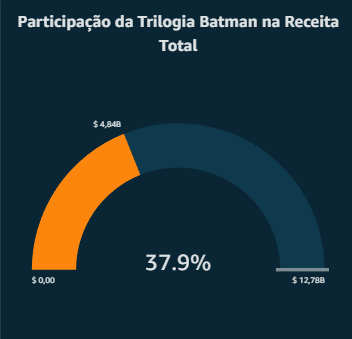

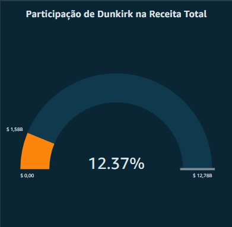

Vale ressaltar que, além dessas visualizações citadas acima, inseri os cartazes dos filmes e um breve sumário de cada um deles, resultando no seguinte dashboard:

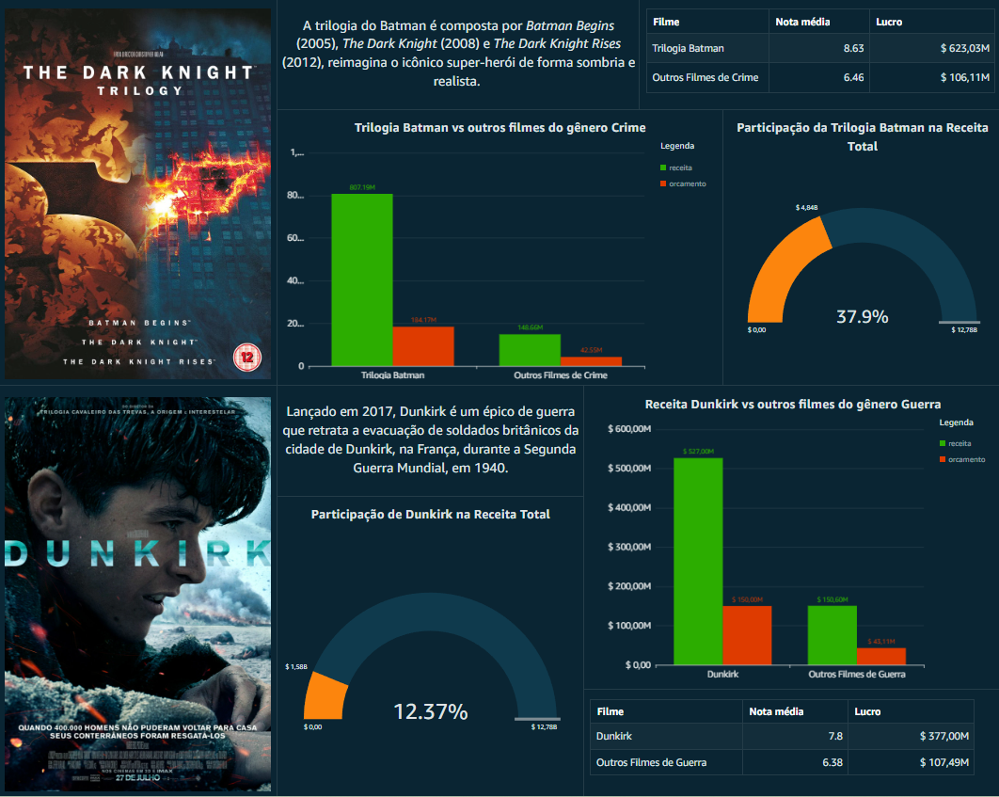

___

### ↩️ [Retornar ao início](../../README.md)