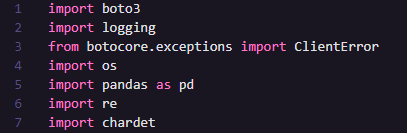
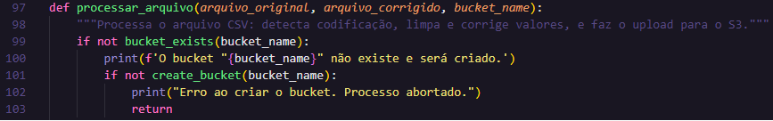
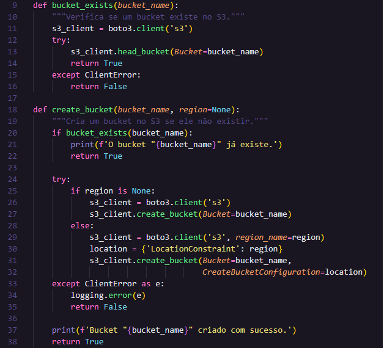
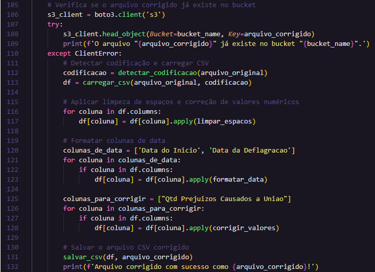
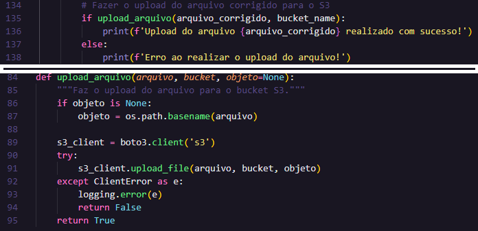
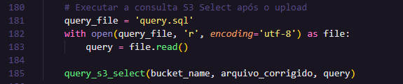
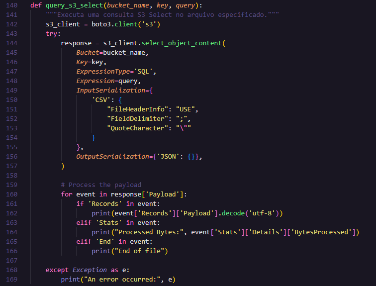
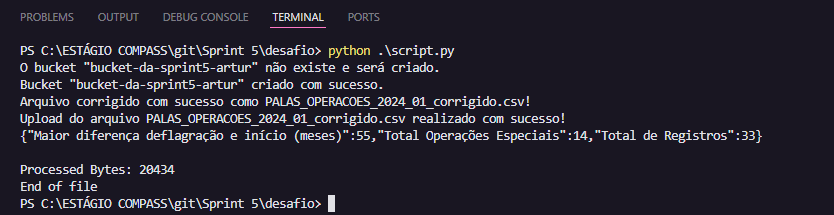
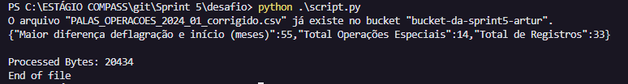

# 🧩 Desafio da Sprint 5
Este diretório contém os arquivos necessários para a realização do desafio desta Sprint.

## 📝 Enunciado(s)
1. Procure um arquivo CSV ou JSON no portal de dados públicos do Governo Brasileiro: [link](http://dados.gov.br)
    - Garanta que seu arquivo seja único na turma;
    - Certifique-se de que não excedeu nenhum limite do S3 de acordo com a documentação do mesmo.

2. Analise o conjunto de dados escolhido localmente em editor de texto para conhecer os dados e o que pode ser analisado.

3. Carregue o arquivo para um *bucket* novo, para executar o desafio.

4. Você pode utilizar o **Console** (nota até 80%) ou desenvolver um código Python usando **Boto3** (nota até 100%) para fazer uso do S3 Select.

5. Através da função **S3 Select** crie pelo menos uma consulta no seu arquivo que utilize:
    1. Uma cláusula que filtra dados usando ao menos dois operadores lógicos
    2. Duas funções de agregação
    3. Uma função condicional
    4. Uma função de conversão
    5. Uma função de data
    6. Uma função de string

OBS.: menos consultas = maior avaliação

6. Armazenar no Git um arquivo Markdown explicando seu conjunto de Dados, bem como sua(s) consulta(s) e o resultado das execuções de suas consultas.
    - Armazenar a(s) consultas em arquivo(s) *.sql*
    - Armazenar o(s) arquivo(s) de código em arquivo(s) *.py*
    - Armazenar as evidências de execução com imagens *.jpeg* ou *.png*

## Resposta(s)
### 1. Escolha do conjunto de dados
Selecionei a base de dados da polícia federal com diversas operações realizadas em diferentes datas, com foco em tipos específicos de crimes e atividades.
- **Site do governo:** [link](https://dados.gov.br/dados/conjuntos-dados/palas---sistema-de-informacoes-de-investigacao)
- **Arquivo baixado:** [link](PALAS_OPERACOES_2024_01.csv)

### 2. Análise do conjunto de dados selecionado
- Markdown com análise do dataset: [Arquivo](analise_dados.md)

### 3. Carregar arquivo para bucket novo
Explicar processo de criação do bucket, carregamento...

### 4, 5. Criação do script Python com as consultas
**1º passo:** instalar biblioteca Boto3: `pip install boto3`

  

**2º passo:** configurar AWS.
- Instalar AWS CLI.
- Comando: `aws configure`
    - Inserir credenciais para comunicar com a conta da AWS.
    - Isso não funcionou de primeira, por isso necessitei alterar o arquivo credentials dentro do diretório .aws.
    - Conforme na seguinte evidência: [configuração](../evidencias/3_config_credentials_correct.png), editei o arquivo credentials, necessitando adicionar a linha com o token da sessão.
        

        
        

**3º passo:** criar *bucket* e fazer upload do arquivo.
    - **Criação:** desenvolvi um script que realizava essa tarefa, inseri o código separado no diretório de evidências ([ver código](../evidencias/criar_bucket.py)).
    - **Upload:** também desenvolvi um script ([veja aqui](../evidencias/upload_csv.py)) que realiza essa tarefa. 

**4º passo:** desenvolver script para a realização de consultas.
    - Primeiramente, também desenvolvi um script apenas para a realização da consulta, na qual utilizei todos os requisitos do desafio [ver código](../evidencias/main.py).
    - Como pode-se perceber na linha 39 do script, a consulta está armazenada no arquivo sql [query.sql](query.sql), e o script criado faz a leitura do arquivo recebendo o que está escrito em seu interior.
    - Após isso realizado, julguei ser melhor modularizar o código e unir tudo em um só, criando o novo [script](script.py).

- Código final: [ver](script.py)

## Explicação detalhada do Script desenvolvido
### 1. Bibliotecas utilizadas

    

- **boto3:** para interagir com o serviço S3 da AWS. Nesse caso, é usada para criar buckets S3, fazer upload de arquivos, e executar consultas em arquivos armazenados no S3.
- **logging:** biblioteca utilizada para gerar logs em aplicativos Python. Foi usada aqui para registrar erros durante operações AWS.
- **botocore.exceptions:** no script, ClientError é usada para capturar e tratar erros ao criar buckets ou fazer uploads no S3.
- **os:** usada para manipular nomes de arquivos e caminhos.
- **pandas:** usada para carregar, processar, e salvar arquivos CSV, incluindo limpeza de dados e formatação de colunas.
- **re:** usada para limpar espaços e padronizar strings nos dados.
- **chardet:** usada para identificar a codificação de arquivos CSV antes de carregá-los com pandas, garantindo que caracteres sejam lidos corretamente.

> As bibliotecas essenciais para o desafio são a "boto3" e "pandas", as outras utilizei devido a diversos fatores: entender os erros que estavam surgindo, manipular arquivos do Sistema Operacional e identificar codificação, que não lê caracteres especiais como 'ç' e '~'. 

### 2. Criação do Bucket

    
    

Como pode ser percebido nas imagens acima, no interior do método de processamento do arquivo o programa verifica se o bucket não existe e posteriormente cria, ou não, o Bucket desejado.

### 3. Ajuste do arquivo
Posterior à criação do Bucket, necessitamos fazer o upload do arquivo para o S3. No entanto, primeiramente foi necessário fazer uma visualização em editor de texto (utilizei o Excel) para identificar possíveis erros e ajustes necessários.

Conforme explicitado no arquivo Markdown da análise da base dados ([ver aqui](analise_dados.md)), necessitou-se **remover vírgulas** de valores numéricos, substituindo por pontos, além de **remover o 'R$'** - isso na coluna **'Qtd Prejuizos Causados a Uniao'**.

    

Ao final, o arquivo é salvo no diretório atual para posterior envio ao Bucket.

### 4. Envio ao Bucket S3

    

Na imagem acima, podemos perceber a chamada da função acima, e a implementação dela abaixo, enviando assim o arquivo corrigido para o Bucket S3.

### 5. Realização da consulta ao arquivo
Primeiramente, a consulta está em um arquivo .sql ([ver arquivo](query.sql)), o qual deve ser lido no script e depois passado como *Expression* para realizar a consulta. A imagem abaixo mostra a leitura do arquivo e a chamada do método que realiza a query.

    

Posteriormente, o método que realiza efetivamente a consulta pode ser observado na imagem abaixo. Faz-se necessário receber o nome do Bucket, da chave (nome do arquivo) e a query (que foi passada por parâmetro).

    

### 6. Resultados da execução do script
**6.1. Primeira execução do script**

    

**6.2. Execuções seguintes**

    

___

### ↩️ [Retornar ao início](../../README.md)