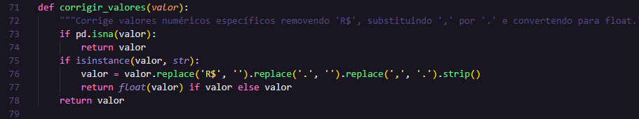
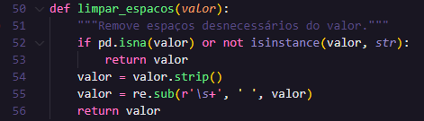
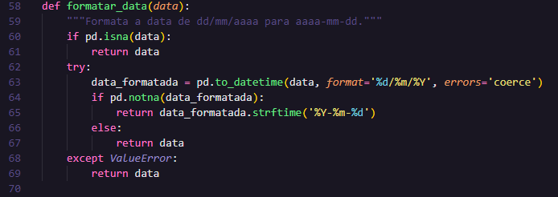

# Análise do conjunto de dados selecionado

Os dados fornecidos referem-se a diversas operações policiais realizadas em diferentes datas, com foco em tipos específicos de crimes e atividades. Cada registro contém informações sobre a operação, incluindo a data de início e deflagração, tipo de operação, área de atuação, e detalhes sobre prisões e apreensões.

## Estrutura dos Dados

Cada linha do conjunto de dados representa uma **operação policial** com as seguintes colunas:
- ***Checksum Id Operacao***: Identificador único da operação.
- ***Data do Inicio***: Data em que a operação foi iniciada.
- ***Data da Deflagracao***: Data em que a operação foi oficialmente deflagrada.
- ***Tipo de Operacao***: Classificação da operação (e.g., Operacao Especial, Operacao Simples).
- ***Area***: Tipo de crime ou atividade investigada.
- ***Sigla Unidade Federativa***: Unidade Federativa onde a operação foi realizada.
- ***Sigla Unidade Institucional***: Unidade institucional responsável pela operação.
- ***Atuacao em Territorio Indigena***: Indica se a operação atuou em território indígena.
- ***Atuacao em Territorio de Fronteira***: Indica se a operação atuou em território de fronteira.
- ***Qtd Prisao em Flagrante***: Quantidade de prisões em flagrante realizadas.
- ***Qtd Prisao Preventiva***: Quantidade de prisões preventivas realizadas.
- ***Qtd Prisao Temporaria***: Quantidade de prisões temporárias realizadas.
- ***Qtd Mandado de Busca e Apreesao***: Quantidade de mandados de busca e apreensão cumpridos.
- ***Qtd Valores Apreendidos***: Quantidade total de valores apreendidos.
- ***Qtd Valores Apreendidos i11***: Valores apreendidos na categoria i11.
- ***Qtd Valores Descapitalizados***: Valores que foram descapitalizados.
- ***Qtd Prejuizos Causados a Uniao***: Prejuízos causados à União.
- ***Proib Ausentar Comarca***: Indica se houve proibição de ausentar-se da comarca.
- ***Proib Acesso ou Freq***: Indica se houve proibição de acesso ou frequência a determinados locais.
- ***Comparecimento Juizo***: Indica se foi exigido comparecimento ao juízo.
- ***Qtd Fianca***: Quantidade de fianças estabelecidas.
- ***Qtd Internacao Prov***: Quantidade de internações provisórias.
- ***Proib Contato***: Indica se houve proibição de contato.
- ***Mand Jud Caut Assec***: Medidas judiciais cautelares aplicadas.
- ***Recol Domic Noturno***: Recolhimento domiciliar noturno.
- ***Susp Ex Func Pub A E***: Suspensão de exercício de função pública.
- ***Monit Eletronica***: Uso de monitoramento eletrônico.

## Tratamentos necessários
1. Há alguns valores com vírgulas, o que não é reconhecido pela codificação UTF-8. Para isso, necessita uma alteração da ',' por '.'. Além disso, valores em milhares possuíam pontos, o que deveria ser removido.

2. Além disso, o campo *Qtd Prejuizos Causados a Uniao* tem "R$", o que prejudicará uma análise que necessite realizar operações numéricas, sendo necessário remover isso. A imagem abaixo mostra o que foi citado neste item e no anterior.

  

3. Havia muitos espaços entre as colunas, o que facilita uma análise visual dos dados, porém pode causar problemas às consultas. Para isso removi esses espaços desnecessários.

  

4. Por fim, necessitei modificar o formato das datas, as quais estavam no formato "brasileiro" (dd/mm/yyyy). Modifiquei para o formato americano (yyyy-mm-dd), o que possibilitou, posteriormente, a conversão para o tipo "datetime", uma vez que o *S3 Select* interpreta tudo como *string*. A imagem abaixo evidencia a função responsável por esse tratamento.

  

## Conclusão

Os dados fornecem uma visão detalhada das operações policiais, mas para uma análise mais profunda, seria útil agregar os dados por **tipo de operação**, **área**, e **unidade federativa**, além de detalhar a relação entre as datas de início e deflagração para avaliar a eficácia das operações. Se precisar de mais análises ou visualizações específicas, como gráficos ou tabelas de resumo, posso ajudar com isso também.