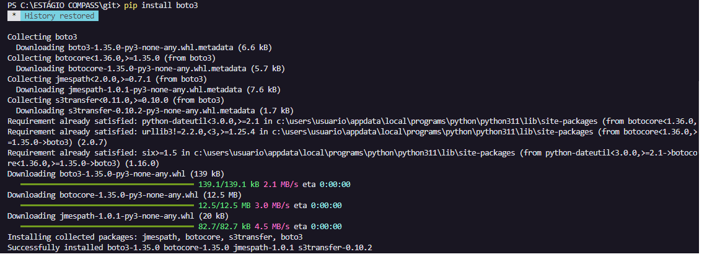
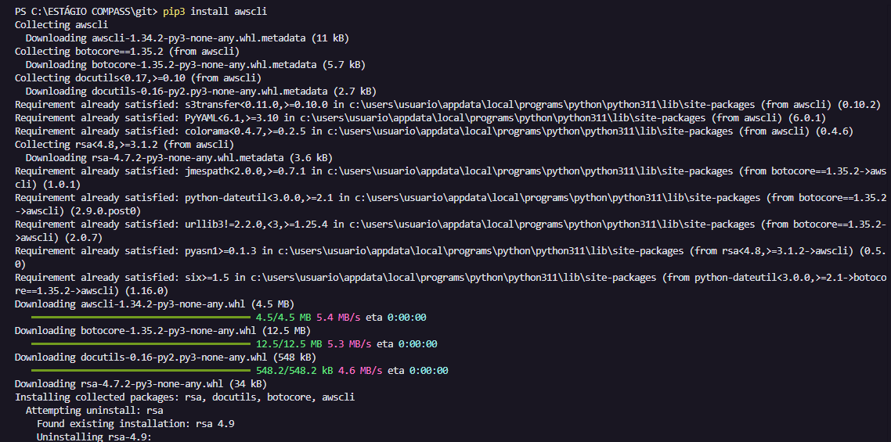
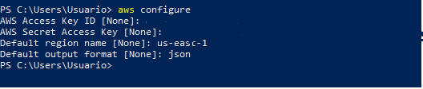
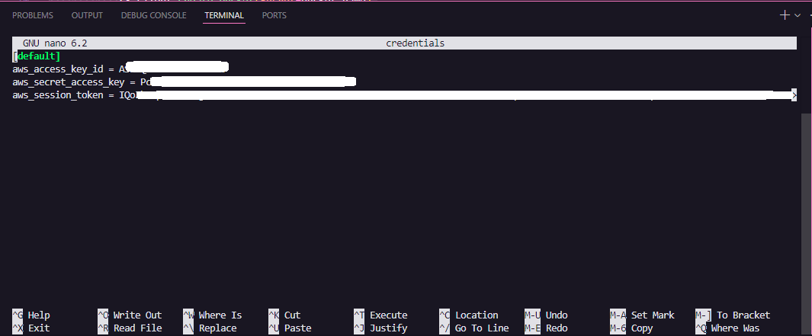
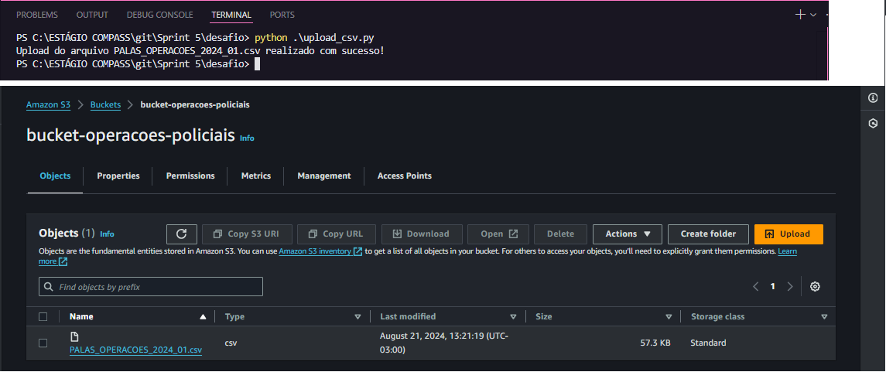

# 📚 Evidências da Sprint 5
Este diretório contém as evidências da sprint 5. Aqui você encontrará prints comprovando a execução correta dos exercícios e do desafio, explicações da resolução de cada um deles e muito mais. As seções abaixo te direcionarão para aquilo que desejas encontrar.

## 1. Instalação de dependências
- Boto3 e awscli
    - [Imagem boto3](1_boto3_install.png)

    

- [Imagem awscli](2_install_awscli.png)

    

## 2. Configuração Credenciais AWS
Primeiro: tentei fazer pelo comando `aws configure`, porém não tive sucesso, faltava o token.
- [Imagem](3_config_aws.png)

    

Posteriormente, necessitei alterar o arquivo credentials no interior do diretório .aws conforme a imagem abaixo:
- [Imagem](config_credentials.png)

    

## 3. Upload do arquivo
Pode-se perceber a conclusão do upload do arquivo e a criação do Bucket na imagem abaixo:
- [Imagem](4_upload_concluido.png)

    

## 4. Primeiros códigos desenvolvidos
Conforme citado no [README](../desafio/README.md) do desafio, primeiramente desenvolvi o código em três partes, sendo a primeira a criação do Bucket, depois o tratamento e upload do arquivo e por fim a consulta. Eles podem ser observados seguindo os links:
- [Criação Bucket](criar_bucket.py)
- [Tratamento e Upload do Arquivo](upload_csv.py)
- [Consulta](main.py)

## 5. Query
A query foi inserida, conforme requerido no enunciado do desafio, num arquivo SQL. Pode-se verificar no link abaixo a query desenvolvida.
- [Query](query.sql)

## 6. Código final
O código final consiste em uma junção dos três citados no item 4 acima. Primeiramente verifica se o Bucket desejado já existe e, em caso negativo, cria. Posteriormente faz a mesma verificação do arquivo dentro do Bucket, fazendo upload em caso negativo. Por fim, após criado o Bucket e com o arquivo já no S3, a consulta é realizada, retornando o resultado para o usuário.

A implementação do código pode ser observada nas seguintes evidências:
1. [Bibliotecas](COD1_bibliotecas.png)
2. [Chamada da função de criação do Bucket](COD2_criacao_bucket.png)
3. [Criação e verificação Bucket](COD3_criacao_verificacao_bucket.png)
4. [Correção dos Dados](COD4_correcoes_dados.png)
5. [Upload](COD5_upload_arquivo.png)
6. [Leitura do arquivo sql e chamada da função query](COD6_consulta_1.png)
7. [Consulta](COD7_consulta_2.png)

## 7. Resultados
A primeira execução do código possui um resultado diferente das execuções seguintes, conforme pode-se perceber nas imagens dos links abaixo.
- [1ª execução](COD8_primeira_execucao.png)
- [Outras execuções](COD9_outras_execucoes.png)

> Demais informações a respeito da realização do desafio podem ser encontradas no README.md do diretório do desafio da Sprint.

___
### ↩️ [Retornar ao início](../../README.md)