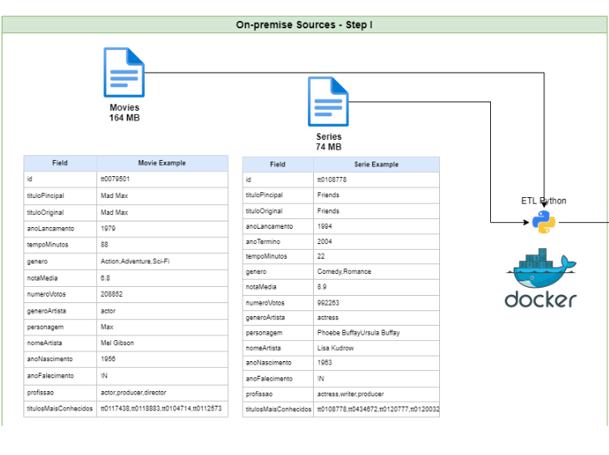
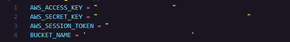
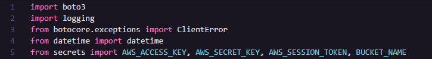
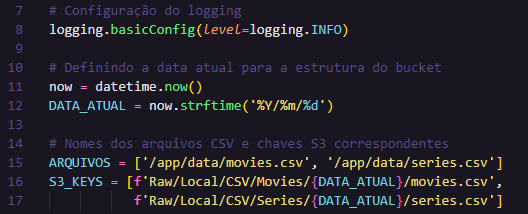
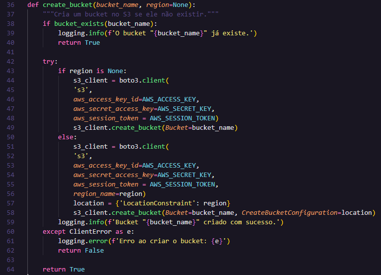
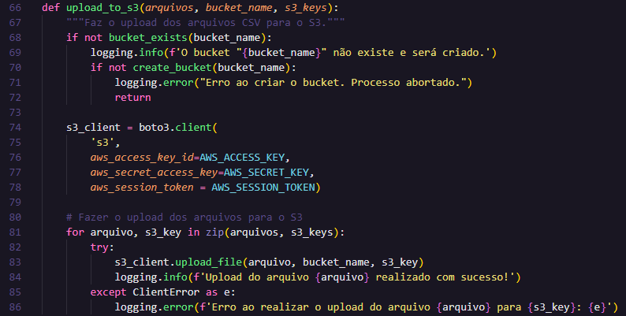
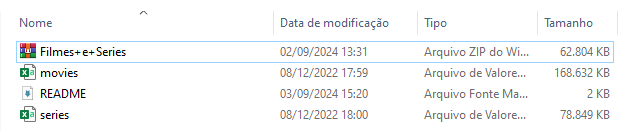
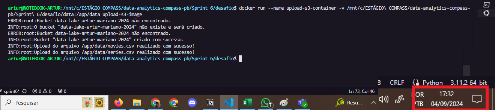
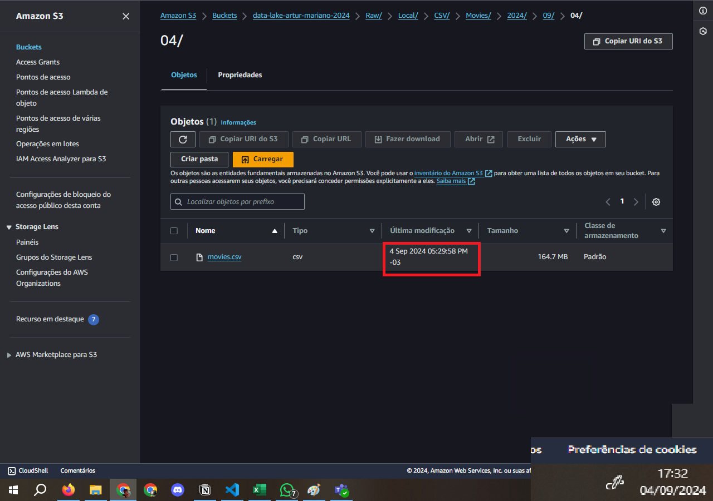
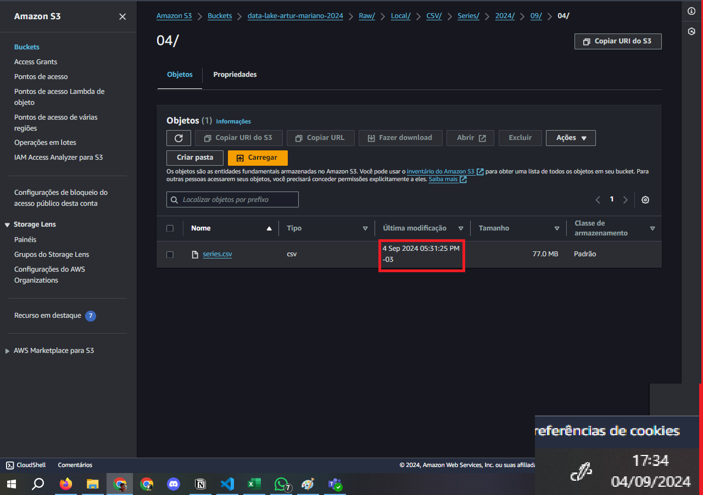

# 🧩 Desafio da Sprint 6
Este diretório contém os arquivos necessários para a realização do desafio desta Sprint.

---

## Questões para Análise 
1. Como foram os primeiros filmes de Christopher Nolan em comparação aos filmes da época do mesmo gênero (receita, bilheteria, avaliações)?	
	- A exemplo de Memento (2000), filme do gênero crime.
2. Qual foi o impacto da trilogia Batman em elevar o padrão de adaptações de quadrinhos, especialmente no uso de temas complexos como crime organizado?
3. Como a abordagem de Christopher Nolan na apresentação de temas científicos e o uso extensivo de efeitos visuais em Interstellar (2014) e Inception (2010) impactaram a popularidade e a recepção crítica desses filmes
4. Como o desempenho de Dunkirk (2017) em termos de avaliações críticas e do público se compara com outros filmes de guerra e com os outros trabalhos de Christopher Nolan, considerando a mudança de gênero para um filme de guerra?
5. Quais foram os principais marcos que consolidaram Christopher Nolan como um dos diretores mais influentes do cinema mundial?

---

## 📝 Enunciado
O desafio da Sprint 6 consiste na primeira entrega do desafio final, o qual terá cinco (5) sprints de duração (da 6ª até a 10ª).

Nesta sprint, devemos realizar a ingestão *batch* (em lote) dos arquivos CSV em um Bucket Amazon S3 RAW Zone.

Devemos desenvolver um código Python que será executado dentro de um container Docker para carregar os dados locais para a nuvem. Será amplamente utilizada a biblioteca `boto3` para a realização dessa etapa do desafio.

A imagem abaixo ilustra o que será realizado nessa primeira etapa do desafio.

1. O código Python deve:
- **Ler** os dois (filmes e séries) no formato CSV **sem filtrar os dados**.
- Utilizar a lib **`boto3`** para **carregar os dados para a AWS**.
- Acessar a AWS e **gravar no S3**, no **bucket definido com RAW Zone**.
    - Na gravação dos dados, deve-se considerar o padrão: `<nome-do-bucket>\<camada-de-armazenamento>\<origem-dado>\<formato-do-dado>\<especificação-do-dado>\<data-do-processamento ano\mes\dia>\<arquivo>`.
        - Exemplo: `S3:\\data-lake\Raw\Local\CSV\Movies\2024\09\03\movies.csv` & `S3:\\data-lake\Raw\Local\CSV\Series\2024\09\03\series.csv`

2. Criar container Docker com um volume para armazenar os arquivos CSV e executar processo Python implementado.
3. Executar localmente o container Docker para realizar a carga dos dados ao S3.

## Resolução

### Etapa 0 - *download* dos recursos
Fiz o *download* do arquivo compactado **"Filmes e Series.zip"** e descompactei os arquivos. Dentro do diretório havia dois arquivos CSV, um relacionado a filmes e outro a séries. 

Além disso, criei um diretório dentro de desafio (data) contendo os dois arquivos CSV.

### Etapa 1 - código Python
- Para desenvolver o código Python com boto3, aproveitei o script da Sprint anterior (5) como base, ajustando para a aplicação necessária para a atual sprint.
- Uma mudança que optei por realizar foi a inserção das credenciais em código Python **secrets.py**, pois assisti a alguns vídeos e foi recomendado adotar essa prática, visando a reutilização (modificando as credenciais no arquivo) e à ocultação ao compartilhar o script principal.
    - Anteriormente, eu havia alterado o arquivo *credentials* no diretório *.aws*, o que também é sugerido na documentação do boto3.
- Outra mudança foi na exclusão dos trechos de código responsáveis pelo tratamento dos dados, haja vista que esta etapa do desafio não necessita de tratamentos, apenas pede o upload dos dados *raw*.

**ESTRUTURA DO CÓDIGO**
1. ***Imports***
    - `boto3`: biblioteca Python para interação com a AWS. Serve para interagirmos com o S3.
    - `logging`: biblioteca padrão para gerar mensagens de log. Utilizada nos exemplos da documentação do `boto3`, por isso optei por também utilizá-la.
    - `botocore.exceptions.ClientError`: o módulo *exceptions* faz parte da biblioteca *botocore*. O ClientError serve para lançar exceções ao ocorrer um erro ao tentar realizar operações em serviços da AWS.
    - `datetime`: biblioteca padrão do Python para trabalhar com datas e horas. No meu código, serve para buscarmos a data atual e utilizar na estrutura de diretórios após o upload.
    - `secrets`: código Python que possui as credenciais e o nome do bucket do arquivo **secrets.py**.
    
    
    
    A imagem acima ilustra o arquivo **secrets.py**, o qual possuiu as credenciais e o nome do bucket. Basta inserir no local as suas credenciais para poder fazer o acesso à AWS. Vale ressaltar que incluí esse arquivo no .gitignore do projeto, por isso ele não se encontra no repositório.

2. **Inicialização de variáveis**
    - **Configuração de *logging*:** configura por meio da função basicConfig, a qual define que o nível de log será INFO, ou seja, todas as mensagens com nível INFO ou superior (INFO, WARNING, ERROR, CRITICAL) serão registradas.
    - **Hora atual:** primeiramente, por meio da biblioteca `datetime`, busca-se a data atual do sistema, passando na linha a seguir a formatação desejada (ano/mês/dia). 
    - **Definição dos caminhos dos arquivos:** o caminho de cada arquivo consiste na estrutura de diretórios de dentro do container, após a criação do volume. 
    - **Chaves S3:** consiste na estrutura de diretórios (caminho) que será criada após upload ao S3.

3. **Método `bucket_exists(bucket_name)`**
    - Método que verifica se o bucket desejado já existe no S3.
    - **Parâmetro(s):** nome do bucket.
    - **Etapas:**
        - Cria um cliente para interagir com o serviço passando as credenciais.
        - Tenta encontrar o bucket desejado (`head_bucket(Bucket=bucket_name)`)
            - Retorna *true* se encontrar.
            - Se o retorno for **404**, não encontrou => apresenta `logging.error`.
        - Além disso, foram inseridos tratamentos para eventuais erros.

4. **Método `create_bucket(bucket_name, region=None)`**
    - Método responsável pela criação do bucket.
    - **Parâmetro(s):** nome do bucket e região (*None* indica que será a região padrão - North Virginia).
    - **Etapas:**
        - Primeiramente, chama o método supracitado (`bucket_exists`), verificando se o bucket já existe. Se existir, não faz nada e retorna *True*.
        - Se o bucket não existir, ela tenta criá-lo:
            - Se nenhuma região for especificada, o bucket é criado com as configurações padrão.
            - Se uma região for fornecida, o bucket é criado nessa região específica.
        - O sucesso ou falha na criação é registrado no log.
        - Em caso de erro, a função retorna *False*. Caso contrário, retorna *True* se o bucket for criado com sucesso.
    

5. **Método `upload_to_s3(arquivos, bucket_name, s3_keys)`**
    - Método que faz o upload dos arquivos para o S3, além de chamar a função de criar o bucket antes disso.
    - **Parâmetro(s):** caminhos dos arquivos, nome do bucket, chaves do S3 (caminho para o upload no S3).
    - **Etapas:**
        - Verifica se o bucket existe, e o cria se necessário.
        - Itera sobre os arquivos e suas chaves S3 correspondentes, realizando o upload de cada arquivo.
        - Em caso de sucesso, registra uma mensagem de confirmação; em caso de falha, registra o erro no log.

6. Chamada da função `upload_to_s3()`

> OBS.: primeiramente executei o script via terminal, na minha máquina para assegurar o funcionamento pleno. Posteriormente, iniciei o desenvolvimento da imagem Docker.

### Etapa 2 - criação de Dockerfile
1. `FROM python:3.9-slim`
    - Este comando especifica a imagem base para o container.
    - `python:3.9-slim` é uma versão mínima da imagem Python, contendo o Python 3.9 e somente as bibliotecas essenciais.
    - A versão "slim" é leve e otimizada, o que resulta em uma imagem Docker menor e mais eficiente.

2. `WORKDIR /app`
    - Define o diretório de trabalho dentro do container.
    - Todas as operações a partir daqui (como copiar arquivos, executar comandos, etc.) acontecerão no diretório /app.
    - Se o diretório /app não existir, ele será automaticamente criado.

3. `COPY requirements.txt .`
    - Comando que copia o arquivo [requirements.txt](requirements.txt) da máquina local para o diretório de trabalho do container (/app).
    - O arquivo requirements.txt contém uma lista de dependências Python que o projeto utiliza - no caso, somente o **boto3**.

4. `RUN pip install --no-cache-dir -r requirements.txt`
    - Instala as dependências listadas no arquivo requirements.txt usando o pip (gerenciador de pacotes Python).
    - **Argumento `--no-cache-dir`**: garante que o pip não armazene em cache os pacotes instalados, o que reduz o tamanho final da imagem Docker.
    - Comando executado em tempo de *build* da imagem - as dependências são instaladas apenas uma vez. Ficam disponíveis quando o container é executado.

5. `COPY script.py .`
    - Comando que copia o arquivo [script.py](script.py) da máquina local para o container no diretório /app.

6. `COPY secrets.py .`
    - Similar ao comando anterior, copia o arquivo **secrets.py** para o diretório de trabalho /app dentro do container.

7. `CMD ["python", "script.py"]`
    - Define o **comando padrão** que será executado **quando o container iniciar**.
    - Neste caso, o container vai rodar o script.py com o Python.

### Etapa 3 - execução local do container Docker
- **Build da imagem: `docker build -t <nome-imagem> .`**
    - Construção da imagem Docker a partir do Dockerfile supracitado.
    - `-t <nome-imagem>`: a flag -t permite dar um nome à imagem que está sendo construída. O nome facilitará a referência à imagem posteriormente, ao invés de usar o ID gerado automaticamente.
    - O ponto (.) especifica o contexto de build, ou seja, o diretório onde o Docker vai procurar pelo Dockerfile e outros arquivos necessários para a construção da imagem. Nesse caso, o ponto indica o diretório atual.

- **Executar o container: `docker run --name <nome-container> -v <caminho-maquina-local>:<caminho-container> <nome-imagem>`**
    - Comando utilizado para executar um container a partir de uma imagem Docker.
    - `--name <nome-container>`: A opção --name permite especificar um nome para o container. Isso também facilitará a manipulação do container para parar, reiniciar, ou acessar ele.
    - `-v <caminho-maquina-local>:<caminho-container>`: A opção -v é usada para montar um volume, ou seja, fazer um mapeamento entre um diretório na máquina local e um diretório dentro do container.
        - `<caminho-maquina-local>`: O caminho no sistema de arquivos da sua máquina local que você deseja compartilhar com o container.
        - `<caminho-container>`: O caminho dentro do container onde o diretório da máquina local será acessível.
        - Isso permite o compartilhamento de arquivos entre o host (máquina local) e o container. Se forem modificados os arquivos na máquina local, as mudanças aparecerão automaticamente no container e vice-versa. 
    - `<nome-imagem>`: Esse é o nome da imagem Docker que você deseja usar para criar o container. O Docker vai iniciar um container a partir dessa imagem.

### Etapa 4 - execução e provas
### 1. *Download* dos recursos
- Nessa etapa, fiz o download dos recursos da Udemy e descompactei os arquivos.

- Vale ressaltar que criei um diretório dentro de "desafio" chamado data, o qual possui os arquivos de filmes e séries.
- Após, desenvolvi o [script](script.py) conforme explicitado acima.

### 2. execução local do container Docker
- **Build da imagem: `docker build -t <nome-imagem> .`**

- **Executar o container**
    - Para a execução do container, eu estava tendo alguns problemas para copiar os arquivos para o volume Docker. Para isso, fiz um teste executanto o container de forma interativa, abrindo o terminal do mesmo para ver os diretórios.
        - `docker run -it -v <caminho-maquina-local>:<caminho-container> <nome-imagem> bash`

    

    - Os problemas que eu estava tendo consiste na estrutura de diretórios até os arquivos movies.csv e series.csv, pois o Docker tem dificuldade de entender letras maiúsculas, espaços em branco e caracteres especiais. 
    - Para resolver isso, tive de alterar a escrita do caminho inserindo **'\'** antes dos espaços para ele entender (a imagem acima comprova isso).

    - Após assegurar-me de que os arquivos estavam dentro do volume Docker, poderia dar prosseguimento ao desafio.

    - Com isso feito, bastou executar o docker com o seguinte comando: 
    `docker run --name <nome-container> -v <caminho-maquina-local>:<caminho-container> <nome-imagem>`

    

    Para verificar se ocorreu tudo certo, verifiquei na AWS:

    
    A imagem acima possui o arquivo de filmes com o caminho completo podendo ser visto no superior dela.

    
    A imagem acima possui o arquivo de séries com o caminho completo podendo ser visto no superior dela.

> Marquei os horários na tentativa de adicionar veracidade às operações realizadas. Isso também será evidenciado no vídeo, mas considerei uma boa estratégia para deixar claro o sucesso da execução.

___

### ↩️ [Retornar ao início](../../README.md)