# 📚 Evidências da Sprint 6
Este diretório contém as evidências da sprint 6. Aqui você encontrará prints comprovando a execução correta dos exercícios e do desafio, explicações da resolução de cada um deles e muito mais. As seções abaixo te direcionarão para aquilo que desejas encontrar.

## Exercícios
### Exercício 1: Lab AWS S3

**ETAPA 1: Criar um *bucket***
- Conforme pedido pelo exercício, criei o *bucket*. A imagem abaixo contém a evidência da criação dele.

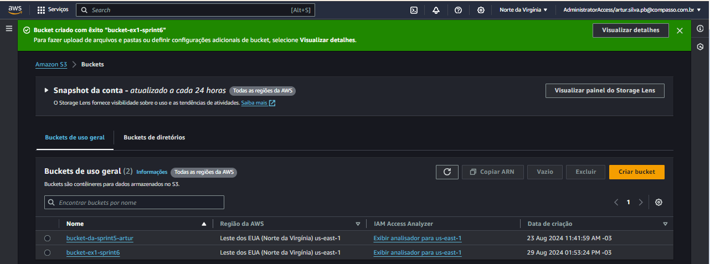

**ETAPA 2: Habilitar hospedagem de site estático**
- Primeiramente, realizei a criação conforme o enunciado sugeriu, com os nomes e as opções necessárias corretas. A imagem abaixo evidencia isso:

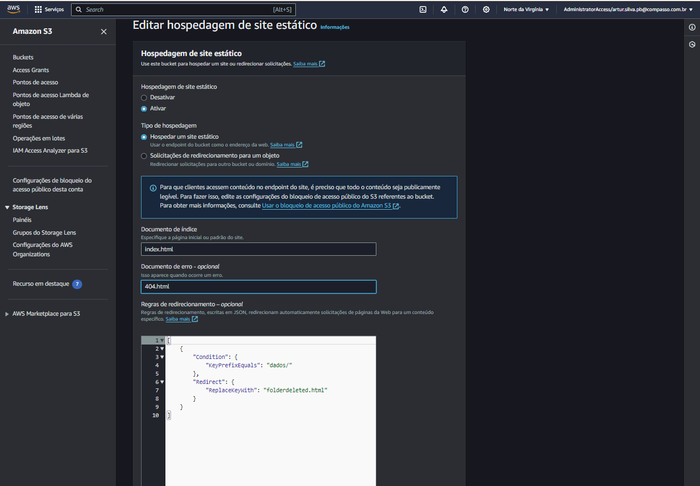

- Por fim, realizei um teste copiando o link e buscando na barra de navegação.

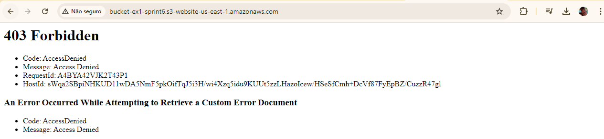

**ETAPA 3: Editar as configurações do bloqueio de acesso público**
- Para modificar o acesso ao S3 via o site estático habilitado, basta modificar as permissões, conforme a imagem abaixo.

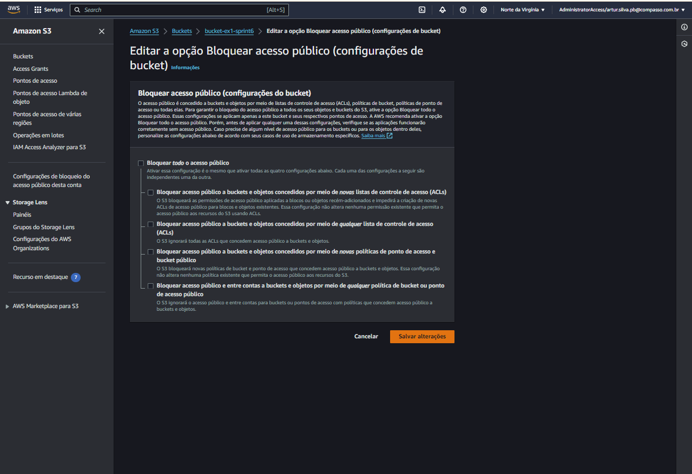

**ETAPA 4: Adicionar política de *bucket* que torna o conteúdo do *bucket* publicamente disponível**
- Primeiramente necessitamos ir na aba Permissões -> Política de Bucket -> Editor de política de Bucket. Tudo isso foi realizado e evidencia-se pela imagem abaixo.

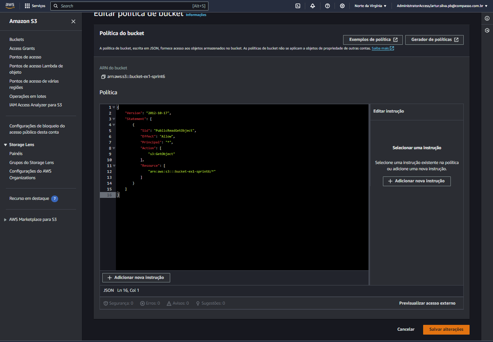

**ETAPA 5: Configurar um documento de índice**
- O arquivo de índice criado deve direcionar para o arquivo CSV do S3, para que seja possível fazer o download. Além disso, os arquivos fornecidos devem ser carregados para o Bucket. Isso pode ser percebido nas imagens abaixo.

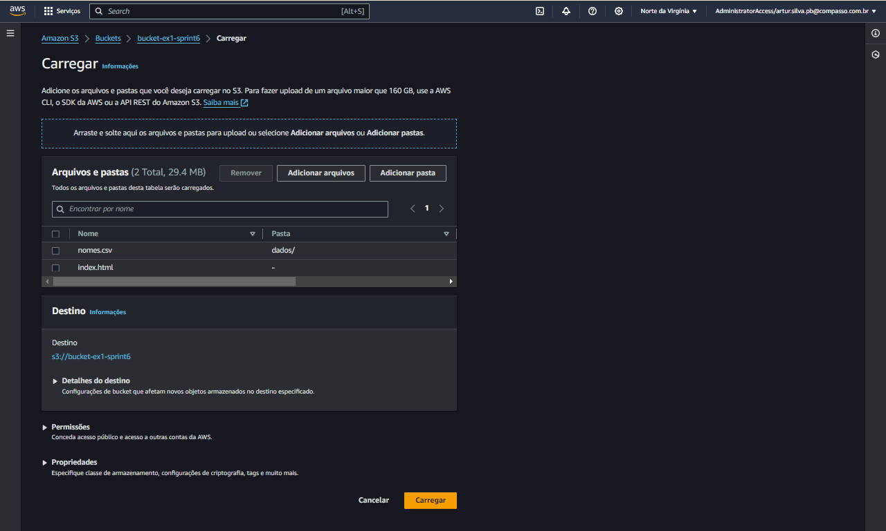

**ETAPA 6: Configurar documento de erros**
- Essa etapa consiste no upload de um arquivo (404.html) para receber os eventuais erros.

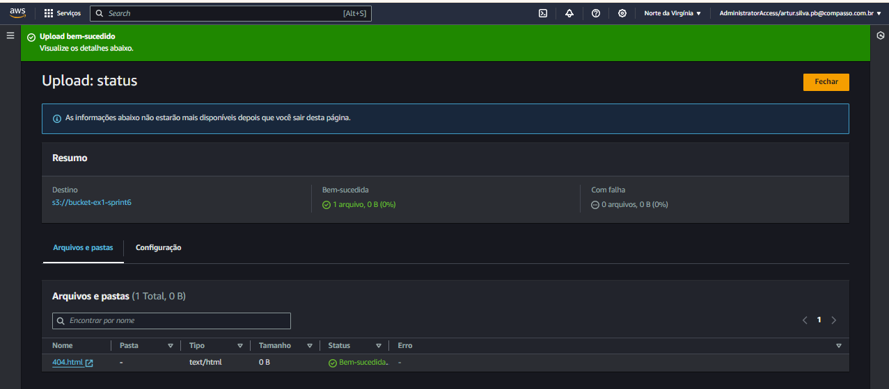

**ETAPA 7: Testar o *endpoint* do site**
- A última etapa do exercício consiste no teste do endpoint, tendo que mostrar o conteúdo do documento de índices e também permitir o download do arquivo CSV.

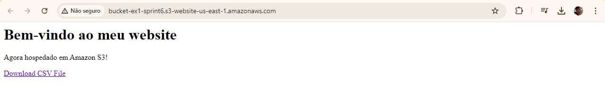

### Exercício 2: Lab AWS Athena

**ETAPA 1: Configurar Athena**
- Primeiramente, o arquivo nomes.csv já estava no *bucket* criado no primeiro exercício, portanto pulei esse item do exercício.
- Com isso, criei a pasta queries dentro do *bucket*, conforme imagem abaixo.

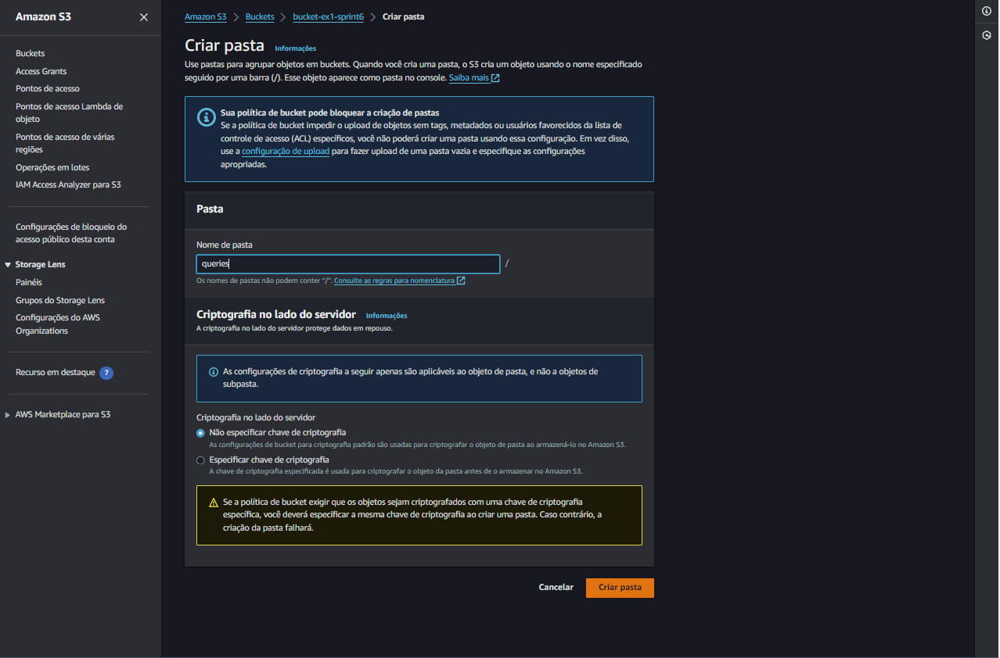

- Por conseguinte, realizei a configuração do query editor para acessar o S3.

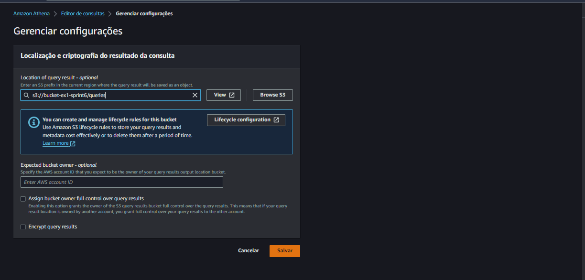

**ETAPA 2: Criar um banco de dados**
- Por meio do comando `CREATE DATABASE meubanco`, criei o banco de dados conforme requerido na etapa do exercício.
    - [Arquivo criação database](../exercicios/2_lab_athena/criar_banco_dados.sql)

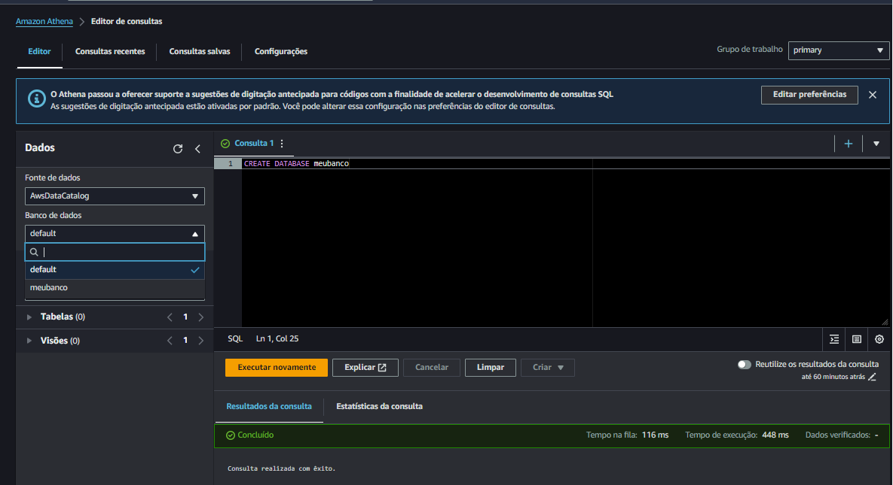

**ETAPA 3: Criar uma tabela**
- Conforme o comando fornecido pelo exercício, criei a tabela necessária. Foi necessário ajustar os campos conforme visualização prévia no arquivo nomes.csv.
    - [Arquivo criação tabela](../exercicios/2_lab_athena/criar_tabela.sql)

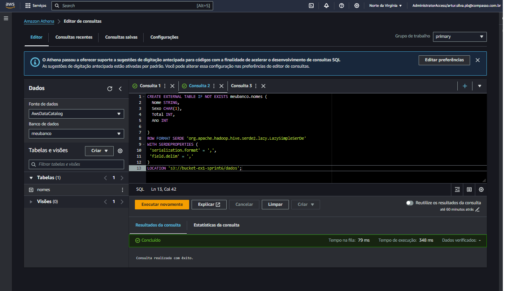

- Por conseguinte, a primeira consulta pedia para realizar a consulta: `select nome from meubanco.nomes where ano = 1999 order by total limit 15;`. Pode-se ver o resultado obtido na imagem a seguir:
    - [Arquivo consulta](../exercicios/2_lab_athena/consulta1.sql)

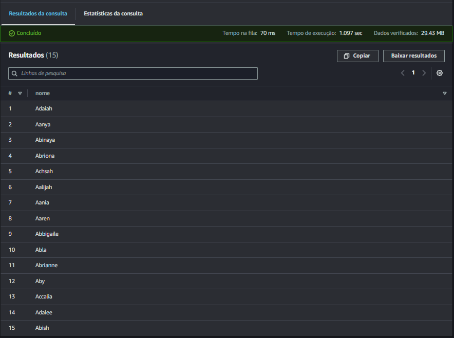

- O último item dessa etapa requeriu a criação de uma consulta que listasse os **3 nomes mais usados em cada década desde 1950 até hoje**.

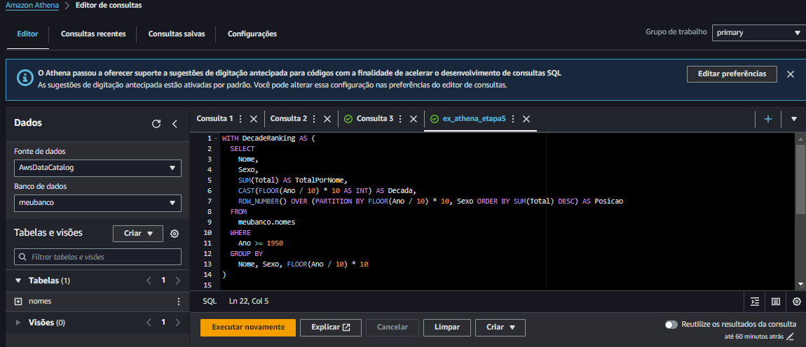

- **Arquivo:** [ver](../exercicios/2_lab_athena/consulta2.sql)
- **Explicação:**
    - A consulta que desenvolvi utiliza a função `PARTITION` dentro de `ROW_NUMBER() OVER` para dividir os dados em grupos com base na década e no sexo, o que permite calcular a posição de cada nome por quantidade dentro desses grupos. 
    - O cálculo da década é realizado pela expressão `CAST(FLOOR(Ano / 10) * 10 AS INT)`, onde `Ano / 10` reduz o ano a uma escala de décadas, `FLOOR` arredonda para baixo para o início da década, e o resultado é multiplicado por 10 para formar o valor da década (por exemplo, 1950, 1960, etc.). 
    - A função `ARRAY_AGG` agrupa todos os nomes que atendem a uma condição específica (como os três nomes mais comuns por sexo e década) em um *array*, que é então transformado em uma string única usando `ARRAY_JOIN`, com os nomes separados por vírgulas. Isso permite que os três nomes mais comuns de cada sexo para cada década sejam concatenados em uma única string para visualização compacta.

### Exercício 3: Lab AWS Lambda
**ETAPA 1: Criar a função do Lambda**

- Aqui, necessitei escolher outra versão do Python, haja vista que a versão 3.7 (recomendada no enunciado) não se encontra mais disponível na AWS.
- Selecionei a **versão 3.11**, pois encontrei diversos materiais a recomendando na Internet, e outros colegas também optaram por essa versão, tendo mais garantias de sucesso.

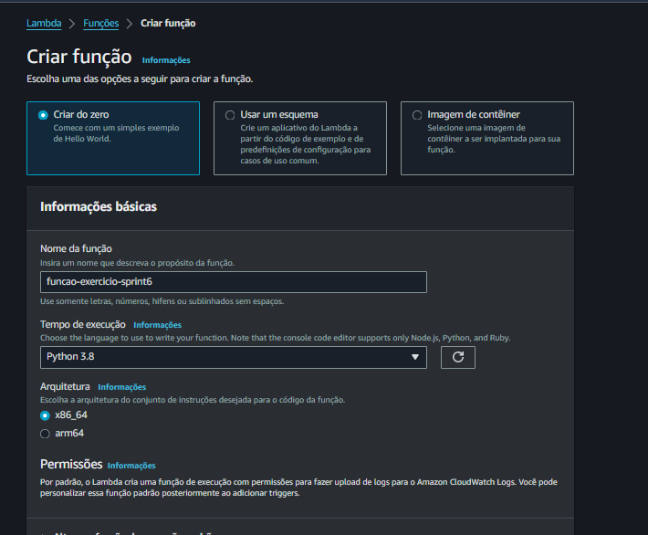

**ETAPA 2: Construção do código**
- O código nos foi fornecido pelo enunciado, o qual deveria ser testado e retornar um erro na importação da biblioteca `pandas`. A imagem abaixo confirma o comportamento esperado:

**ETAPA 3: Criar uma *layer***
- Na imagem abaixo, pode-se perceber que algumas alterações foram feitas em comparação ao arquivo fornecido no enunciado da questão. A imagem Amazon Linux teve de ser alterada para a versão 2023, e a versão do Python para 3.11.
    - [Arquivo Dockerfile](../exercicios/3_lambda/Dockerfile)

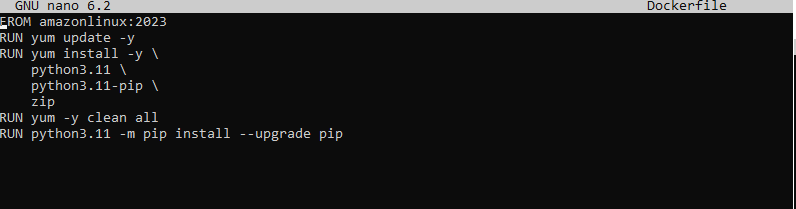

- Para o *build* da imagem do Docker, apenas modifiquei o nome sugerido pelo exercício, modificando o "37" por "311".

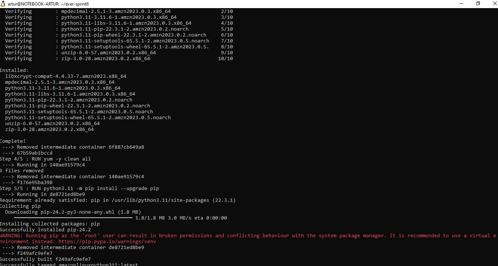

- Execução:

- Após, foi necessário copiar o zip do Container para a máquina local, conforme a imagem abaixo:

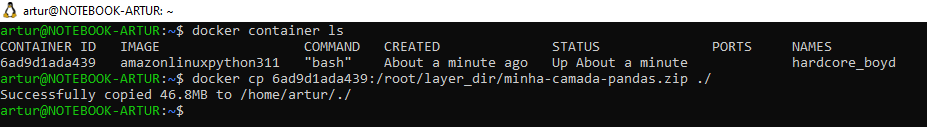

- Em seguida, realizei o upload para um Bucket S3 (o mesmo criado no exercício 1), haja vista que é recomendação realizar upload para o S3 primeiramente caso a camada possua mais de 10 MB, no caso possui 44.6 MB. Vale ressaltar que criei um diretório "libs/" para inserir o zip dentro.

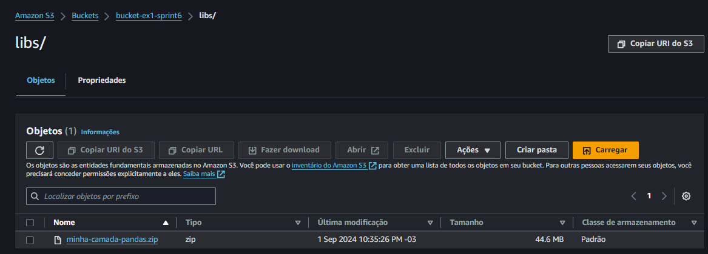

- Agora, devemos criar a camada no Lambda. Nomeei como *PandasLayer* e inseri o caminho para o Amazon S3, as arquiteturas compatíveis (x86_64) e o tempo de execução compatível (Python 3.11).

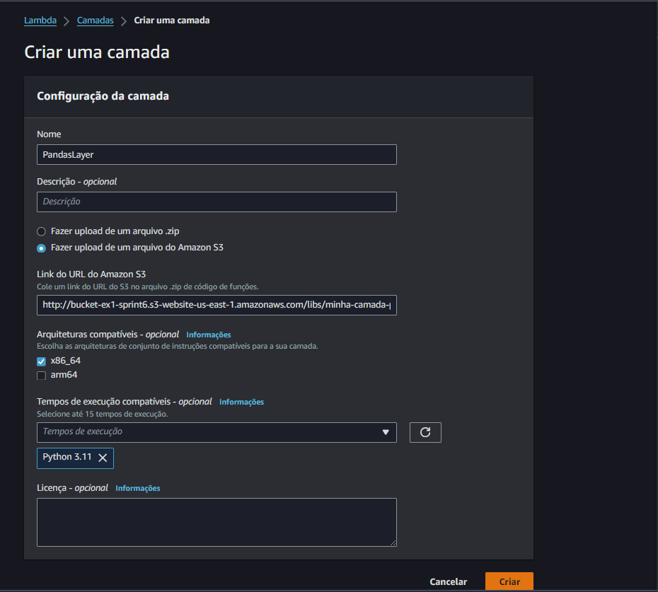

**ETAPA 4: Utilizando a *layer***
- Primeiramente, o teste retornou um erro: *Task timed out after 3.12 seconds ...*, conforme imagem abaixo.

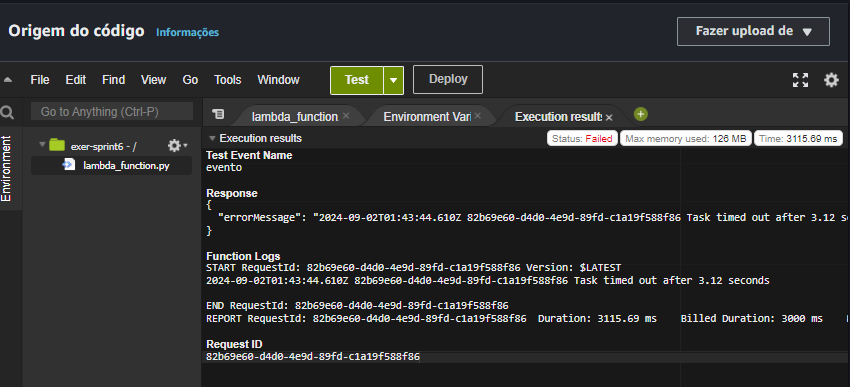

- Com isso, necessitei modificar uma configuração da função, aumentando a memória para 256 MB (era 128 MB) e o tempo de execução para 15 segundos (era 3 segundos). Vale ressaltar que o exercício indicou que essas modificações possivelmente seriam necessárias.

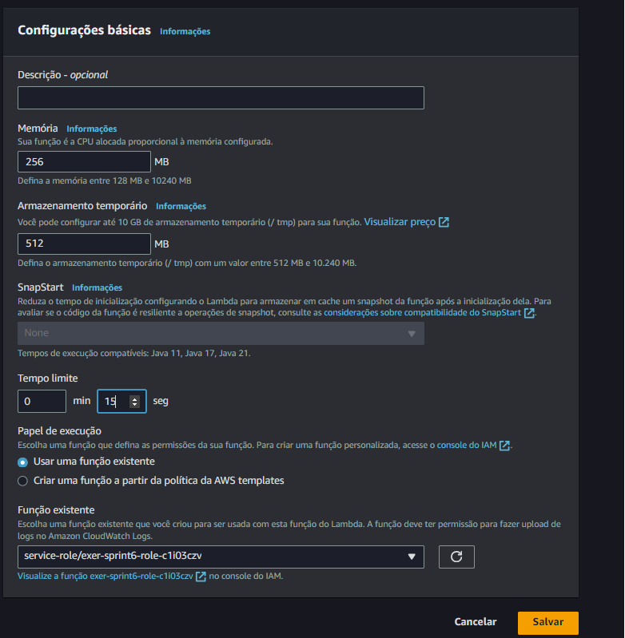

- Por fim, a execução do código retornou sucesso. Isso pode ser percebido na imagem abaixo.

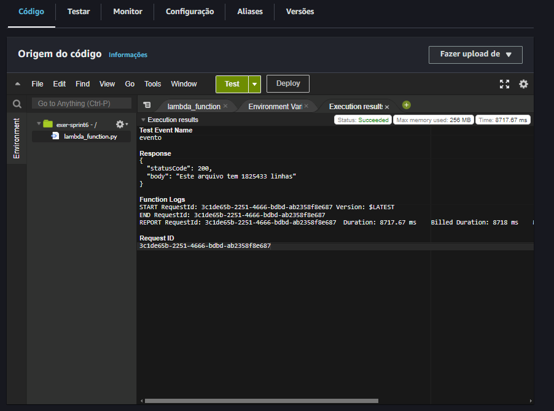

### Exercício 4: Limpeza de recursos

- Excluí a tabela "nomes" que havia criado.

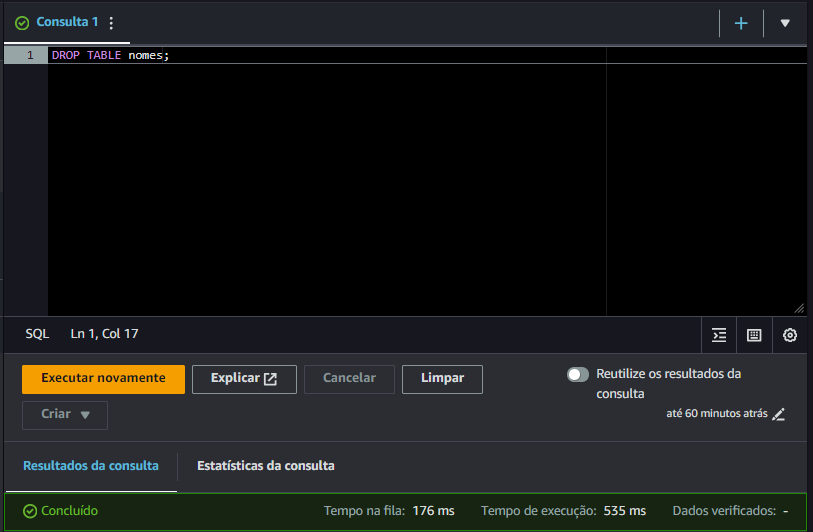

- Em seguida, pude excluir meu database "meubanco".

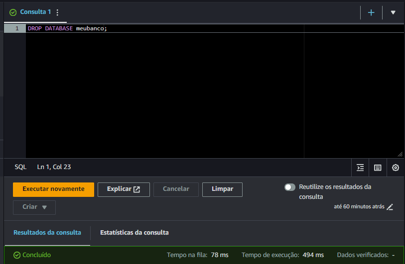

- Posteriormente, verifiquei se o diretório "queries" no S3 ainda possuía alguma query para excluir.

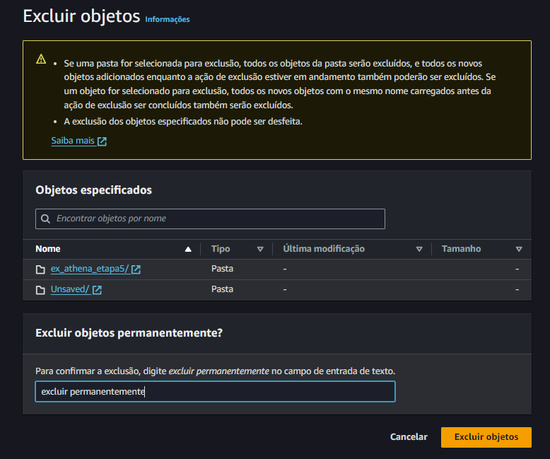

- Por fim, excluí todos os arquivos que estavam no S3.

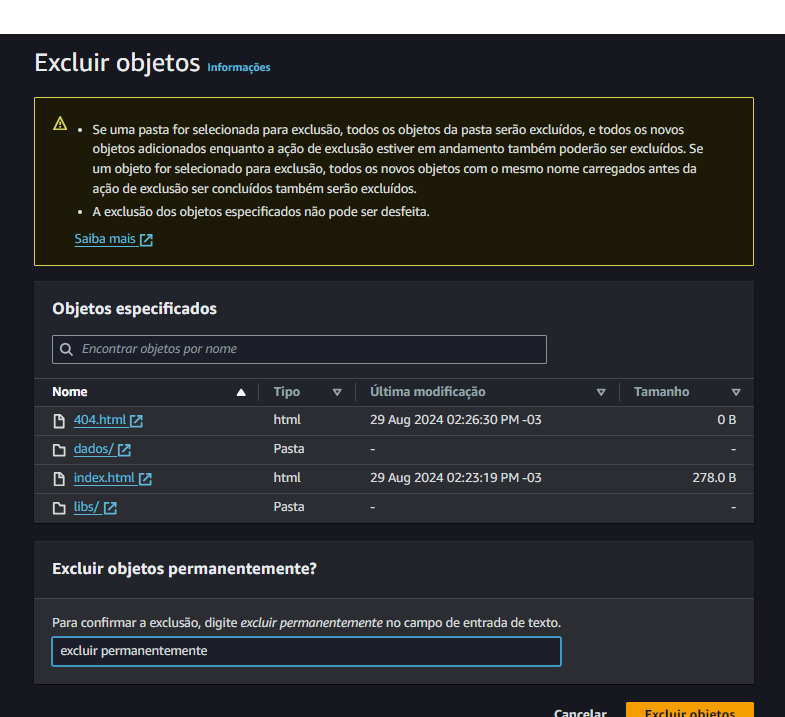

___
### ↩️ [Retornar ao início](../../README.md)