# 🧩 Desafio da Sprint 7
Este diretório contém os arquivos necessários para a realização do desafio desta Sprint.

---

## 📝 Enunciado
O desafio da Sprint 7 é uma continuação do desafio iniciado na Sprint anterior a esta (6), sendo a segunda entrega do desafio final.

Nesta Sprint, devemos realizar a ingestão de API, isto é, capturar dados do TMDB a fim de complementar os dados carregados na Sprint anterior.

Esse processo de ingestão deve ser realizado via AWS Lambda, o qual deve realizar chamadas de API. Por conseguinte, os dados coletados devem ser persistidos em Amazon S3, camada RAW Zone, mantendo o formato da origem (JSON) e agrupando-os em arquivos com, no máximo, 100 registros cada arquivo.

Caso desejemos, podem ser utilizadas outras APIs de nossa escolha. 

### :warning: Informações importantes
- Os arquivos CSV carregados na Etapa 1 não devem ser modificados em nenhuma etapa do desafio.
- Os novos dados devem ser complementares aos dados do CSV.
- Não é necessário realizar o tratamento dos dados externos, o máximo que pode ser feito é o agrupamento de dados para gerar menor quantidade de arquivos JSON.
- Cuidado para os arquivos JSON gerados não serem maiores do que 10 MB.
- Não agrupar JSON com estruturas diferentes.
- Os IDs do IMDB presentes nos arquivos CSV podem ser utilizados em pesquisas do TMDB.
- Considere desenvolver seu código localmente primeiro e com poucos dados para depois levá-lo para a AWS Lambda.

Realizar as seguintes atividades:
1. Se necessário criar nova camada (*layer*) no AWS Lambda para as libs necessárias à ingestão de dados (por exemplo, *tmdbv3api*, se utilizar o TMDB).
2. Implementar o código Python em AWS Lambda para consumo de dados do TMDB.
3. Se está utilizando TMDB, buscar pela API os dados que complementem a análise. Se achar importante, agrupar os retornos da API em arquivos JSON com, no máximo, 100 registros cada.
4. Utilizar a lib `boto3` para gravar dados no AWS S3.
    - No momento da gravação dos dados deve-se considerar o padrão de *path*: `S3:\\data-lake-do-fulano\Raw\TMDB\JSON\ano\mes\dia\arquivo.json`.

## Resolução
### Novas questões para análise
Primeiramente, em conversas com o monitor da Sprint, optei por modificar as questões de análise por mim escolhidas na Sprint 6. Percebi que havia levantado muitas informações e desejava contar sobre vários filmes de Christopher Nolan, ao invés de focar em menos elementos do diretor, podendo realizar uma análise mais aprofundada.

Além disso, estudei sobre a carreira de Christopher Nolan, percebendo que ele teve filmes que marcaram a história do cinema e elevaram o nível do diretor, sendo notado inclusive pela Warner, com a qual desenvolveu vários filmes marcantes.

Com isso, minha questão de análise atual são:

1. Quais foram os principais marcos que consolidaram Christopher Nolan como um dos diretores mais influentes do cinema mundial? 
    - Fiz uma pesquisa prévia e percebi que entre Following e Amnésia representou um marco - Nolan foi notado por um estúdio Hollywoodiano, recebendo 9 milhões de dólares de recursos, sendo nomeado para o Oscar.

2. Média de bilheteria de todos os filmes do ano 2000 e comparar com Memento (Amnésia) - primeiro filme de sucesso de Nolan.
    - Posteriormente, a Warner Bros notou Nolan e ofereceu a trilogia Batman. O diretor teve interesse e teve muito sucesso na releitura dos quadrinhos.

3. Avaliação média de filmes de heróis em comparação à média dos filmes do Batman de Nolan.
    - Comparar orçamento entre os filmes.

4. Para colocar suas ideias em prática, Nolan precisa de orçamentos maiores do que outros filmes similares?

**BUSCAR NA API**
1. Todos os filmes de Christopher Nolan
2. Todos os filmes das décadas de 2000-2010 e 2010-2020.
3. Todos os filmes em que Heath Ledger atuou.

### Passo a passo
1. **Realização de um script local**
Primeiramente, conforme foi sugerido pelo enunciado do desafio, desenvolvi um script local, fazendo requisições com poucos dados para testar a interação com a API do TMDB.

**a. BIBLIOTECAS NECESSÁRIAS**
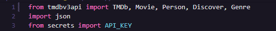
- **`tmdbv3api`:** biblioteca que permite a interação com a API do The Movie Database (TMDb). Facilita a busca de informações sobre filmes, séries e pessoas relacionadas ao cinema.
    - TMDb: Classe principal que configura a API key e outras informações como idioma e região.
    - Movie: Classe usada para buscar dados sobre filmes, como informações detalhadas, classificações e imagens.
    - Person: Classe usada para obter informações sobre pessoas relacionadas a filmes, como diretores, atores e produtores.
    - Discover: Classe que permite buscar filmes com base em critérios específicos, como ano, gênero ou popularidade.
    - Genre: Classe que fornece uma lista de gêneros e permite buscar filmes ou séries baseados em gêneros.
- **`json`:** módulo nativo do Python usado para trabalhar com dados no formato JSON, permitindo serialização e desserialização de objetos.
- **`secrets`:** módulo utilizado para armazenar e acessar informações sensíveis, como a API_KEY, garantindo que a chave de API da TMDb não esteja exposta diretamente no código.

**b. Configurações iniciais**
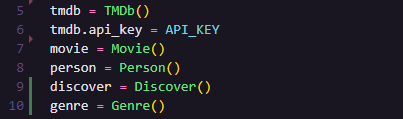

Esse trecho de código configura a biblioteca TMDb para acessar a API e inicializa diferentes classes para buscar informações sobre filmes, pessoas, descobertas e gêneros:
- `tmdb = TMDb()`: cria uma instância da classe TMDb, que será usada para configurar a API do The Movie Database.
- `tmdb.api_key = API_KEY`: define a chave de API necessária para autenticar as solicitações à API do TMDb. A API_KEY é uma variável armazenada no código secrets.py, um arquivo de configuração separado para segurança (não deve aparecer no código principal).
- `movie = Movie()`: inicializa a classe Movie, que permite buscar informações detalhadas sobre filmes, como sinopse, elenco e avaliações.
- `person = Person()`: inicializa a classe Person, utilizada para buscar informações sobre pessoas relacionadas ao cinema, como atores, diretores ou produtores.
- `discover = Discover()`: Inicializa a classe Discover, que possibilita realizar buscas mais avançadas de filmes com base em critérios como data de lançamento, gênero, ou popularidade.
- `genre = Genre()`: Inicializa a classe Genre, que permite listar e filtrar filmes por gêneros (como ação, comédia, drama).

Esse trecho do código prepara o acesso à API e define os objetos necessários para fazer diversas buscas de dados relacionados a filmes e pessoas.

**c. Método `convert_to_serializable(data)`**

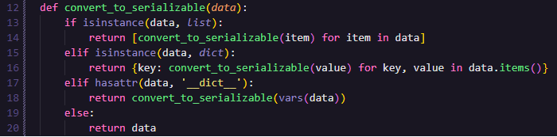

Converte dados complexos em tipos serializáveis para JSON, como listas, dicionários ou objetos. Isso é necessário para garantir que todos os dados possam ser convertidos corretamente para o formato JSON.
- Parâmetros: `data` – dados que podem ser uma li

**d. Método `save_to_json(data, filename)`**

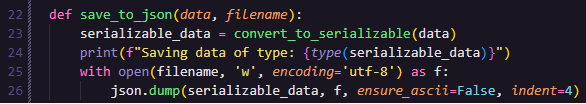

Salva os dados fornecidos em um arquivo JSON, utilizando o método `convert_to_serializable` para garantir a conversão correta dos dados em tipos serializáveis.
- Parâmetros:
    - *data*: Dados que serão salvos no arquivo.
    - *filename*: Nome do arquivo onde os dados serão armazenados.

**e. Método `get_unique_movies(movie_list)`**

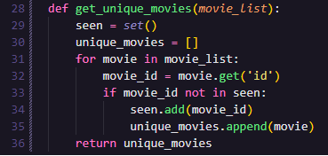

Remove filmes duplicados de uma lista de filmes, garantindo que cada filme tenha um ID único. Usa um conjunto (set) para rastrear os IDs já vistos e filtrar filmes duplicados.
- Parâmetros: *movie_list* – lista de filmes com informações como título, popularidade e data de lançamento.
- Retorna: lista filtrada contendo apenas filmes únicos com base no ID.

**f. Método `get_nolan_movies()`**

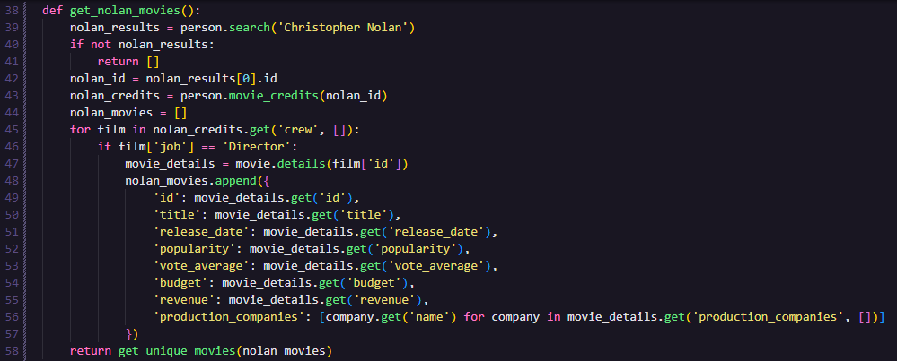

Busca todos os filmes dirigidos por Christopher Nolan. Utiliza o método `person.search()` para encontrar Nolan, e `person.movie_credits()` para obter a lista de filmes em que ele trabalhou como diretor. As informações detalhadas dos filmes são então coletadas.
- Retorna: Lista de filmes únicos dirigidos por Christopher Nolan, com informações como título, popularidade e receita.

**g. Método `get_movies_by_year(year)`**

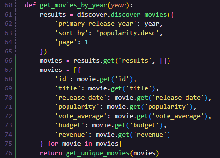

Busca filmes lançados em um ano específico, classificados por popularidade. Utiliza a classe Discover para realizar a busca e filtra informações relevantes dos filmes.
- Parâmetro: *year* - ano de lançamento dos filmes.
- Retorna: lista de filmes únicos lançados no ano fornecido.

**h. Método `get_movies_by_decade(start_year, end_year)`**

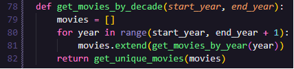

Busca filmes de uma década ou intervalo de anos fornecido. Chama o método `get_movies_by_year()` para cada ano dentro do intervalo e compila todos os filmes encontrados.
- Parâmetros:
    - *start_year*: Ano inicial do intervalo.
    - *end_year*: Ano final do intervalo.
- Retorna: lista de filmes únicos de todos os anos do intervalo.

**i. Método `get_heath_ledger_movies()`**

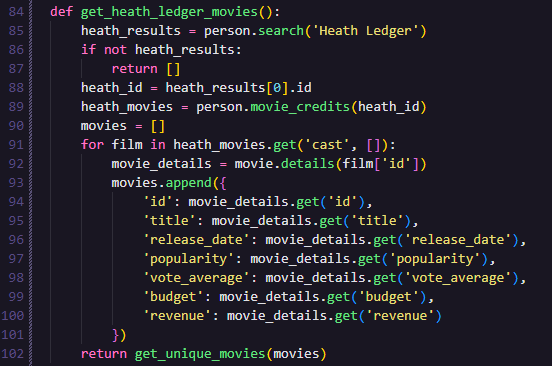

Busca todos os filmes estrelados por Heath Ledger. Utiliza o método `person.search()` para encontrar Heath Ledger e `person.movie_credits()` para obter a lista de filmes em que ele atuou. As informações detalhadas dos filmes são então coletadas.
- Retorna: lista de filmes únicos com Heath Ledger, com informações como título, popularidade e receita.

**j. Método `save_movies_in_files(movies, prefix)`**

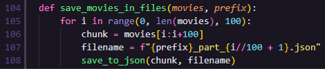

Divide a lista de filmes em partes de 100 filmes e salva cada parte em um arquivo JSON. O nome do arquivo é gerado com base no prefixo fornecido e na parte do arquivo.
- Parâmetros:
    - *movies*: lista de filmes a ser salva.
    - *prefix*: prefixo para o nome dos arquivos gerados.

**k. Chamadas dos métodos**

**EVIDÊNCIA DA EXECUÇÃO LOCAL DO SCRIPT**

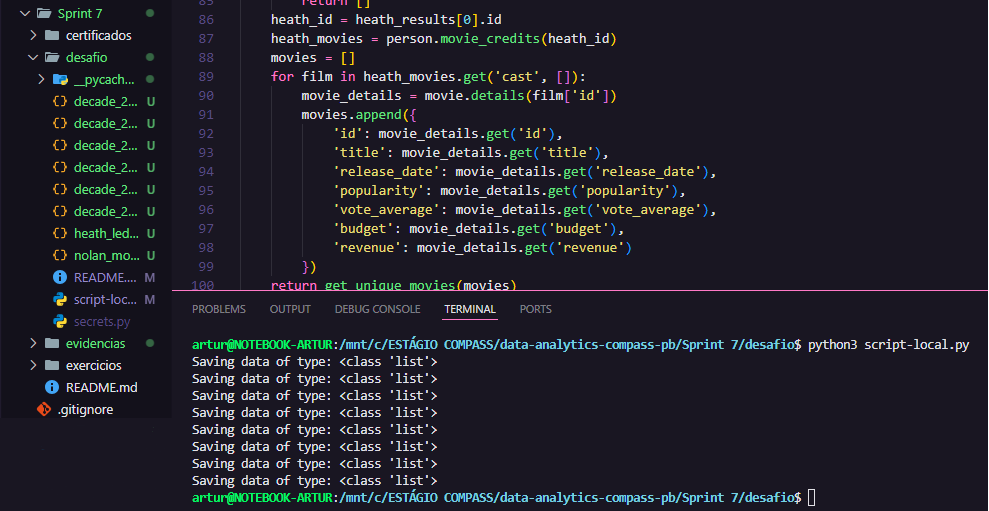

[Script local](script-local.py)

2. **Migração do script para AWS Lambda**

**a. Criação da função no AWS Lambda**

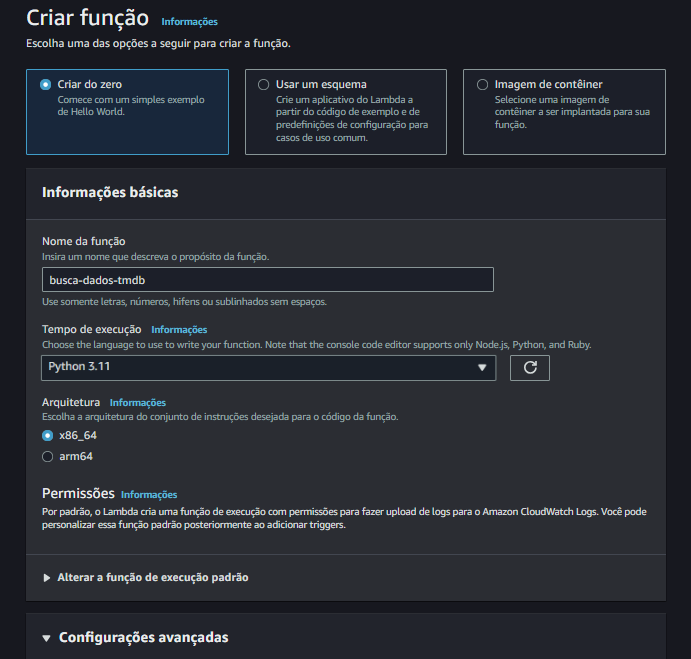

Primeiramente, criei a função no AWS Lambda. Para isso, utilizei a mesma versão do Python da Sprint anterior, na qual tivemos um Lab de AWS Lambda, e a única versão funcional para mim foi a 11.

Por essa razão, escolhi-a também para a realização deste desafio.

**b. Adaptação do código**

Para executar o script no ambiente AWS Lambda, será necessário criar uma função de entrada chamada `lambda_handler()`. Esse método é o ponto de entrada padrão para qualquer função Lambda e deve ser configurado para receber dois parâmetros principais:
- *event*: contém os dados que acionam a execução da função Lambda. Esses dados podem vir de uma variedade de fontes, como SQS, API Gateway, ou outro serviço da AWS.
- *context*: fornece informações sobre o ambiente de execução, como o tempo restante e a função Lambda que está sendo executada.

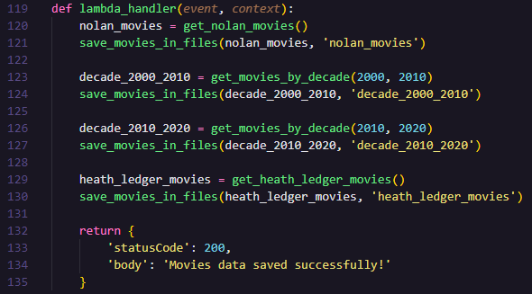

Outra adaptação consiste na definição de uma variável de ambiente 'API_KEY', ao invés de criar outro arquivo Python com a credencial de acesso. Para isso, necessitei inserir a biblioteca *os* para buscar essa variável definida no Lambda.

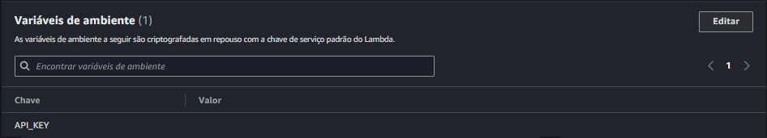

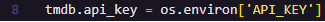

A última adaptação realizada, consiste no local de salvamento dos arquivos conforme o padrão requisitado e explicitado acima. Tais arquivos devem ser salvos no Bucket S3 criado na Sprint anterior (data-lake-artur-mariano-2024). Para isso, necessitou-se a definição de um cliente S3 e incluir as bibliotecas boto3 para conexão com o serviço S3 e a datetime para buscar a data do sistema.

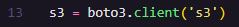

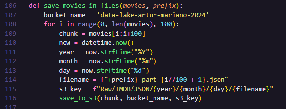

A estrutura geral do código permanece a mesma, mas a lógica de processamento será chamada dentro do `lambda_handler()`.

**c. Criação de camada para execução**

Para realizar a criação de uma camada (*layer*) para execução do código no AWS Lambda, realizei do modo sugerido na Sprint anterior, por meio de uma imagem Docker.

- Imagem Docker:

Conforme pode-se perceber, optei por utilizar a versão 3.11 do Python, a qual já havia sido testada na Sprint anterior.

- Build da imagem:

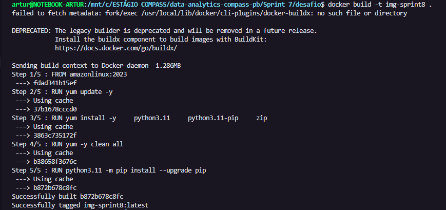

- Execução do container e zip do arquivo:

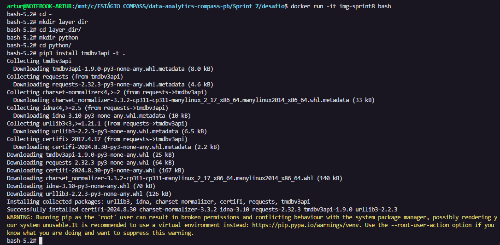

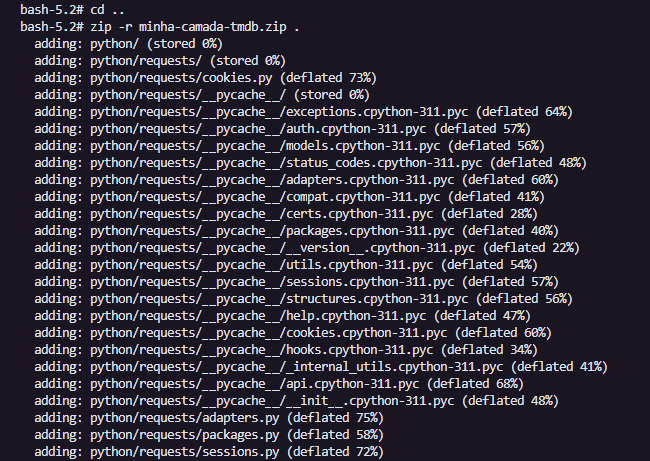

- Cópia de arquivo para máquina local:

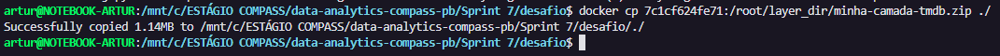

**d. Criação de camada**

Para criar a camada, basta fazer upload do arquivo .zip e selecionar a versão do Python correspondente.

**e. Criação de função**

Após criar a função, necessitou-se realizar algumas alterações:

- Aumento do tempo de execução

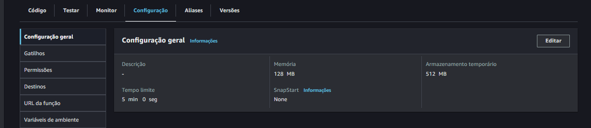

- Configuração de variável de ambiente (chave de API)

- [Script final](lambda_function.py)

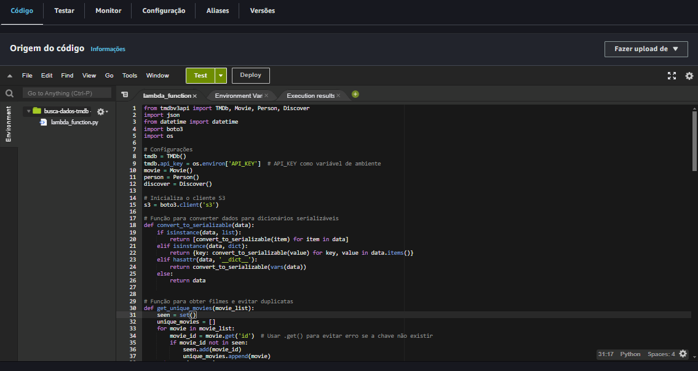

**EVIDÊNCIAS DE EXECUÇÃO LAMBDA**

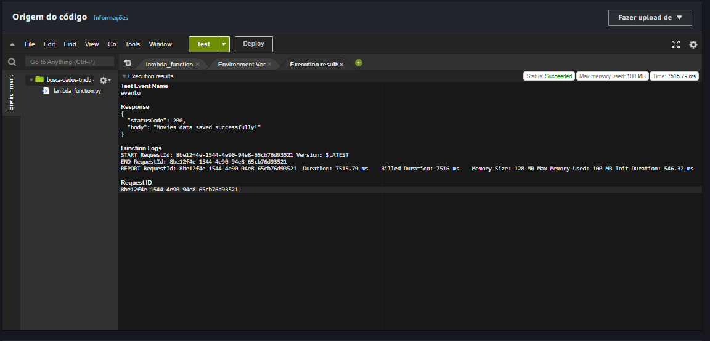

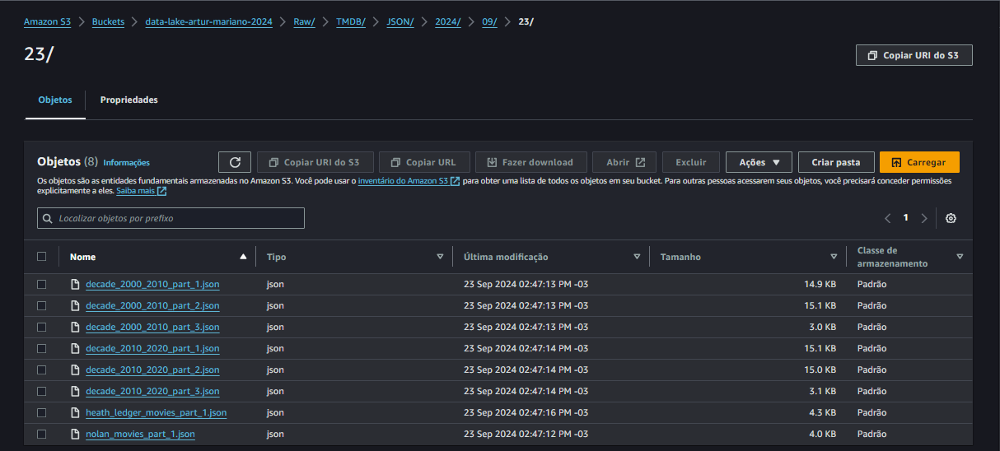

___

### ↩️ [Retornar ao início](../../README.md)