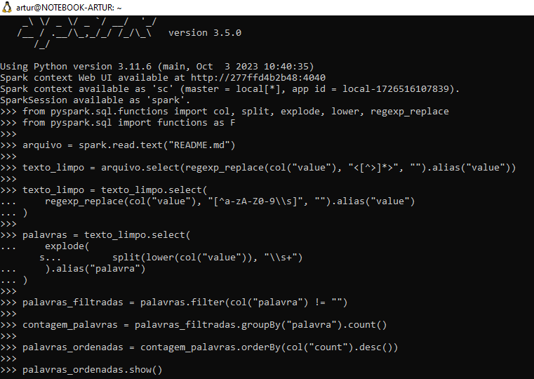

# Exercícios da Sprint 7
Este diretório contém os exercícios da Sprint 7. 

São dois (2) exercícios: Laboratório de AWS Glue e outro envolvendo a criação de um contador de palavras com Apache Spark.

## 1. Apache Spark - Contador de Palavras

### Etapa 1 - *Pull* da imagem docker

O pull da imagem sugerida no enunciado do exercício pode ser realizada pelo seguinte comando:

```bash
docker pull jupyter/all-spark-notebook
```


### Etapa 2 - Criação do container a partir da imagem
A criação do container deve ter `-it` como argumento, para rodar de modo interativo, além de mapear a porta 8888 exposta pelo serviço para a máquina local.

```bash
docker run --name <nome-container> -it -p 8888:8888 jupyter/all-spark-notebook
```


### Etapa 3 - Execução no terminal
1. **Download do arquivo 'README.md'**

Primeiramente necessita-se fazer o download do arquivo README do meu GitHub. Para isso, primeiramente deve-se executar o container abrindo o terminal bin/bash dele.

`docker exec -it <nome-container> bin/bash`

Com isso, no terminal do container, pode-se fazer o download do arquivo por meio do comando `wget`.

```bash
wget <url-README>
```

Com isso, o arquivo será baixado para o diretório atual. Para facilitar o manuseio posterior, deve-se renomeá-lo, pois ele vem com um nome gerado aleatoriamente.

```bash
mv <nome-arquivo> <README.md>
```


Dessa forma, poderá ser acessado pelo **pyspark** na próxima etapa.

### Etapa 4 - Contagem de Palavras com PySpark

Nesta etapa, necessitava-se utilizar o PySpark para contar o número total de palavras em um arquivo de texto. A seguir, há o detalhamento do processo realizado.

1. **Inicialização do PySpark Shell**
    
A inicialização do shell do PySpark no contêiner Spark foi realizado com o seguinte comando:

```bash
   docker exec -it container-spark pyspark
```

2. **Leitura do Arquivo**

```python
arquivo = spark.read.text("README.md")
```
Isso cria um DataFrame arquivo onde cada linha representa uma linha do arquivo.

3. **Divisão do Texto em Palavras**

O conteúdo do arquivo foi dividido em palavras. 

Para isso, utilizou-se a função `split` para separar o texto por espaços e a função `explode` para transformar cada linha em várias linhas, cada uma contendo uma palavra:

```python

from pyspark.sql.functions import col, split, explode

palavras = arquivo.select(
    explode(
        split(col("value"), " ")
    ).alias("palavra")
)
```

4. **Filtragem de Palavras Vazias**

Em seguida, filtrou-se as palavras vazias para garantir uma contagem precisa:

```python
palavras_filtradas = palavras.filter(col("palavra") != "")
```

5. **Contagem Total de Palavras**

Finalmente, realizou-se a contagem do número total de palavras:

```python
total_palavras = palavras_filtradas.count()
```

6. **Exibição do Resultado**

O total de palavras foi exibido no console com o seguinte comando:

```python
print(f"Total de palavras: {total_palavras}")
```

7. **O resultado obtido foi:**

Total de palavras: 499



___

## 2. Lab AWS Glue
- O laboratório consiste em construir um processo de ETL simplificado utilizando AWS Glue.

### 1. Preparação dos dados de origem
- É um arquivo CSV com os nomes mais comuns de registro de nascimento dos cartórios americanos entre 1880 e 2014. Consiste em um arquivo CSV com o seguinte formato:

*nome,sexo,total,ano*
*Jennifer,F,54336,1983*

- O arquivo **deverá estar em um Bucket** do S3.
    - O caminho deve ser: s3://{BUCKET_NAME}/lab-glue/input/nomes.csv

**SOLUÇÃO**
- Primeiramente, criei o bucket com o nome **"lab-aws-glue-artur"**.
- Em seguida, fiz upload do arquivo para o bucket.
- Tudo isso utilizando o mesmo script da Sprint passada, porém realizando as alterações necessárias:
    - Modifiquei a key do S3 (caminho onde irá salvar no S3);
    - Modifiquei o nome do arquivo e do Bucket.

**EXECUÇÃO**
1. Script


2. AWS


### 2. Configuração da conta para usar AWS Glue
- Deve-se prover acesso total ao S3 para leitura e escrita.

**EXECUÇÃO**
- Ao selecionar a opção de selecionar usuários, não possuía nenhum. Com isso, criei um usuário IAM para este exercício.


___

### ↩️ [Retornar ao início](../../README.md)