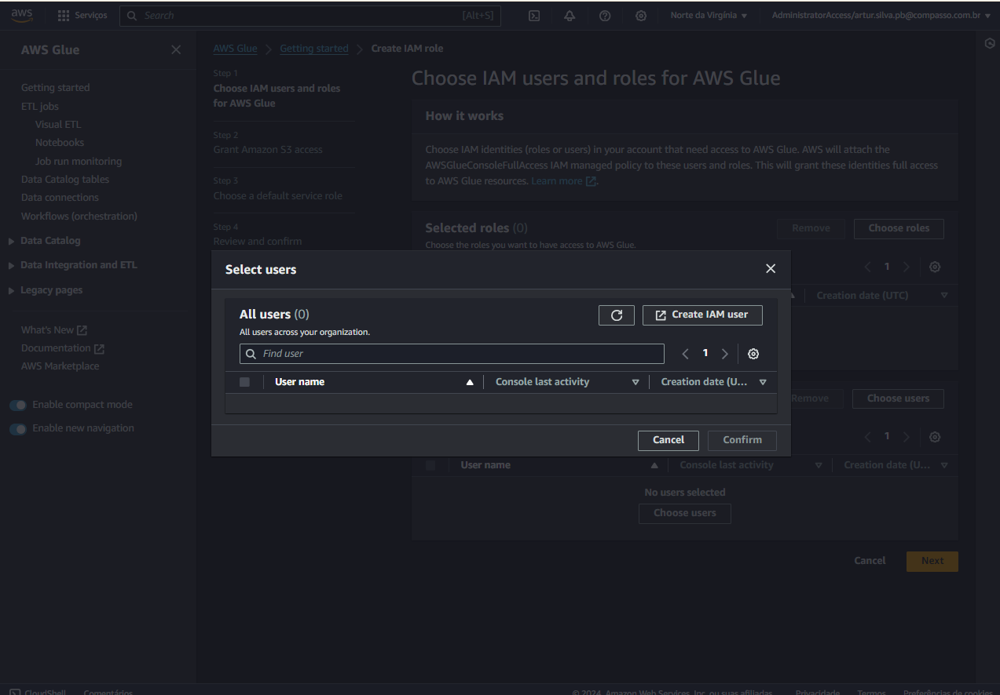
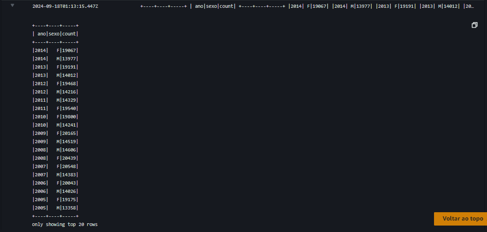
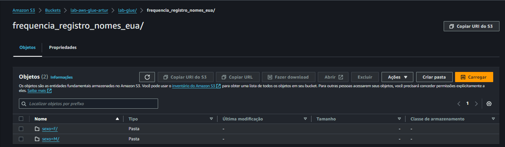

# Exercícios da Sprint 7
Este diretório contém os exercícios da Sprint 7. 

São dois (2) exercícios: Laboratório de AWS Glue e outro envolvendo a criação de um contador de palavras com Apache Spark.

## 1. Apache Spark - Contador de Palavras

### Etapa 1 - *Pull* da imagem docker

O pull da imagem sugerida no enunciado do exercício pode ser realizada pelo seguinte comando:

```bash
docker pull jupyter/all-spark-notebook
```


### Etapa 2 - Criação do container a partir da imagem
A criação do container deve ter `-it` como argumento, para rodar de modo interativo, além de mapear a porta 8888 exposta pelo serviço para a máquina local.

```bash
docker run --name <nome-container> -it -p 8888:8888 jupyter/all-spark-notebook
```


### Etapa 3 - Execução no terminal
1. **Download do arquivo 'README.md'**

Primeiramente necessita-se fazer o download do arquivo README do meu GitHub. Para isso, primeiramente deve-se executar o container abrindo o terminal bin/bash dele.

`docker exec -it <nome-container> /bin/bash`

Com isso, no terminal do container, pode-se fazer o download do arquivo por meio do comando `wget`.

```bash
wget <url-README>
```

Com isso, o arquivo será baixado para o diretório atual. Para facilitar o manuseio posterior, deve-se renomeá-lo, pois ele vem com um nome gerado aleatoriamente.

```bash
mv <nome-arquivo> <README.md>
```


Dessa forma, poderá ser acessado pelo **pyspark** na próxima etapa.

### Etapa 4 - Contagem de Palavras com PySpark

Nesta etapa, necessitava-se utilizar o PySpark para contar o número total de palavras em um arquivo de texto. A seguir, há o detalhamento do processo realizado.

1. **Inicialização do PySpark Shell**
    
A inicialização do shell do PySpark no contêiner Spark foi realizado com o seguinte comando:

```bash
   docker exec -it container-spark pyspark
```

2. **Leitura do Arquivo**

```python
arquivo = spark.read.text("README.md")
```
Isso cria um DataFrame arquivo onde cada linha representa uma linha do arquivo.

3. **Limpeza e Preparação do Texto**

Para garantir que apenas palavras efetivas fossem consideradas, o texto foi limpo de tags HTML e caracteres especiais. Utilizou-se a função `regexp_replace` para realizar a limpeza:

```python
from pyspark.sql.functions import col, regexp_replace

# Remove tags HTML utilizadas
texto_limpo = arquivo.select(regexp_replace(col("value"), "<[^>]*>", "").alias("value"))

# Remove caracteres não alfanuméricos e múltiplos espaços
texto_limpo = texto_limpo.select(
    regexp_replace(col("value"), "[^a-zA-Z0-9\\s]", "").alias("value")
)

```

4. **Divisão do Texto em Palavras**

O texto limpo foi dividido em palavras. Utilizou-se a função split para separar o texto por espaços e a função explode para transformar cada linha em várias linhas, cada uma contendo uma palavra:

```python
from pyspark.sql.functions import split, explode, lower

palavras = texto_limpo.select(
    explode(
        split(lower(col("value")), "\\s+")
    ).alias("palavra")
)
```

5. **Filtragem de Palavras Vazias**

As palavras vazias foram filtradas para garantir uma contagem precisa:

```python
palavras_filtradas = palavras.filter(col("palavra") != "")
```

6. **Contagem das Ocorrências de Palavras**

A contagem das ocorrências de cada palavra foi realizada, agrupando as palavras e contando suas aparições:

```python
contagem_palavras = palavras_filtradas.groupBy("palavra").count()
```

7. **Ordenação e Exibição das Palavras Mais Frequentes**

As palavras foram ordenadas pela contagem em ordem decrescente, e as palavras mais frequentes foram exibidas:

```python
palavras_ordenadas = contagem_palavras.orderBy(col("count").desc())
palavras_ordenadas.show()
```


8. **Resultado obtido**


___

## 2. Lab AWS Glue
- O laboratório consiste em construir um processo de ETL simplificado utilizando AWS Glue.

### 1. Preparação dos dados de origem
- É um arquivo CSV com os nomes mais comuns de registro de nascimento dos cartórios americanos entre 1880 e 2014. Consiste em um arquivo CSV com o seguinte formato:

*nome,sexo,total,ano*
*Jennifer,F,54336,1983*

- O arquivo **deverá estar em um Bucket** do S3.
    - O caminho deve ser: s3://{BUCKET_NAME}/lab-glue/input/nomes.csv

**SOLUÇÃO**
- Primeiramente, criei o bucket com o nome **"lab-aws-glue-artur"**.
- Em seguida, fiz upload do arquivo para o bucket.
- Tudo isso utilizando o mesmo script da Sprint passada, porém realizando as alterações necessárias:
    - Modifiquei a key do S3 (caminho onde irá salvar no S3);
    - Modifiquei o nome do arquivo e do Bucket.

**EXECUÇÃO**
1. Script


2. AWS


### 2. Configuração da conta para usar AWS Glue
- Deve-se prover acesso total ao S3 para leitura e escrita.

**EXECUÇÃO**
- Ao selecionar a opção de selecionar usuários, não possuía nenhum. Com isso, criei um usuário IAM para este exercício (**user-glue**).




### 3. Criação de IAM Role para os jobs do AWS Glue
- Após isso, tornou-se necessária a criação de credenciais temporárias - *roles*.
- Bastou seguir o passo a passo conforme imagens abaixo.


### 4. Configuração das permissões no AWS Lake Formation
- Primeiramente, criei o banco de dados **"glue-lab"**.


- Em seguida, alterei as permissões, concedendo ao usuário user-glue, criado conforme item 2 acima.


### 5. Criação de job no AWS Glue
- Primeiramente criei o job conforme requerido no pdf [glue-lab](glue-lab.pdf).


- Em seguida, realizei o teste fornecido como exemplo:


Para isso, necessitei alterar os parâmetros S3_INPUT_PATH e S3_TARGET_PATH, sendo eles o caminho para o arquivo movies.csv, no bucket criado para o desafio final, e o destino inseri no próprio bucket criado para o presente exercício, fornecendo o caminho s3://<bucket>/lab-glue/output/.


### 5.1. Eliminação de execuções de jobs
- Após, verifiquei se havia algum "run" para ser eliminado, o que não havia. Portanto, segui para o próximo passo.

### 5.2. Sua vez ([script completo](script-glue-lab.py))
- Deveríamos construir um job Glue nos moldes dos exemplos anteriores. Ele deveria resolver os seguintes problemas:

1. Ler o arquivo nomes.csv no S3 (lembre-se de realizar upload do arquivo antes).
2. Imprima o schema do dataframe gerado no passo anterior.
3. Escrever o código necessário para alterar a caixa dos valores da coluna nome para MAIÚSCULO.
4. Imprimir a contagem de linhas presentes no dataframe.
5. Imprimir a contagem de nomes, agrupando os dados do dataframe pelas colunas ano e sexo. Ordene os dados de modo que o ano mais recente apareça como primeiro registro do dataframe.
6. Apresentar qual foi o nome feminino com mais registros e em que ano ocorreu.
7. Apresentar qual foi o nome masculino com mais registros e em que ano ocorreu.
8. Apresentar o total de registros (masculinos e femininos) para cada ano presente no dataframe. Considere apenas as primeiras 10 linhas, ordenadas pelo ano, de forma crescente.
9. Escrever o conteúdo do dataframe com os valores de nome em maiúsculo no S3.
    - Atenção aos requisitos:
        - A gravação deve ocorrer no subdiretório frequencia_registro_nomes_eua do path
        - s3://<BUCKET>/lab-glue/
        - O formato deve ser JSON
        - O particionamento deverá ser realizado pelas colunas sexo e ano (nesta ordem)

**RESOLUÇÃO**
- Para resolver, necessitei alterar os parâmetros, inserindo como **origem** **s3://<bucket>/lab-glue/input/nomes.csv** e como **destino** o caminho **s3://<bucket>/lab-glue/frequencia_registro_nomes_eua**.
- Em seguida, parti para a implementação no script base fazendo as modificações necessárias:

0. Bibliotecas e configurações iniciais

```python
import sys
from awsglue.transforms import *
from awsglue.utils import getResolvedOptions
from pyspark.context import SparkContext
from awsglue.context import GlueContext
from awsglue.job import Job
from pyspark.sql import functions as F

args = getResolvedOptions(sys.argv, ['JOB_NAME', 'S3_INPUT_PATH', 'S3_TARGET_PATH'])

sc = SparkContext()
glueContext = GlueContext(sc)
spark = glueContext.spark_session
job = Job(glueContext)
job.init(args['JOB_NAME'], args)

# Paths
source_file = args['S3_INPUT_PATH']
target_path = args['S3_TARGET_PATH']
```

1. Leitura do arquivo CSV
```python
df_dynamic = glueContext.create_dynamic_frame.from_options(
    "s3",
    {
        "paths": [source_file]
    },
    "csv",
    {"withHeader": True, "separator": ","},
)
```

2. Impressão do schema do DataFrame
- Nesse caso, primeiramente converti para DataFrame Spark para aproveitar a flexibilidade e as funcionalidades avançadas da API DataFrame do Spark. 

```python
df_spark = df_dynamic.toDF()

df_spark.printSchema()
```

Conforme poderá ser percebido na imagem abaixo, devido à leitura dos dados do CSV, todas as colunas são reconhecidas como String. No entanto, adaptações devem ser realizadas, modificando os campos 'ano' e 'total' para Integer, para que esses campos numéricos possam ser manipulados corretamente:

```python
df_spark = df_spark.withColumn('ano', F.col('ano').cast(IntegerType()))
df_spark = df_spark.withColumn('total', F.col('total').cast(IntegerType()))
```

3. Alteração dos nomes para maiúsculo
```python
df_spark = df_spark.withColumn('nome', F.upper(F.col('nome')))
```


4. Impressão do total de linhas do arquivo
```python
print("Total de linhas: ", df_spark.count())
```


5. Impressão do total de nomes agrupados por ano e sexo, e ordenados por ano
```python
df_grouped = df_spark.groupBy('ano', 'sexo').count()
df_grouped_ordered = df_grouped.orderBy(F.col('ano').desc())
df_grouped_ordered.show()
```



6. Nome feminino mais frequente e ano
```python
df_female = df_spark.filter(F.col('sexo') == 'F')
most_frequent_female = df_female.orderBy('total', ascending=False).first()
print(f"Nome feminino mais frequente: {most_frequent_female['nome']}, Ano: {most_frequent_female['ano']}")
```

7. Nome masculino com mais registros e o ano
```python
df_male = df_spark.filter(F.col('sexo') == 'M')
most_frequent_male = df_male.orderBy('total', ascending=False).first()
print(f"Nome masculino mais frequente: {most_frequent_male['nome']}, Ano: {most_frequent_male['ano']}")
```


8. Total de registros (masculinos e femininos) para cada ano (10 primeiros crescente)
```python
df_total_per_year_top_10 = df_spark.groupBy('ano').sum('total').orderBy(F.col('ano').asc()).limit(10)
df_total_per_year_top_10.show()
```


9. Gravação do DataFrame no S3 com valores de nome em maiúsculo
```python
df_spark.write.partitionBy('sexo', 'ano').format('json').mode('overwrite').save(f"{target_path}")
```



### 6. Criação de Crawler
Nessa parte do exercício, deveríamos criar um Crawler para monitorar o armazenamento de dados.

1. Criação


2. Verificação Crawler


### 7. Extra: adição de permissões ao Lake Formation
Nessa parte, deveríamos conceder privilégios de **DESCRIBE** e **SELECT** no Lake Formation. Isso pode ser comprovado com a imagem abaixo:


- **[Ver script completo](script-glue-lab.py)**

___

### ↩️ [Retornar ao início](../../README.md)