# 🧩 Desafio da Sprint 8
Este diretório contém os arquivos necessários para a realização do desafio desta Sprint.

___

## 📝 Enunciado
O desafio da Sprint 8 é uma continuação do desafio iniciado na Sprint 6, sendo a terceira entrega do desafio final.

Esta etapa consiste no **processamento da camada *trusted***, com essa possuindo os dados limpos e confiáveis. Consiste na integração das diversas fontes de origem (dados que estão na camada Raw).

Será utilizado Apache Spark através do serviço AWS Glue, integrando dados existentes na camada *Raw Zone* para a *Trusted Zone*. Todos os dados da *Trusted Zone* devem possuir o mesmo formato de armazenamento e poder ser analisados no AWS Athena por meio de SQL.

Os dados serão persistidos no formato PARQUET, particionados por data de criação do arquivo no momento da ingestão do dado da TMDB. A exceção fica para os dados oriundos do processamento *batch* (CSV), que não precisam ser particionados.

Iremos separar o processamento em dois jobs:
1. Processamento dos arquivos CSV
2. Processamento dos dados oriundos da API TMDB.

> OBS.: Não utilizar notebooks do Glue.

## Resolução

### 1. Criação e permissões de usuário IAM

Na Sprint anterior, no exercício Lab AWS Glue, tivemos de criar um usuário IAM para fornecer permissões e realizar as operações necessárias. No entanto, ao encerrar a Sprint, excluí todos os recursos criados por mim durante a Sprint, necessitando agora criar outro usuário IAM.

Sendo assim, criei o usuário e configurei a *Role* para o Glue.

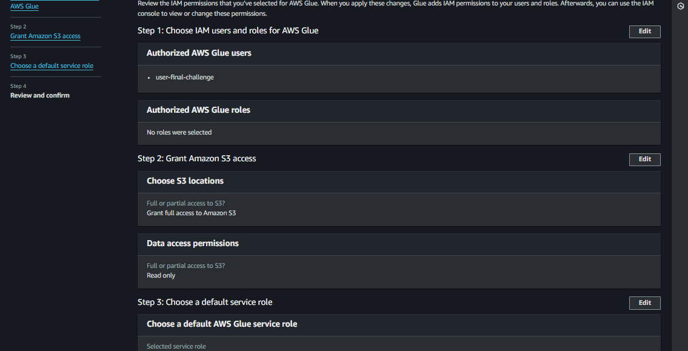

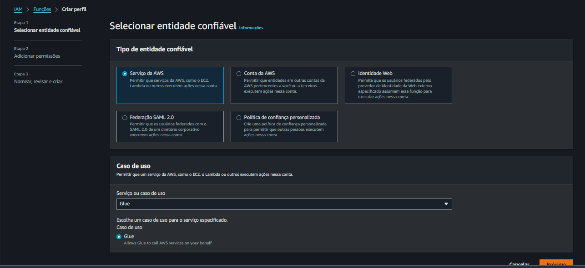

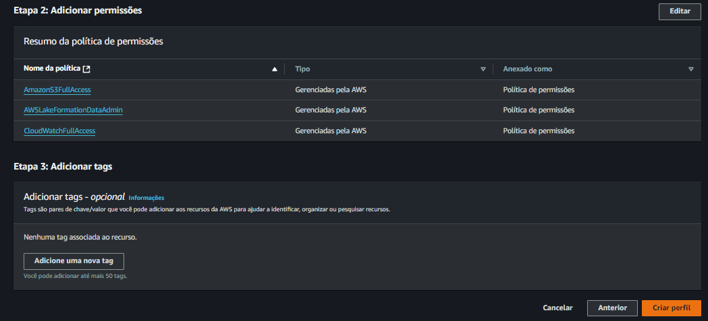

### 2. Configurações de permissões no AWS Lake Formation

**2.1. Criação de *Database***

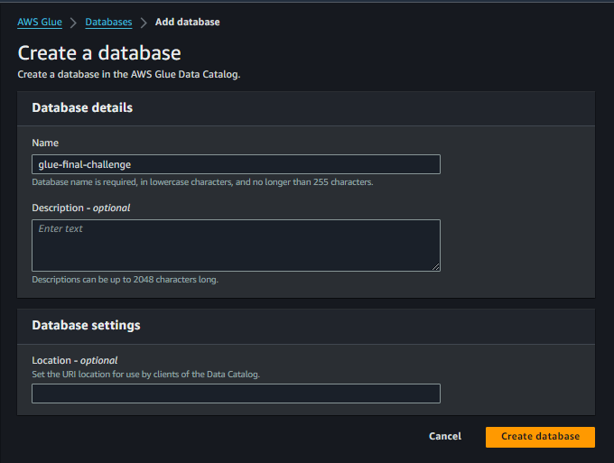

**2.2. Adição do usuário IAM como Administrador do *data lake***

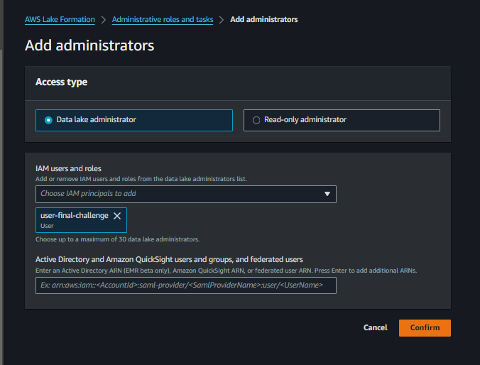

**2.3. Alteração de permissões do *Database***

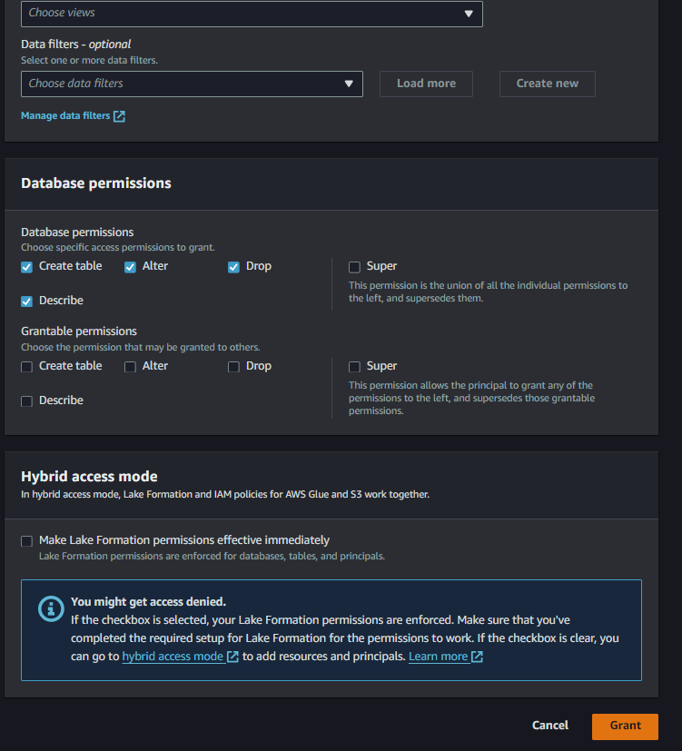

### 3. Criação dos jobs

Cada um dos jobs fica responsável por dados ingeridos de maneira distinta:

- **job-batch-data**: dados CSV processados em lote (Sprint 6).

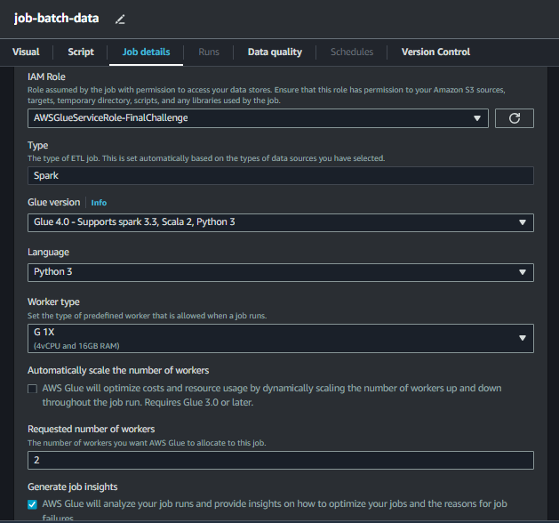

- **job-tmdb-data**: dados JSON ingeridos da API do TMDB (Sprint 7).

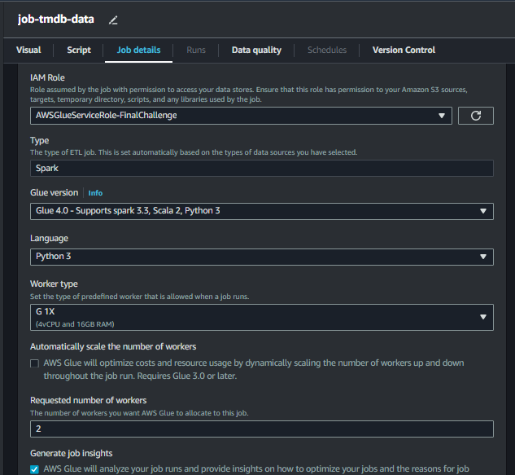

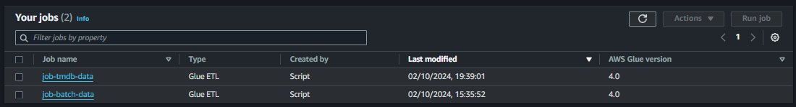

Por conseguinte, foi necessário alterar os parâmetros com os locais de busca dos arquivos Raw e de salvamento dos arquivos na camada Trusted.

### 4. Desenvolvimento dos Scripts

### 4.1. Script dados *Batch*

1. **Importações e dependências**

- `sys`: para acessar argumentos de linha de comando.
- `awsglue.transforms, awsglue.utils, awsglue.context, awsglue.job`: bibliotecas da AWS Glue para trabalhar com jobs, criar contextos e transformar dados.
- `pyspark.sql.functions` e `pyspark.sql.types`: funções e tipos de dados do PySpark para manipulação e conversão de colunas no DataFrame.
- `datetime`: utilizado para gerar o timestamp da execução.

2. **Definição dos parâmetros do job**

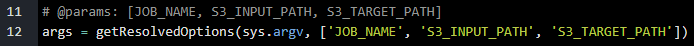

Aqui são obtidos os argumentos passados ao job (nome do job, caminho de entrada e saída no S3).

3. **Criação do contexto do Spark e inicialização do job**

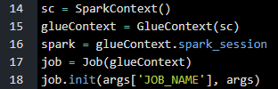

- `SparkContext`: inicializa o contexto do Spark.
- `GlueContext`: cria um contexto do Glue para utilizar suas funcionalidades no Spark.
- `spark_session`: cria uma sessão Spark para manipular DataFrames.
- `job.init`: inicializa o job Glue usando o nome passado via parâmetro.

4. **Definição de variáveis e preparação de caminhos**

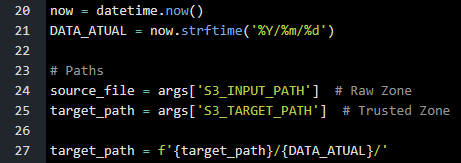

- `now`: armazena a data e hora atuais.
- `DATA_ATUAL`: formata a data para ser utilizada nos caminhos de saída.
- `source_file`: caminho do arquivo de entrada na "Raw Zone".
- `target_path`: caminho do arquivo de saída na "Trusted Zone", que inclui a data no caminho.

5. **Leitura dos dados da Raw Zone**

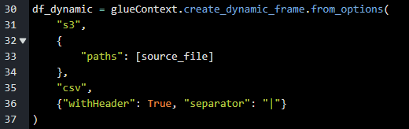

- `create_dynamic_frame`: lê o arquivo CSV diretamente do S3.
- `withHeader`: indica que o arquivo CSV contém um cabeçalho.
- `separator`: define o separador de colunas (neste caso, é **|**).

6. **Conversão para DataFrame Spark**

Converti o *DynamicFrame* (estrutura nativa do AWS Glue) para um DataFrame do Spark para facilitar as transformações.

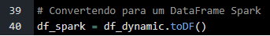

7. **Conversão de colunas para os tipos apropriados**

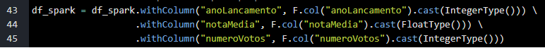

- anoLancamento: para *IntegerType*.
- notaMedia: para *FloatType*.
- numeroVotos: para *IntegerType*.

8. **Seleção das colunas desejadas**

Selecionei apenas as colunas relevantes do DataFrame original: ID, títulos (principal e original), ano de lançamento, gênero, nota média e número de votos.

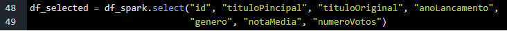

9. **Filtragem de filmes**

- Filtragem dos filmes que foram lançados entre os anos de 2000 e 2020.

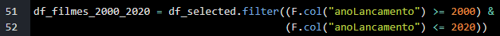

- Filtragem dos filmes em que Heath Ledger atuou.

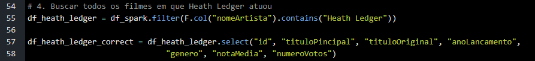

10. **Remoção de duplicados pelo id**

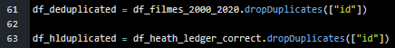

11. **Salvamento do resultado no S3 em formato Parquet**

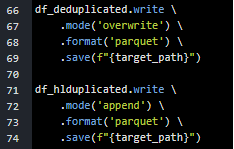

12. **Finalização do job**

13. **Execução do Script**

- Job runs:

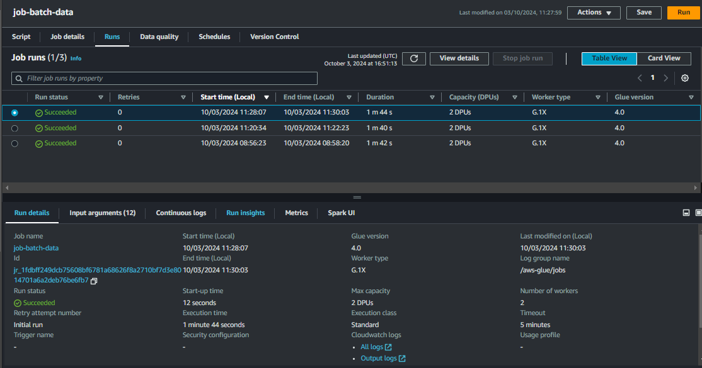

- Estrutura de diretórios:

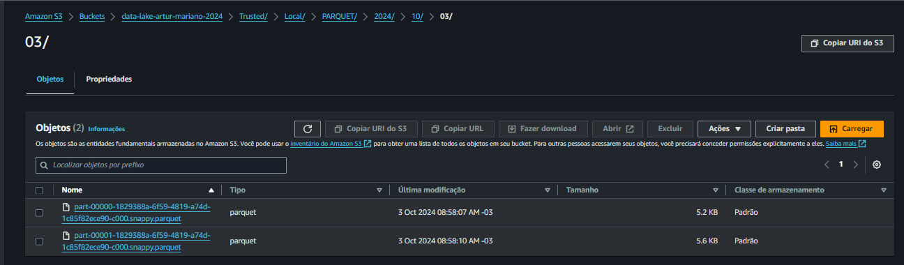

### 4.2. Script dados API TMDB

1. **Bibliotecas necessárias**

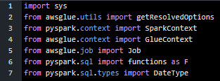

2. **Parâmetros**

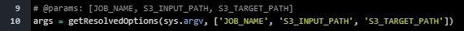

3. **Inicialização do contexto Glue**

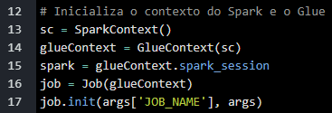

4. **Definição de Caminhos**

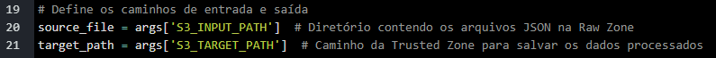

5. **Leitura de arquivos JSON**

Para realizar a leitura dos arquivos JSON utilizei o DataFrame do Spark diretamente, sem utilizar o DynamicFrame (nativo do Glue). Isso, pois inicialmente tentei utilizar a mesma estratégia do passo anterior, para ler o arquivo CSV, mas não obtive sucesso. Modificando isso, consegui realizar corretamente.

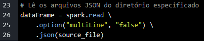

6. **Conversão de Colunas**

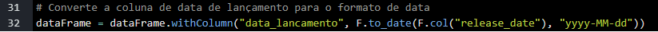

Converte a coluna *release_date* para o formato de data, renomeando-a para *data_lancamento*.

7. **Captura do Caminho do Arquivo S3**

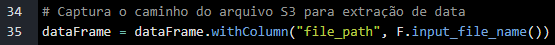

Adiciona uma nova coluna *file_path* que contém o caminho do arquivo S3 de onde os dados foram lidos.

8. **Extração de Data a Partir do Caminho do Arquivo**

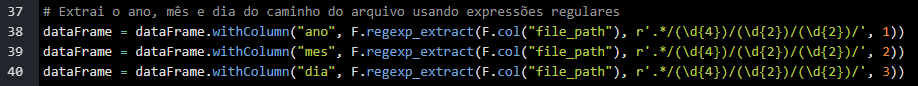

Utiliza expressões regulares para extrair o ano, mês e dia do caminho do arquivo, armazenando-os em novas colunas ano, mes e dia.

9. **Criação da Coluna de Data de Criação**

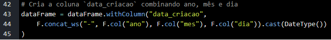

Combina as colunas de ano, mês e dia em uma nova coluna chamada `data_criacao`, convertendo-a para o tipo de dado `DateType`.

10. **Correção da Coluna de Empresas de Produção**

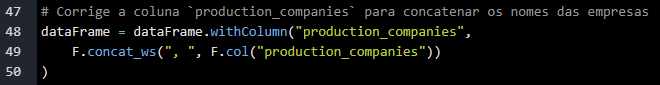

Concatena os nomes das empresas de produção em uma única string, separando-os por vírgulas.

11. **Seleção das Colunas de Interesse**

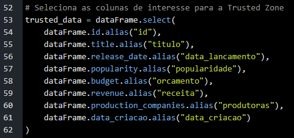

12. **Salvamento dos Dados em Formato Parquet**

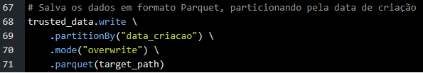

13. **Finalização do Job**

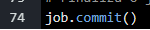

14. **Execução script**

- Job runs:

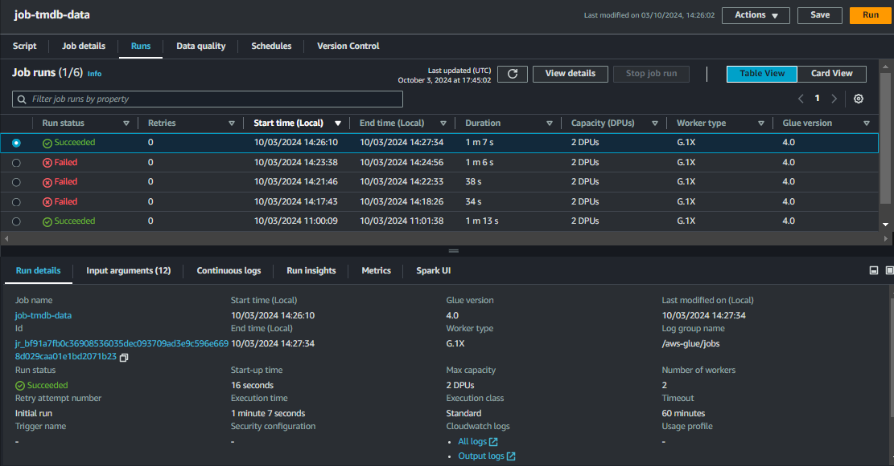

**Execução do Script**
- Estrutura de diretórios: 

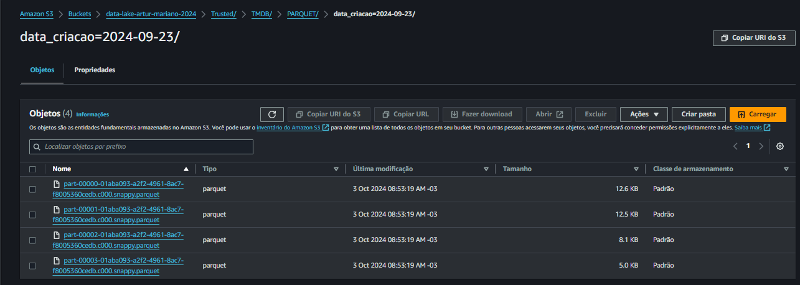

### 5. Criação de Crawler

Depois, necessitamos criar um Crawler para criar uma tabela a partir dos dados do S3 automaticamente.

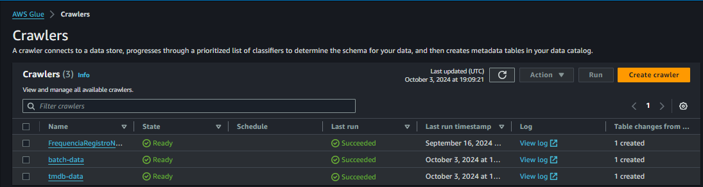

Sendo assim, os crawlers criados geraram as tabelas abaixo:

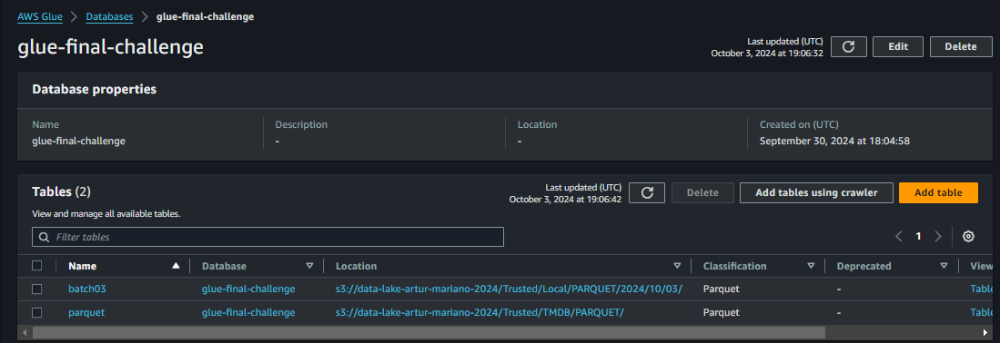

### 6. Consultando dados com Athena

**6.1. Consulta na tabela dos dados CSV**

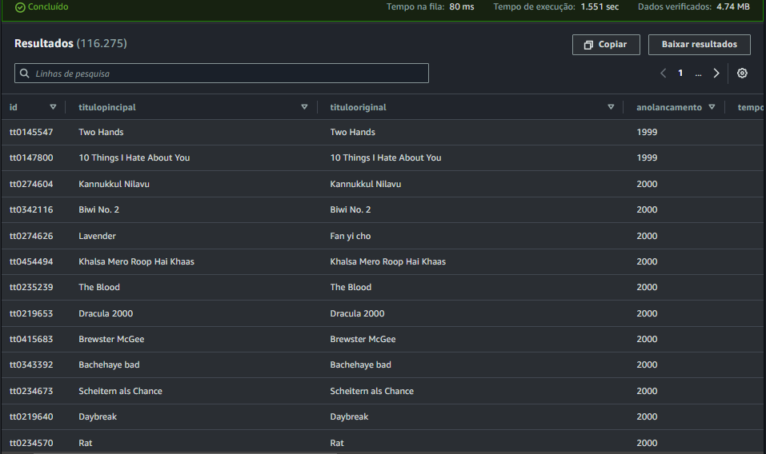

**6.2. Consulta na tabela dos dados JSON (TMDB)**

Primeiramente, ao tentar realizar *selects* na tabela "parquet", criada com os dados provenientes do TMDB, obtive uma tabela sem registros (vazia). Para isso, necessitei dar o seguinte comando: 

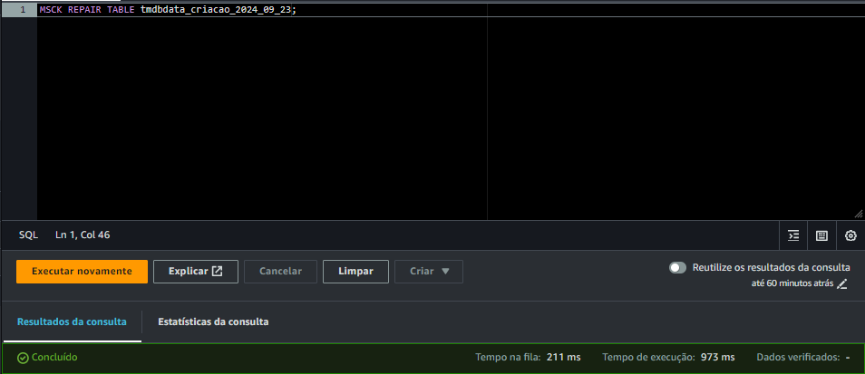

O comando `MSCK REPAIR TABLE nometabela` é utilizado no contexto do Apache Hive e do Amazon Athena, que são ferramentas de processamento de dados que trabalham com grandes volumes de informações armazenadas em sistemas distribuídos, como o Amazon S3. A função desse comando é manter a integridade da tabela que está sendo utilizada para consultar dados particionados.

Nesse caso, como a tabela possui dados particionados, necessitei executar esse comando.

Após isso realizado, pude realizar os comandos de seleção na tabela:

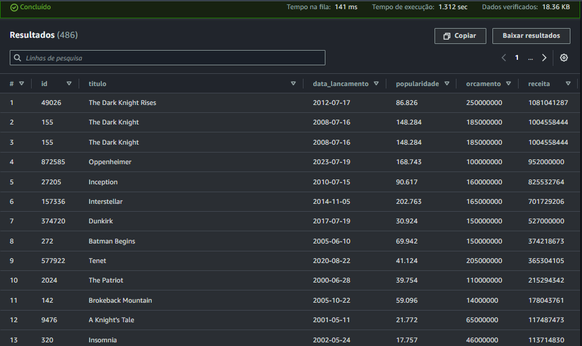

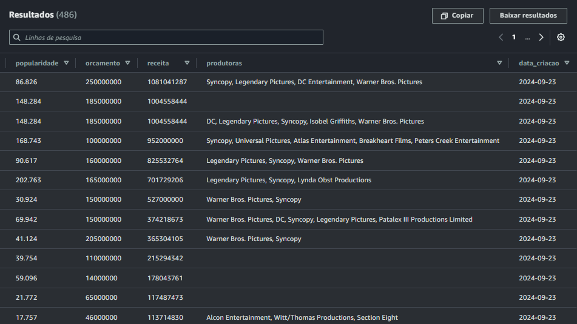

___

### ↩️ [Retornar ao início](../../README.md)