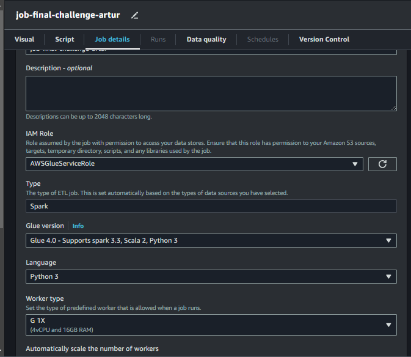

# 🧩 Desafio da Sprint 8
Este diretório contém os arquivos necessários para a realização do desafio desta Sprint.

___

## 📝 Enunciado
O desafio da Sprint 8 é uma continuação do desafio iniciado na Sprint 6, sendo a terceira entrega do desafio final.

Esta etapa consiste no **processamento da camada *trusted***, com essa possuindo os dados limpos e confiáveis. Consiste na integração das diversas fontes de origem (dados que estão na camada Raw).

Será utilizado Apache Spark através do serviço AWS Glue, integrando dados existentes na camada *Raw Zone* para a *Trusted Zone*. Todos os dados da *Trusted Zone* devem possuir o mesmo formato de armazenamento e poder ser analisados no AWS Athena por meio de SQL.

Os dados serão persistidos no formato PARQUET, particionados por data de criação do arquivo no momento da ingestão do dado da TMDB. A exceção fica para os dados oriundos do processamento *batch* (CSV), que não precisam ser particionados.

Iremos separar o processamento em dois jobs:
1. Processamento dos arquivos CSV
2. Processamento dos dados oriundos da API TMDB.

> OBS.: Não utilizar notebooks do Glue.

## Resolução

### 1. Criação do job

### 2. 

___

### ↩️ [Retornar ao início](../../README.md)