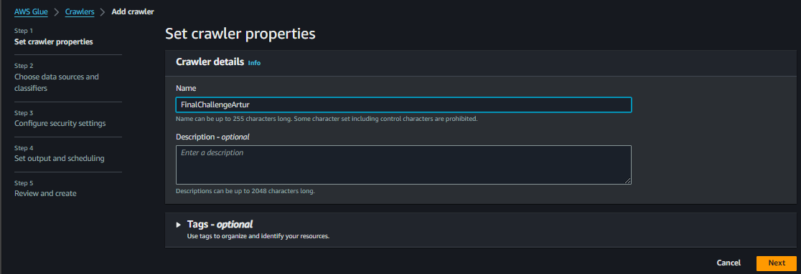
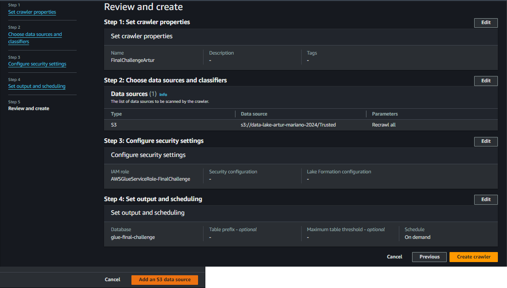

# 🧩 Desafio da Sprint 8
Este diretório contém os arquivos necessários para a realização do desafio desta Sprint.

___

## 📝 Enunciado
O desafio da Sprint 8 é uma continuação do desafio iniciado na Sprint 6, sendo a terceira entrega do desafio final.

Esta etapa consiste no **processamento da camada *trusted***, com essa possuindo os dados limpos e confiáveis. Consiste na integração das diversas fontes de origem (dados que estão na camada Raw).

Será utilizado Apache Spark através do serviço AWS Glue, integrando dados existentes na camada *Raw Zone* para a *Trusted Zone*. Todos os dados da *Trusted Zone* devem possuir o mesmo formato de armazenamento e poder ser analisados no AWS Athena por meio de SQL.

Os dados serão persistidos no formato PARQUET, particionados por data de criação do arquivo no momento da ingestão do dado da TMDB. A exceção fica para os dados oriundos do processamento *batch* (CSV), que não precisam ser particionados.

Iremos separar o processamento em dois jobs:
1. Processamento dos arquivos CSV
2. Processamento dos dados oriundos da API TMDB.

> OBS.: Não utilizar notebooks do Glue.

## Resolução

### 1. Criação e permissões de usuário IAM

Na Sprint anterior, no exercício Lab AWS Glue, tivemos de criar um usuário IAM para fornecer permissões e realizar as operações necessárias. No entanto, ao encerrar a Sprint, excluí todos os recursos criados por mim durante a Sprint, necessitando agora criar outro usuário IAM.

Sendo assim, criei o usuário e configurei a *Role* para o Glue.

### 2. Configurações de permissões no AWS Lake Formation

**2.1. Criação de *Database***

**2.2. Adição do usuário IAM como Administrador do *data lake***

**2.3. Alteração de permissões do *Database***

### 3. Criação dos jobs

Cada um dos jobs fica responsável por dados ingeridos de maneira distinta:

- **job-batch-data**: dados CSV processados em lote (Sprint 6).

- **job-tmdb-data**: dados JSON ingeridos da API do TMDB (Sprint 7).

Por conseguinte, foi necessário alterar os parâmetros com os locais de busca dos arquivos Raw e de salvamento dos arquivos na camada Trusted.

### 4. Desenvolvimento dos Scripts

### 4.1. Script dados *Batch*

### 4.2. Script dados API TMDB

### 5. Criação de Crawler

Depois, necessitamos criar um Crawler para criar uma tabela a partir dos dados do S3 automaticamente.

### 6. Evidências execução

___

### ↩️ [Retornar ao início](../../README.md)