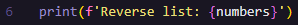
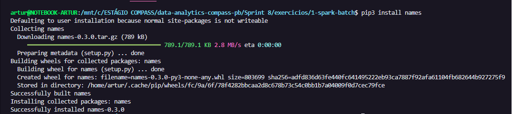
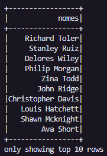

# Exercícios da Sprint 8
Este diretório contém os exercícios da Sprint 8. 

## 1 - Exercícios Spark Batch
## 1.1 - Geração e massa de dados

### Etapa 1 - Lista aleatória de números inteiros

**RESOLUÇÃO** 

1. Importação da biblioteca `random`

2. Geração da lista aleatoriamente (250 valores), com o método `random.randint(min, max)` - selecionei de 1 a 10000.

3. Aplicação do método `reverse()`

4. Mostrar resultado

**EVIDÊNCIA EXECUÇÃO**

Executei duas vezes para mostrar a pseudo-aleatoriedade para geração dos valores.

- [**SCRIPT FINAL**](1-spark-batch/etapa1.py)

### Etapa 2 - Lista de animais em arquivo CSV 

**RESOLUÇÃO**

1. Criação da lista com nomes de animais diferentes (20)

2. Ordenação da lista com método `sort()`

3. Print animais com *list comprehension*

4. Escrita em arquivo CSV

**EXECUÇÃO**

1. Console

2. Arquivo CSV - [ver arquivo](1-spark-batch/animais.csv)

- [**SCRIPT FINAL**](1-spark-batch/etapa2.py)
- [**ARQUIVO .CSV**](1-spark-batch/animais.csv)

### Etapa 3 - Gerar dataset de nomes de pessoas

**RESOLUÇÃO**

1. Instalação da biblioteca `names`

2. Importação das bibliotecas necessárias (`random`, `time`, `os`, `names`)

3. Definição dos parâmetros para a geração do dataset: quantidade de nomes aleatórios e quantidade de nomes únicos (trecho de código fornecido pelo enunciado do exercício)

4. Geração de nomes aleatórios (trecho de código fornecido pelo enunciado do exercício)

5. Geração de arquivo texto com todos os nomes

6. Visualização do conteúdo do arquivo texto

**EXECUÇÃO**

- [**SCRIPT FINAL**](1-spark-batch/etapa3.py)
- [**ARQUIVO TEXTO**](1-spark-batch/nomes_aleatorios.txt)

---

## 1.2 - Apache Spark

### Etapa 1 - Preparação do ambiente

1. Import de bibliotecas

2. Definição da SparkSession (fornecido pelo enunciado do exercício)

3. Leitura do arquivo em dataframe (df_nomes) e exibição

4. Evidência da execução

- [**SCRIPT FINAL**](2-apache-spark/etapa1.py)

### Etapa 2 - Renomear coluna para Nomes, imprimir esquema e mostrar 10 linhas do dataframe

1. Biblioteca pyspark e leitura do arquivo (igual à etapa anterior)

2. `printSchema()`

3. Renomeação da coluna
- Ao executar `printSchema`, percebi que o nome da coluna adotado pelo Spark foi **_c0**. Por isso, no método `withColumnRenamed()` esse foi o primeiro parâmetro (coluna atual).

3. Alteração do schema
- Com isso, executei novamente o método `printSchema()` para garantir a alteração do nome da coluna.
- O resultado foi:

4. Mostrar  10 linhas do dataframe

5. Evidência da execução total

- [**SCRIPT FINAL**](2-apache-spark/etapa2.py)

### Etapa 3 - 

___

### ↩️ [Retornar ao início](../../README.md)