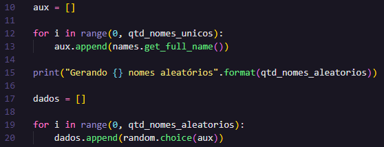
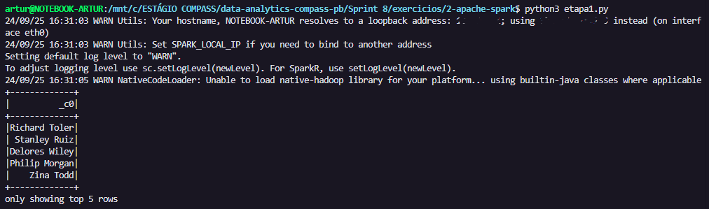
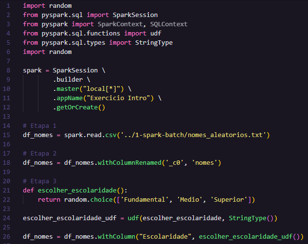
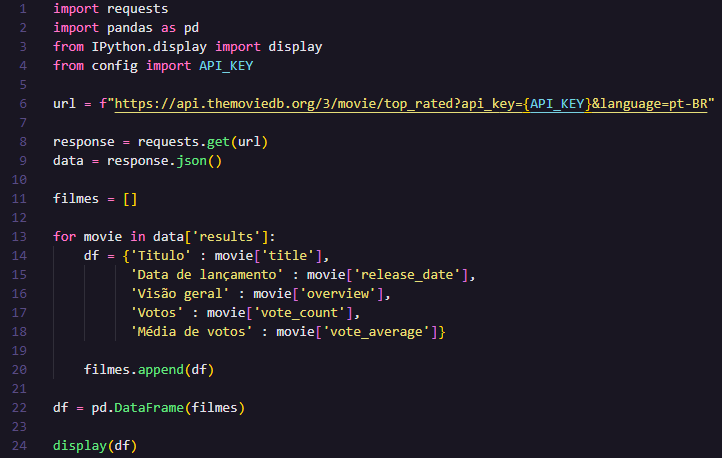

# Exercícios da Sprint 8
Este diretório contém os exercícios da Sprint 8. 

## 1 - Exercícios Spark Batch
## 1.1 - Geração e massa de dados

### Etapa 1 - Lista aleatória de números inteiros

**RESOLUÇÃO** 

1. Importação da biblioteca `random`

2. Geração da lista aleatoriamente (250 valores), com o método `random.randint(min, max)` - selecionei de 1 a 10000.

3. Aplicação do método `reverse()`

4. Mostrar resultado

**EVIDÊNCIA EXECUÇÃO**

Executei duas vezes para mostrar a pseudo-aleatoriedade para geração dos valores.

- [**SCRIPT FINAL**](1-spark-batch/etapa1.py)

### Etapa 2 - Lista de animais em arquivo CSV 

**RESOLUÇÃO**

1. Criação da lista com nomes de animais diferentes (20)

2. Ordenação da lista com método `sort()`

3. Print animais com *list comprehension*

4. Escrita em arquivo CSV

**EXECUÇÃO**

1. Console

2. Arquivo CSV - [ver arquivo](1-spark-batch/animais.csv)

- [**SCRIPT FINAL**](1-spark-batch/etapa2.py)
- [**ARQUIVO .CSV**](1-spark-batch/animais.csv)

### Etapa 3 - Gerar dataset de nomes de pessoas

**RESOLUÇÃO**

1. Instalação da biblioteca `names`

2. Importação das bibliotecas necessárias (`random`, `time`, `os`, `names`)

3. Definição dos parâmetros para a geração do dataset: quantidade de nomes aleatórios e quantidade de nomes únicos (trecho de código fornecido pelo enunciado do exercício)

4. Geração de nomes aleatórios (trecho de código fornecido pelo enunciado do exercício)

5. Geração de arquivo texto com todos os nomes

6. Visualização do conteúdo do arquivo texto

**EXECUÇÃO**

- [**SCRIPT FINAL**](1-spark-batch/etapa3.py)
- [**ARQUIVO TEXTO**](1-spark-batch/nomes_aleatorios.txt)

---

## 1.2 - Apache Spark

### Etapa 1 - Preparação do ambiente

1. Import de bibliotecas

2. Definição da SparkSession (fornecido pelo enunciado do exercício)

3. Leitura do arquivo em dataframe (df_nomes) e exibição

4. Evidência da execução

- [**SCRIPT 1**](2-apache-spark/etapa1.py)

### Etapa 2 - Renomear coluna para Nomes, imprimir esquema e mostrar 10 linhas do dataframe

1. Biblioteca pyspark e leitura do arquivo (igual à etapa anterior)

2. `printSchema()`

3. Renomeação da coluna
- Ao executar `printSchema`, percebi que o nome da coluna adotado pelo Spark foi **_c0**. Por isso, no método `withColumnRenamed()` esse foi o primeiro parâmetro (coluna atual).

3. Alteração do schema
- Com isso, executei novamente o método `printSchema()` para garantir a alteração do nome da coluna.
- O resultado foi:

4. Mostrar  10 linhas do dataframe

5. Evidência da execução total

- [**SCRIPT 2**](2-apache-spark/etapa2.py)

### Etapa 3 - Inclusão da coluna "Escolaridade"

1. O código das etapas anteriores permanece, conforme as figuras abaixo:

2. Primeiramente, criei o método `escolher_escolaridade()`, o qual retorna uma opção aleatória entre "Fundamental", "Médio" e "Superior", utilizando a lib random.

3. Além disso, criei uma UDF (*User Defined Function*), a qual consiste em uma função do PySpark que converte uma função do Python simples em uma função que pode ser aplicada sobre colunas de um DataFrame.

4. Dessa forma, com o `withColumn()`, criei a nova coluna "Escolaridade". 

5. Por fim, são mostradas as 10 primeiras linhas do DataFrame.

6. **Execução**

[**SCRIPT 3**](2-apache-spark/etapa3.py)

### Etapa 4 - Inclusão da coluna "País"

A inclusão da coluna país correu de modo similar à etapa anterior:

1. Manteve-se as etapas anteriores no código desta etapa:

2. Criou-se uma função `escolher_pais()`, a qual foi utilizada como `udf()`, retornando uma escolha aleatória entre os 13 paízes da América do Sul.

3. O restante ficou exatamente igual à etapa anterior.

4. **Execução**

### Etapa 5 - Inclusão da coluna "AnoNascimento"

A inclusão da coluna AnoNascimento ocorreu basicamente da mesma forma que as duas etapas anteriores, porém com a diferença de ser valores inteiros.

Com isso, necessitou-se adicionar o módulo IntegerType. 

- **Execução**

### Etapa 6 - Pessoas que nasceram neste século

A etapa 6, por outro lado, solicitou uma filtragem e a utilização do método `select` do Spark, selecionando apenas pessoas que nasceram no século XXI.

Para isso, utilizei o método `.filter()` filtrando apenas pelos anos de nascimento a partir do ano 2000, além de selecionar nomes e AnoNascimento.

- **Execução**

### Etapa 7 - Utilizar SparkSQL no mesmo caso da etapa 6

A etapa 7 visa realizar a mesma atividade da etapa anterior, porém com a utilização do Spark SQL.

- **Execução**

### Etapa 8 - Pessoas da geração *Millenials* (select Dataframe)

A etapa 8 é bastante similar à 6ª etapa, porém necessita incluir duas validações: maior ou igual a 1980 e menor ou igual a 1994.

- **Execução**

### Etapa 9 - SparkSQL na etapa 8

A etapa 9 é bastante similar à etapa 7, basta solucionar o problema da etapa 8 com a utilização de Spark SQL.

- **Execução**

### Etapa 10 - SparkSQL para dividir em gerações e países

A etapa 10 pediu uma query que contasse todos os registros de gerações por país, ordenando por país e por geração.

Dessa forma, primeiramente defini uma *string* chamada *query* e realizei a query da mesma forma que nas etapa 9 e 7.

- **Execução**

Dessa forma, finaliza-se os exercícios de Spark. Ao final produzi um script final com todas as operações, uma a uma:

[**SCRIPT FINAL**](2-apache-spark/script-final.py)

---

## 2 - Exercícios TMDB

### Etapa 1 - Criação da conta TMDB

A conta de desenvolvedor no TMDB já havia sido criada na Sprint anterior para realizar o desafio. Por isso, apenas insiro um print comprovando a criação de minha conta:

### Etapa 2 - Teste de credenciais e biblioteca

O código deste exercício foi fornecido pelo enunciado, portanto apenas o copiei e adaptei para utilizar a minha API_KEY (que inseri em outro arquivo - `config.py`).

**Execução**

[**SCRIPT FINAL**](3-tmdb/etapa2.py)

___

### ↩️ [Retornar ao início](../../README.md)