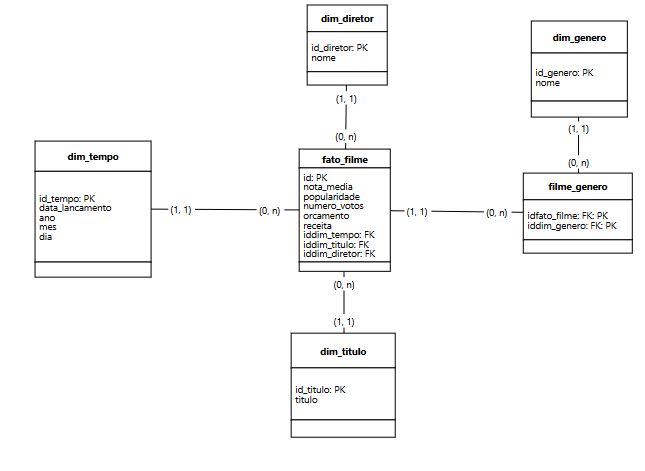
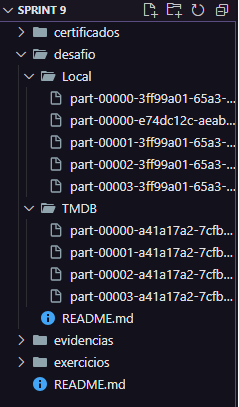
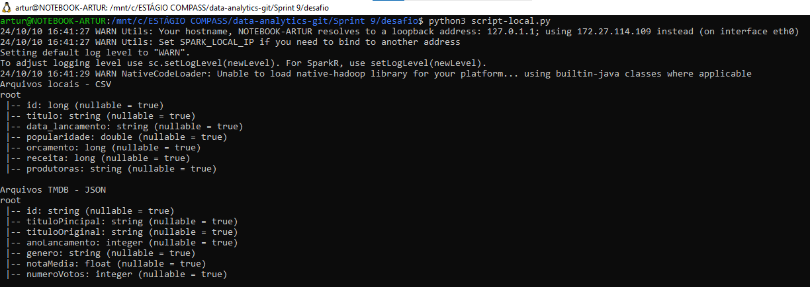
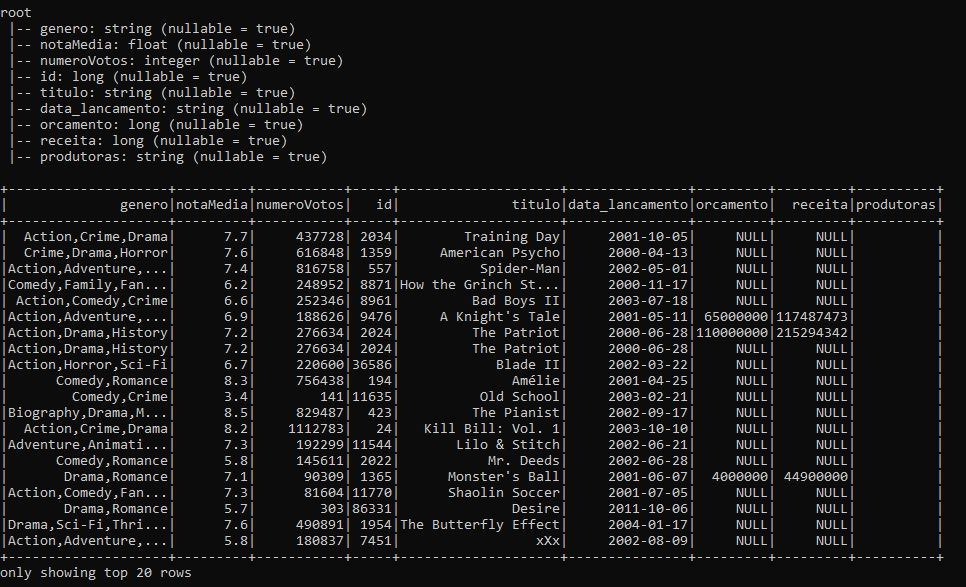
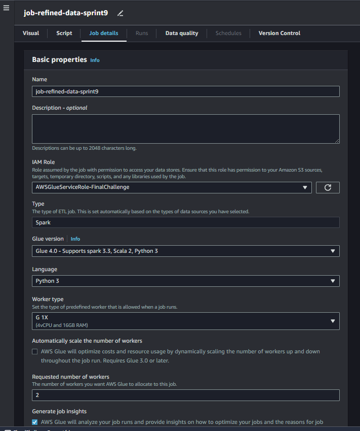
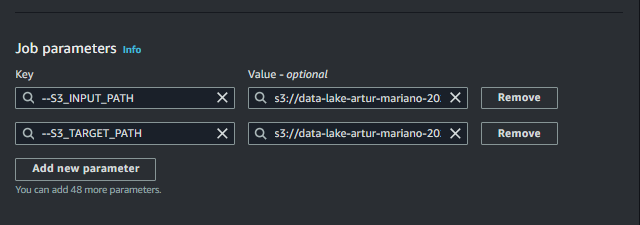

# 🧩 Desafio da Sprint 9
Este diretório contém os arquivos necessários para a realização do desafio desta Sprint.

___

## 📝 Enunciado
O desafio da Sprint 9 é uma continuação do desafio iniciado na Sprint 6, sendo a quarta entrega do desafio final.

Esta etapa consiste na **modelagem dos dados e processamento da Camada *refined***. Nessa camada, os dados devem estar prontos para análise e extração de insights. A origem correspondente desses dados deve ser a camada Trusted, processada na Sprint 8.

Nesta Sprint devemos pensar em estruturar os dados seguindo os princípios de modelagem multidimensional, a fim de permitir consultas sobre diferentes perspectivas.

Será novamente utilizado o Apache Spark no processo, utilizando jobs cuja origem sejam dados da Trusted Zone, e o destino a camada Refined Zone. Os dados devem ser novamente persistidos no formato PARQUET, particionados, se necessário, de acordo com as necessidades definidas para a camada de visualização.

### Afazeres
- Criar tabelas no AWS Glue Data Catalog.
- Se necessário, criar *views* de acordo com a modelagem de dados solicitada.
- Criar camada *Refined*, tendo como origem os dados da camada *Trusted*.

### Entregáveis
- Arquivo markdown (este README) com evidências da realização do desafio + documentação de cada parte executada.
- Modelo de dados da camada Refined desenhado em ferramenta de modelagem.
- Código desenvolvido com devidos comentários.

--- 

## Resolução

### 1. Questões para análise

As questões para análise não foram alteradas, seguem as mesmas definidas na Sprint 7:

1. Quais foram os principais marcos que consolidaram Christopher Nolan como um dos diretores mais influentes do cinema mundial? 

2. Média de bilheteria de todos os filmes do ano 2000 e comparar com Memento (Amnésia) - primeiro filme de sucesso de Nolan.

3. Avaliação média de filmes de heróis em comparação à média dos filmes do Batman de Nolan.

4. Para colocar suas ideias em prática, Nolan precisa de orçamentos maiores do que outros filmes similares?

### 2. Modelagem dos dados

Por conseguinte, realizei a modelagem dos dados. Necessitei rever conceitos aprendidos e aplicados na Sprint 2 (modelagem dimensional - *star schema* e *snowflake*) para realizar essa tarefa.

Para realizar a modelagem, utilizei a ferramenta **brmodelo**, criando os seguintes fatos e dimensões:

- **dim_tempo:** contém a data de lançamento do filme, além dos campos ano, mês e dia, para facilitar análises posteriores.
- **dim_diretor:** contém o nome do diretor, no caso apenas filmes de Christopher Nolan conterão, os outros não foram coletados, pois não havia necessidade.
- **dim_genero:** contém o(s) gênero(s) dos filmes.
- **dim_titulo:** contém o título dos filmes.
- **fato_filme:** considerei o filme como o fato, contendo todas as informações numéricas do meu dataset: id, número de votos, nota média, orçamento e receita.

As cardinalidades são todas **1-n** devido à limitação da ferramenta brmodelo, porém entre o fato e a dimensão tempo deveria ser **1-1**, e a cardinalidade do lado da dimensão gênero deveria ser **1-n**, não 0-n. O restante está correto.

### 3. Criação do script local

Primeiramente optei por criar o script *on-premise* para posteriormente levar ao AWS Glue e executar em um job.

**3.1 - Download dos arquivos .parquet**

Busquei os arquivos .PARQUET processados na Sprint anterior e localizados na camada Trusted Zone para tê-los em minha máquina.

**3.2 - Criação do script**

- **3.2.1**
    - Primeiro, criei um script que lia os arquivos .parquet e exibia os schemas, para entender todos os campos e como faria organizaria os dados para a modelagem efetuada.

- **3.2.2**
    - Posteriormente, realizei alguns testes de junção entre os dados do CSV (batch) e do TMDB, unindo pelo título do filme, haja vista que os ids eram diferentes.
    - Além disso, removi campos desnecessários, que não seriam efetivamente utilizados na análise final.

 

### 4. Job AWS Glue

**4.1 - Criação do job**

Primeiramente, criei o job no AWS Glue conforme solicitado no enunciado do exercício. A imagem abaixo comprova a criação do job.

**4.2 - Ajuste de parâmetros do job**

Agora, inseri os parâmetros com local de origem dos dados (camada Trusted) e onde eles serão salvos após execução do script (camada Refined).

**4.3 - Criação do script do job**

___

### ↩️ [Retornar ao início](../../README.md)