# 🧩 Desafio da Sprint 9
Este diretório contém os arquivos necessários para a realização do desafio desta Sprint.

___

## 📝 Enunciado
O desafio da Sprint 9 é uma continuação do desafio iniciado na Sprint 6, sendo a quarta entrega do desafio final.

Esta etapa consiste na **modelagem dos dados e processamento da Camada *refined***. Nessa camada, os dados devem estar prontos para análise e extração de insights. A origem correspondente desses dados deve ser a camada Trusted, processada na Sprint 8.

Nesta Sprint devemos pensar em estruturar os dados seguindo os princípios de modelagem multidimensional, a fim de permitir consultas sobre diferentes perspectivas.

Será novamente utilizado o Apache Spark no processo, utilizando jobs cuja origem sejam dados da Trusted Zone, e o destino a camada Refined Zone. Os dados devem ser novamente persistidos no formato PARQUET, particionados, se necessário, de acordo com as necessidades definidas para a camada de visualização.

### Afazeres
- Criar tabelas no AWS Glue Data Catalog.
- Se necessário, criar *views* de acordo com a modelagem de dados solicitada.
- Criar camada *Refined*, tendo como origem os dados da camada *Trusted*.

### Entregáveis
- Arquivo markdown (este README) com evidências da realização do desafio + documentação de cada parte executada.
- Modelo de dados da camada Refined desenhado em ferramenta de modelagem.
- Código desenvolvido com devidos comentários.

--- 

## Resolução

### PROBLEMA IDENTIFICADO NOS DADOS AO REALIZAR CONSULTAS

**1. PROBLEMAS**

Ao realizar consultas no Amazon Athena, percebi problemas nos dados. 

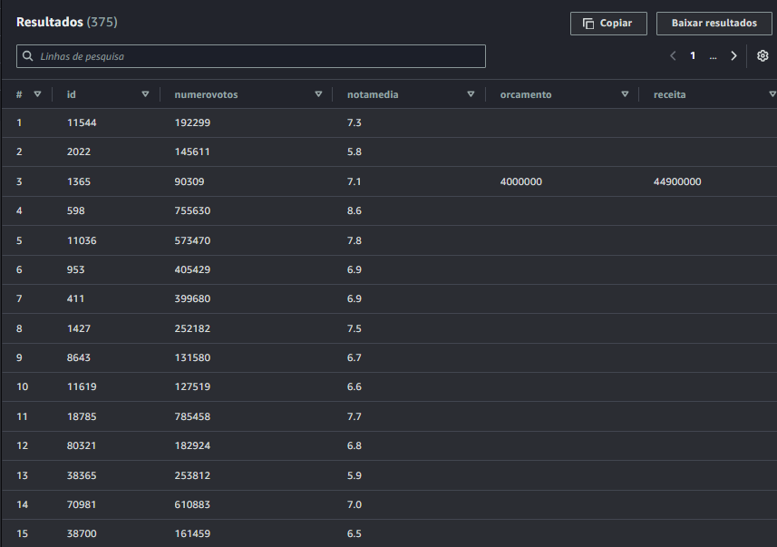

**Problema 1:** campos de receita e orçamento vazios na maior parte dos filmes. Isso ocorreu devido à utilização das classes da API do TMDB, ao invés de fazer requisições com a URL e com a biblioteca `requests`.
- **Solução:** realizar novamente a ingestão da API e fazer o upload na camada Raw.
    - O script desenvolvido está neste diretório ([scriptnovoingestaoAPI.py](nova-ingestao/scriptnovoingestaoAPI.py))
    - Optei por fazer tudo localmente para não comprometer tanto tempo quanto necessitou na Sprint 7.
    - Selecionei apenas filmes entre 2000 e 2010, limitando por 100 a cada ano, além de buscar todos os filmes de Christopher Nolan.
        - Limitei a quantidade devido à imensidão de filmes, tornando o script extremamente demorado para ser executado.

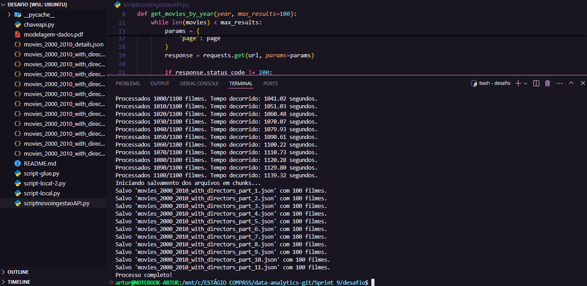

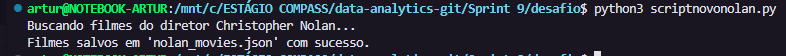

> Pode-se perceber que fiz um script para buscar os filmes entre 2000 e 2010, e outro para buscar os filmes de Christopher Nolan

**Problema 2:** eu não havia buscado os nomes dos diretores dos filmes, causando um problema na hora de realizar a modelagem dimensional dos dados. Por isso, resolvi buscar os diretores de cada filme também.

**Problema 3:** julguei não serem mais necessárias as produtoras para a minha análise.

**2. UPLOAD S3**
- Após a execução dos scripts e a criação dos arquivos, realizei o upload no S3 conforme a figura abaixo:

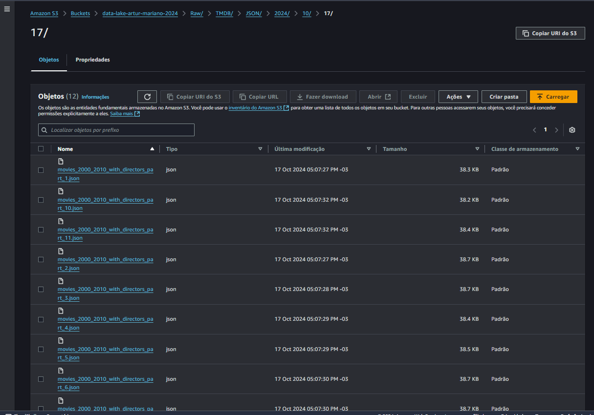

**3. PROCESSAMENTO DA CAMADA TRUSTED**

1. Alterei o parâmetro dos arquivos de entrada, passando o novo caminho dos dados (com a data de hoje: 17/10).
2. Alterei o script para que recebesse todos os dados e os processasse corretamente, haja vista que alguns deles sofreram modificações.
3. Executei o job e obtive o resultado abaixo

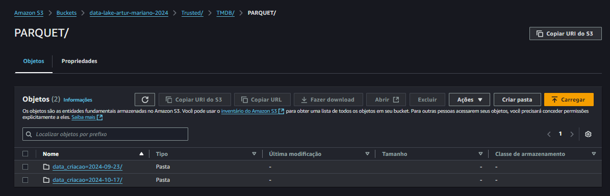

**4. CRIAÇÃO DO CRAWLER PARA OS NOVOS DADOS**

- Após, criei um novo crawler para os dados novos.

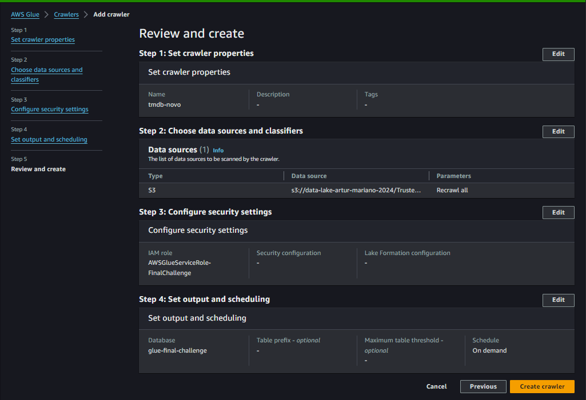

**5. CONSULTA NO ATHENA**

- Por fim, consultei no Amazon Athena para ver se os dados estavam corretos.

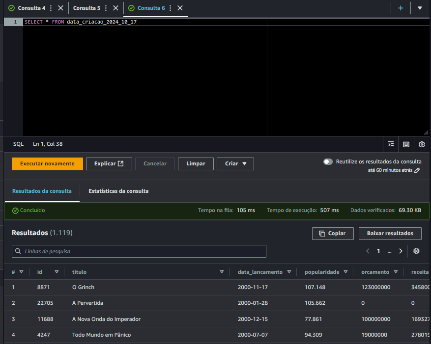

### 1. Questões para análise

As questões para análise foram alteradas, seguem quase as mesmas definidas na Sprint 7:

1. Quais foram os principais marcos que consolidaram Christopher Nolan como um dos diretores mais influentes do cinema mundial? 

2. Bilheteria de todos os filmes do ano 2000 e comparar com Memento (Amnésia) - primeiro filme de sucesso de Nolan.

3. Como foi o desempenho dos filmes do Batman em comparação aos outros filmes do diretor (nota média e bilheteria)?

4. Para colocar suas ideias em prática, Nolan precisa de orçamentos maiores do que outros filmes similares?

### 2. Modelagem dos dados

Durante a realização da modelagem dos dados, revisitei conceitos abordados na **Sprint 2** sobre modelagem dimensional, especificamente *star schema* e *snowflake*. Utilizei a ferramenta **BRModelo** para criar o diagrama de entidade-relacionamento e definir as tabelas de fatos e dimensões. Abaixo, apresento a estrutura do modelo e as respectivas explicações:

#### Estrutura do Modelo

1. **Dimensão Tempo (`dim_tempo`)**:
   - Esta tabela contém a **data de lançamento** do filme, além dos campos **ano**, **mês** e **dia**, facilitando análises temporais. A inclusão desses campos permite consultas e relatórios baseados em períodos específicos, como por ano ou por mês.

2. **Dimensão Diretor (`dim_diretor`)**:
   - Armazena os **nomes dos diretores** do filme. 

3. **Dimensão Gênero (`dim_genero`)**:
   - Contém o(s) **gênero(s)** dos filmes. Para lidar com filmes que possuem múltiplos gêneros, foi utilizada uma **tabela de ponte** (`filme_genero`), que resolve o relacionamento muitos-para-muitos entre filmes e gêneros.

4. **Dimensão Título (`dim_titulo`)**:
   - Esta dimensão contém os **títulos** dos filmes. Essa informação textual é crucial para identificação e consultas por nome de filme.

5. **Fato Filme (`fato_filme`)**:
   - A tabela de fatos armazena as métricas numéricas e dados quantitativos do conjunto de dados. As colunas principais são:
     - **id**: Chave primária do filme.
     - **numero_votos**: Total de votos que o filme recebeu.
     - **nota_media**: A média das notas atribuídas ao filme.
     - **orcamento**: O orçamento destinado à produção do filme.
     - **receita**: A receita gerada pelo filme.

#### Ajustes de Cardinalidade

Durante a modelagem, algumas cardinalidades foram ajustadas devido a limitações da ferramenta **BRModelo**, onde todas as relações foram representadas como **1-n**. No entanto, as correções conceituais são as seguintes:
  - Entre **fato_filme** e **dim_tempo**, a cardinalidade correta deveria ser **1-1**, pois um filme possui uma única data de lançamento.
  - Entre **fato_filme** e **dim_genero**, a cardinalidade deveria ser **1-n**, e não **0-n**, já que cada filme possui ao menos um gênero.

O restante da modelagem está correto, com a relação de muitos-para-muitos entre **fato_filme** e **dim_genero** resolvida pela tabela de ponte **filme_genero**.

### 3. Criação do script local

Primeiramente optei por criar o script *on-premise* para posteriormente levar ao AWS Glue e executar em um job.

**3.1 - Download dos arquivos .parquet**

Busquei os arquivos .PARQUET processados na Sprint anterior e localizados na camada Trusted Zone para tê-los em minha máquina.

**3.2 - Criação do script**

- **3.2.1**
    - Primeiro, criei um script que lia os arquivos .parquet e exibia os schemas, para entender todos os campos e como faria organizaria os dados para a modelagem efetuada.

- **3.2.2**
    - Posteriormente, realizei alguns testes de junção entre os dados do CSV (batch) e do TMDB, unindo pelo id do imdb, dado que busquei nessa mudança que realizei nesta Sprint.
    - Além disso, removi campos desnecessários, que não seriam efetivamente utilizados na análise final.

 

- [SCRIPT LOCAL](script-local.py)

### 4. Job AWS Glue

**4.1 - Criação do job**

Primeiramente, criei o job no AWS Glue conforme solicitado no enunciado do exercício. A imagem abaixo comprova a criação do job.

**4.2 - Ajuste de parâmetros do job**

Agora, inseri os parâmetros com local de origem dos dados (camada Trusted) e onde eles serão salvos após execução do script (camada Refined).

**4.3 - Criação do script do job**

Com o job criado e os parâmetros definidos, iniciei a construção do [script](script-glue.py) do job no Glue. Para isso, utilizei como base o script local desenvolvido anteriormente.

1. Imports necessários

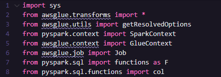

- O código importa bibliotecas essenciais para executar um job no AWS Glue e manipular dados com PySpark.
- Bibliotecas essenciais para o uso do AWS Glue, o qual é utilizado para ETL (*Extract*, *Transform*, *Load*) na AWS.
- PySpark: usado para manipulação e processamento de dados distribuídos.
- Função `col` do PySpark para tratamento das colunas.

2. Configurações de ambiente (parâmetros, SparkContext e caminhos de arquivos)

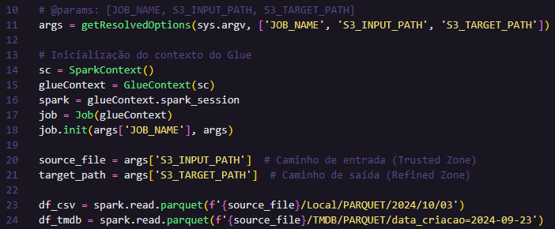

- **Linha 11:** `getResolvedOptions` obtém os parâmetros necessários para rodar o job. Eles incluem o nome do job, o caminho de entrada `(S3_INPUT_PATH)`, e o caminho de saída `(S3_TARGET_PATH)`.
- **Linhas 14-18:** configurações necessárias para script no AWS Glue (fornecido pelo próprio serviço ao criar o job).
- **Linhas 20-21:** definição dos caminhos dos arquivos de entrada e saída, Trusted e Refined Zone respectivamente.
- **Linhas 23-24:** Leitura dos arquivos PARQUET para Spark DataFrames: `df_csv` com dados da ingestão batch (local) e `df_tmdb` com os dados da ingestão da API do TMDB.

3. Transformações nos DataFrames

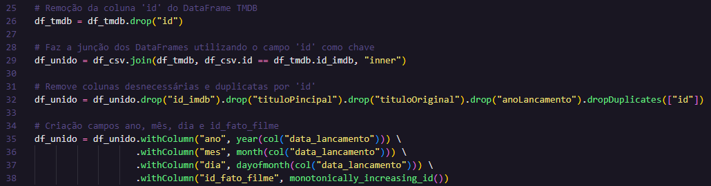

- **Linha 26:** removi o id do `df_tmdb`, pois utilizarei apenas o id do IMDB.
- **Linha 29:** junção dos DataFrames pelo id do TMDB.
- **Linha 32:** removi alguns campos que julguei não serem mais necessários para a minha análise final e também removi os duplicados pelo id do filme.
- **Linhas 35-38:** criei as colunas `ano`, `mes`, `dia` e `id_fato_filme` que seriam posteriormente necessárias.
   - Para criar o campo `id_fato_filme`, utilizei o método `monotonically_increasing_id()` que gera um long para cada registro, uma espécie de contador.
- **Linha 41:** printei o Schema do DataFrame para entender como havia ficado após essas transformações.

4. Ajuste no local de salvamento dos arquivos PARQUET

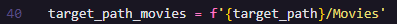

- Necessitei ajustar o local de salvamento dos arquivos PARQUET, inserindo mais um diretório: "Movies".

5. Tabela Dimensional `dim_titulo`

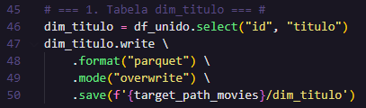

- A tabela armazena o id e o título do filme, e os dados são salvos no diretório /dim_titulo.

6. Tabela Dimensional `dim_tempo`

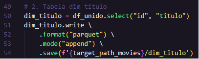

- Colunas ano, mes, e dia que foram criadas anteriormente são extraídas da coluna data_lancamento, além da criação de um campo id_tempo para ser chave estrangeira na tabela de fatos.
- Os dados são gravados no diretório /dim_tempo.

7. Tabela Dimensional `dim_diretor`

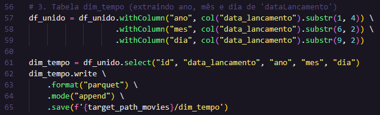

- Cria um id para cada diretor, além de selecionar a coluna "diretor" do DataFrame, que contém o nome de cada um deles. Salva no diretório /dim_diretor.

8. Tabela Dimensional `dim_genero`

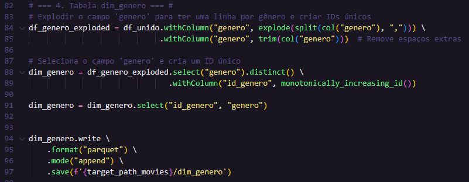

- Seleciona o campo `genero` do DataFrame principal. No entanto, esse é uma string em que pode haver mais de um gênero, sendo necessário um tratamento nesse sentido. 
   - Para isso utilizei os métodos `explode()` e `split()` para separar os gêneros.
   - Após, gerei um id para cada, utilizando o método `distinct()`, que pega apenas os gêneros diferentes para criar ids.

9. Tabela Fato `fato_filme`

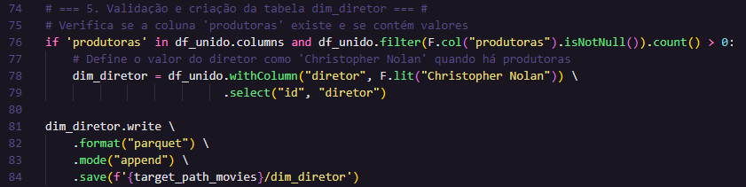

- Essa tabela possui todos os campos numéricos (`notaMedia`, `popularidade`, `numeroVotos`, `orcamento`, `receita`).
- Possui também os ids das dimensões (chaves estrangeiras): `id` (id_imdb), `id_tempo` e `id_diretor`.

10. Tabela de ponte `filme_genero`

Como já foi explicitado acima, essa tabela serve para relacionar filmes e gêneros, haja vista que é uma relação N para N.

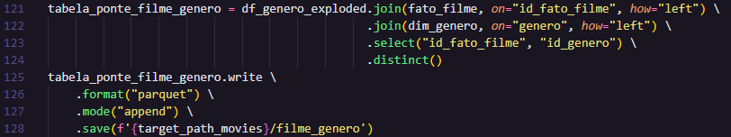

- Ela faz um join entre a tabela `fato_filme` e a tabela `dim_genero`, relacionando os filmes ao(s) seu(s) gênero(s).

 
11. Finalização do job

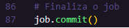

**4.4 - Job Runs**

Após desenvolver o script, executei o job. Fiz isso por diversas vezes, pois obtive erros no meio do caminho, os quais tiveram de ser solucionados resultando no script explicitado no item anterior.

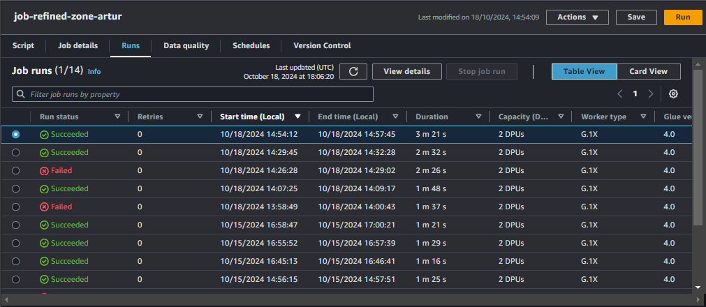

**4.5 - Diretórios criados**

Os diretórios criados após a execução do job ficaram da seguinte maneira:

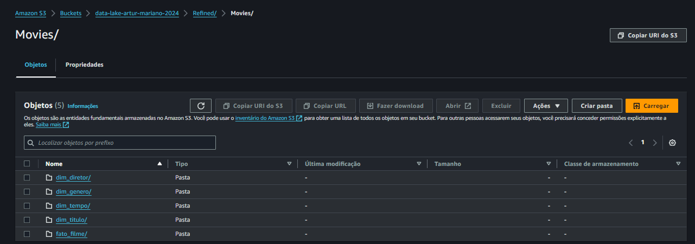

### 5. Crawler

**5.1 - Criação**

Para criar as tabelas conforme requisitado, necessitei criar novamente um *crawler*, da mesma forma que na Sprint anterior. A imagem a seguir comprova a criação do Crawler, com a origem dos dados sendo a Refined Zone.

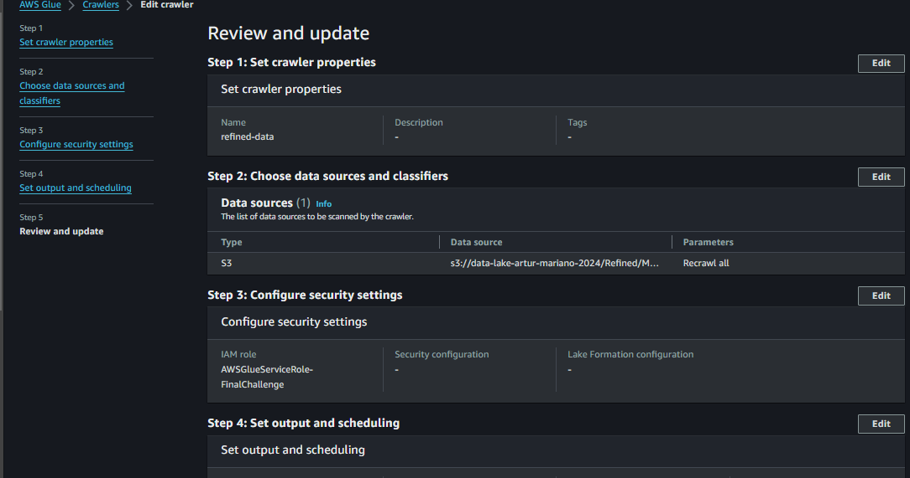

**5.2 - Execução**

Após criar o *crawler*, executei-o para que ele criasse as tabelas baseado nos arquivos PARQUET gerados.

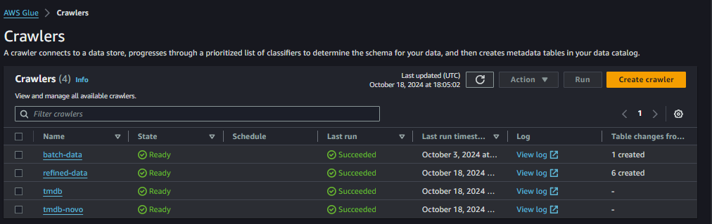

**5.3 - Consulta das tabelas criadas**

Com isso, verifiquei se as tabelas haviam sido criadas corretamente no AWS Glue Data Catalog.

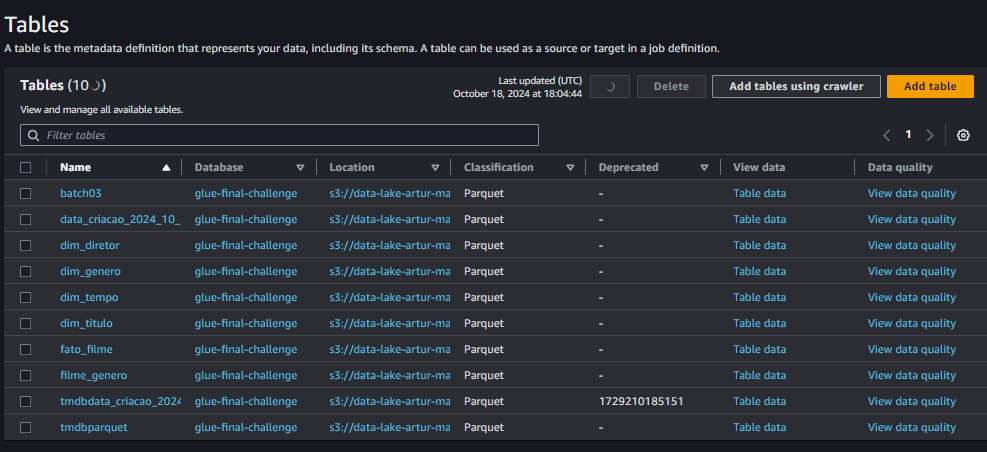

**5.4 - Consulta no Amazon Athena**

Por fim, performei uma consulta no Amazon Athena para ver se as tabelas estavam preenchidas corretamente conforme o script desenvolvido.

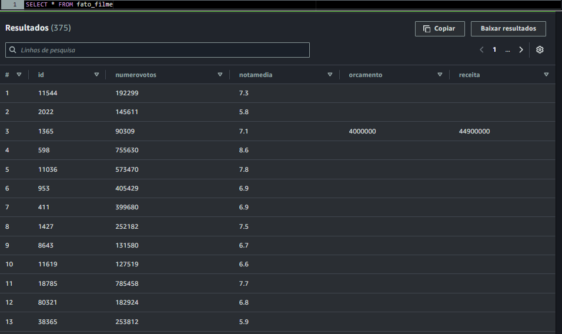

___

### ↩️ [Retornar ao início](../../README.md)